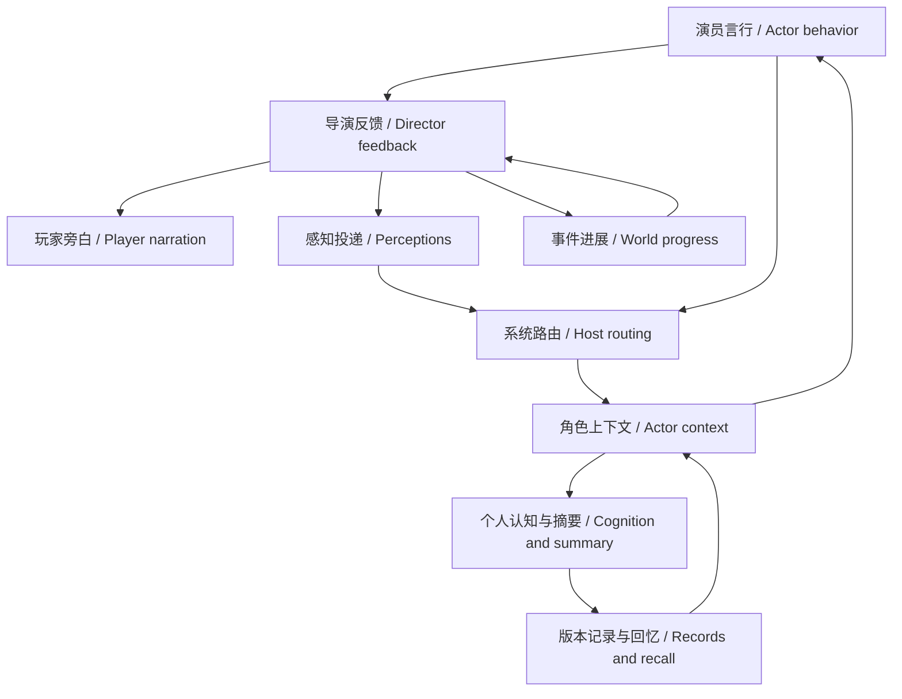

# Agent Note: Storyweaver discussion, perception, and memory evolution

Status: implemented

English | [中文](2026-09-12-discussion-perception-memory.zh.md)

## Problem

Characters need to respond to one another, receive only their own perceptions, and use personal experience in later choices. The existing runtime already had useful routing, persistence and player controls; this work completes the planned discussion/perception/memory flow without replacing those foundations.

## Decision

The product now uses the [background memory queue](2026-09-13-background-memory-queue.md) instead of waiting for private consolidation at foreground completion. The queue decision owns scheduling and result integration; the perception, review, recall and evaluation decisions below remain applicable.

D1–D4, S1–S3 and M1–M6 are implemented and verified at the scopes below. K1–K8 remain protections, not optional optimizations. This is a functional implementation decision, not a guarantee of error-free generated prose. The historical experiments at the end retain both passing and failing samples; their former next-step statements are historical, not current delivery work.

| Requirements | Delivered behavior | Verification owners |
|---|---|---|
| D1–D4 | Private discussion requests and host decisions; configurable fair opportunities, directed handoff, public budgets, flexible contributions and bounded feedback/resumption. | Core discussion tests, actor executor, service composition, discussion settings UI and browser flow. |
| S1–S3 | Shared perceptions with individual supplements/replacement, restricted behavior, observer-local identities and attempt/result links. | World tests, perception feedback composition and native private-clue sample. |
| M1–M3 | Relevant brief selection, exact/detail recall, actor/director private consolidation, sourced episodes and revision of interpretations and open questions. | Retention/runtime tests, actual executor requests and native recall/revision/A5 probes. |
| M4–M5 | Review by default, optional automatic activation, direct source inspection, correction, disabling, history, retry, rewind/import and explicit forgetting. | Core, SQLite, controller, memory UI and browser tests. |
| M6 | Origin-appropriate initial knowledge, isolated acquired cognition and experiential revision across spaced observations and counterexamples. | Background knowledge tests and native newcomer/child/native scenarios. |

SQLite remains authoritative. Models submit scoped changes and use recall rather than arbitrary filesystem paths. Originals and source versions remain retrievable after summary replacement. Player-visible narration does not automatically become actor evidence; private cognition is not public discussion. Actor mistakes remain subjective claims, and action attempts require world results.

Saved settings keep precedence. Eagerness remains the scheduling fallback; balanced is explicitly selectable. New guidance favors flexible contributions without a hard character ceiling. The shipped web profile uses actor/director consolidation thresholds of 16, a two-batch limit and two feedback continuations; service-only consolidation defaults remain disabled. Review-before-replacement remains the product fallback, while automatic activation requires an explicit owner policy.

K1–K8 are covered by owner/instance and historical-identity isolation, atomic rejection and cancellation, player floors and silence, archive/rewrite behavior, saved recipes/sharing semantics, complete original retrieval and native usage, and reuse of existing player panels. No player instance was used as an evaluation target.

## Verification

The current feature regression passes 324 tests in 56 files (.tmp/discussion-memory-completion-regression.log). The latest build, 13 source-review component tests and independent browser flow pass. The browser verifies source reading before approval, correction, disabling and discussion recovery with a mock provider. These results do not imply all-repository checks pass.

| Case | Inspected evidence | Boundary of the conclusion |
|---|---|---|
| A1 | 14-33-49 current-build artifact dispute: six public slots, two each; failed destruction changes choices and passage feedback changes crossing order. | Review activation; not all participants have escaped at the bounded stopping point. |
| A2 | 10-37-04 quiet promise: custody, return at revision 75 and retiring the slip at revision 78. | Repeated terms and a narration continuity issue remain in the recorded sample. |
| A3/A4 | 08-59-57 perception sample plus current composition: shared bell once, private clue isolated, attempt settled and player floor preserved. | Unsupported speech can still occur; routing does not judge prose truth. |
| A5 | 14-27-08 high-effort sample preserves witnessed agency, hearsay attribution and a later evidence-based choice through revisions. | Low-effort counterexamples remain; one pair is not an error-rate estimate. |
| A6 | Current core/SQLite/controller/UI regressions and browser approval/correction/revocation; native exact recall and episode-revision probes. | Player review remains a deliberate action, not automatic factual certification. |
| A7 | 09-24-44 restored growth run completes repeat, counterexample and transfer phases with fresh actual perceptions. | The original timeout is retained; a time jump does not simulate a lifetime. |

Full artifact paths, tests and observations are recorded in .tmp/discussion-memory-completion-audit.json and in the retained records below. Samples use temporary isolated instances. No additional native rerun is needed merely to claim universal prose quality; the delivered review controls address the explicitly accepted possibility of incorrect summaries.

## Alternatives considered

A full rewrite or copying the MVP scheduler would discard existing protections without isolating the cause of stagnation. One universal narration parser or another perception judge would add cost and disagreement; shared delivery plus explicit exceptions suffices. Free-form memory files would duplicate authority and weaken ownership. Mandatory automatic activation would amplify incorrect summaries, while mandatory extra consolidation after every utterance would increase latency. These alternatives are not part of the implementation.

## Consequences

The full discussion/perception/memory workflow is available with preserved player control and reversible summaries. Model-generated attribution, repetition, background claims and age-appropriate voice remain quality limits, not guarantees supplied by storage validation. Keep source inspection and review available; a high-effort A5 success does not justify overwriting model preferences.

Cost remains substantial: current A1 takes 538 seconds, outputs 93,724 tokens including 56,517 for consolidation, and recovers seven invalid tool submissions. Its cache-read fraction is about 80%, which is not a promise for other runs or proof of lower total cost. Named changed documentation pairs pass; existing repository-wide documentation failures outside this feature remain recorded rather than silently repaired. No deployment, commit or player-data migration is implied by this local delivery.

Player operations are documented in the [guide](../../../../docs/roleplay-discussion-memory-guide.md).

## Retained planning and evaluation record

Earlier decisions, experiments and failed branches

The following records preserve the original plan and intermediate evidence. Earlier statements of remaining work refer to their original checkpoint; the delivered scope and verification above are current.

### Problem

#### Scope and implementation entry point for this round

Work continues toward the full implementation goal. Preserve the existing implementation and evaluation records below as the baseline; inspect gaps in each batch rather than rebuilding the original additions list. Player instances and saved configuration are not test or reset targets.

| Work | Bounded next concern | Evidence required before proceeding |
|---|---|---|
| Discussion D1–D4 | Verify proactive requests, speaking opportunities, directed responses, and continuation after actions; borrow the MVP's pacing without copying its entire scheduler. | The same scenario responds to specific contributions and produces a next choice while preserving silence, refusal, and player-owned turns. |
| Perception S1–S3 | Verify the path from director settlement to each actor's actual request, especially shared changes, private clues, and action results. | Intended observers receive results, other actors do not, and settled attempts are not repeated because feedback was lost. |
| Memory M1–M5 | Verify the roles of briefs, details, and originals, prioritizing experience attribution, stale unresolved questions, and retrieval time semantics. | Later choices cite the correct experience, new evidence can revise understanding, and corrections or disabled summaries remain traceable. |
| Growth M6 | After those paths stabilize, compare starting knowledge and learning for newcomers and native characters. | Unknown setting details are acquired through experience and counterevidence changes judgment; a time jump alone is not evidence of learning. |

Each implementation batch uses the requirement identifiers and K1–K8 protections below and names changed files, existing behavior, intended differences, verification entry points, and recovery. Prefer prompt and existing projection changes; add tools or durable fields only for a demonstrated representation gap, defining instance ownership, provenance, revisions, and import/replay handling first.

M1/M2 provenance verification confirms that personal judgment and state histories do not store their story occurrence revisions, which cannot be recovered from the current entity snapshot. [retention-records.ts](../../../../packages/story/roleplay-core/src/retention-records.ts) therefore projects revisionScope: record explicitly, preserving versions and references without comparing them with event revisions. Undated personal originals sort separately by stable identity; mixed-source summaries have a null time range, and mixed or undated consolidation batches infer no later-event window. Retained-note recall also identifies record-local versions. No durable format or configuration changes; this does not establish a complete personal cognition timeline.

The batch passes the build, 142 domain tests, and three real-composition tests; a rerun with new RPC assertions verifies that note version markers reach the actual API while event revisions retain their meaning. A source-block snapshot records personal version markers; historical replay and archive round trips verify judgment markers and isolation. Changed ordering/recall sources and dedicated tests pass lint; untouched usage structures in types.ts retain seven existing separator diagnostics. No new native-model sample was run, and mechanism tests do not establish narrative quality improvement.

M1/K6 follow-up verification covers the ordinary actor policy: record versions are not experience age, a null source range means at least one source has unknown time, and display order cannot supply it. Actual Harness system-prompt assertions and the protocol snapshot verify delivery; one actor-composition test and three service-composition tests pass, as does focused lint. Saved author recipes, style, and model settings remain unchanged. This batch verifies policy delivery, not recovered personal-history timestamps or universally correct model temporal reasoning.

The complete native rerun with corrected fixture `2026-09-12T13-17-00-826Z` passes in 61,330 milliseconds with two private consolidations: processed originals are not duplicated, additional supporting evidence remains available, and exact recall and private isolation pass. Initial memory cites the later answer rather than retaining the storage question as unanswered; the later actor chooses not to follow the old warning based on direct observation. Quality still fails: initial and revised episode details turn witnessing immersion into personally placing the material, the final summary treats an unsettled storage attempt as completed, and retellings repeat. Ordinary/consolidation output is 1,689/9,269 tokens; this sample has no unrepresented history remainder and is not a causal comparison of temporal guidance. Separate quality-review.json retains these failures with humanReviewed=false; explicit automatic activation belongs to the isolated fixture, while the product review default is unchanged.

Acceptance separates mechanism correctness, narrative quality, and cost. Cache hit rates above 60% are player observations and cannot alone establish useful memory; compare actual input/output, additional consolidation calls, first-token latency, and subsequent actions. Preserve stochastic wording defects as quality evidence without indefinitely expanding completion criteria. Detailed scope, protections, phases, and scenarios remain in their sections below.

M2/S3/K2 request inspection identifies pending status lost during private background filtering: ordinary actor evidence includes attempts awaiting feedback, which consolidation removes with the ordinary event stream. A consolidation-pending section now retains only this actor's assigned attempts still awaiting feedback in the frozen snapshot, by ID without action text or out-of-batch members, and explicitly states that absence does not imply success. Settlement, permissions, storage, and review are unchanged. The build, focused lint, 144 domain tests, and four real-composition tests pass; a new runtime regression verifies that consolidation leaves the action pending and the proposal awaiting review, while a source snapshot verifies scope and guidance. The preceding native sample predates this fix; semantic effects require a rerun.

The pending-status native rerun `2026-09-12T13-23-54-990Z` completes in 73,426 milliseconds and passes execution checks. The archive confirms that the actual revision-17 consolidation request contains the assigned immersion attempt's pending-feedback ID, yet the final outcome note still describes an established physical arrangement: delivery passes and semantic fidelity fails. The initial episode still invents personal placement; a question brief later becomes resolved while omitted episode updates retain its old experience and unresolved question. Ordinary/consolidation output is 6,504/8,428 tokens; trajectories differ, so no causal cost comparison is made. Separate quality review preserves the exact section and failures. The next check concerns consistency of revised briefs, status, and optional details, rather than repeating the same guidance.

M1/M3 revision inspection confirms that omitted episode fields preserve existing details by design, with regression coverage for revise, resolve, withdraw, and archive. Rather than deleting potentially meaningful questions blindly, brief indexes add unresolvedCount to expose how many questions remain stored in the details without asserting that they are currently open. Shared tool guidance explains that changing status alone does not clear them and still directs the actor to read details before submitting a complete revision. Storage, history, and review are unchanged. All 160 domain, schema, and real-composition tests pass, with six owner-local snapshots updated; zero counts after correction, instance isolation, and original-version preservation are verified. Focused source lint passes; spontaneous correct native detail revision remains unverified.

The open-history native sample after unresolved counts, `2026-09-12T13-30-40-790Z`, passes in 35,158 milliseconds with one private consolidation and all notes remaining at revision 1. Briefs and details correctly preserve witnessing the material slip into water, the later choice follows the observation, and the old storage question incorporates a later answer. Ordinary/consolidation output is 1,915/4,418 tokens. No detail revision or pending action occurs, so this proves neither improved revision from counts nor semantic compliance with pending guidance, and cost reduction is not causally established. The next verification seeds one existing episode with an unresolved question, delivers an explicit answer, and directly observes recall and revision rather than relying on an open scenario to generate that branch. Separate review preserves this coverage gap.

M3 targeted acceptance adds episode-revision-performance.e2e.ts: controlled setup retains a question about when the guest will collect the copper key, then explicitly delivers its completed return at seven and runs only a native actor response. Sample `2026-09-12T13-34-08-549Z` takes 4,048 milliseconds and 671 output tokens; it revises the brief to resolved but leaves the old details and open question unchanged, which the structural assertion exposes as failure. Retain this failing test rather than weakening it to brief-only acceptance. Fixture lint passes, complete artifacts are saved before assertions, and setup usage is separated from native usage. Subsequent detail-revision verification uses this short scenario rather than repeatedly running open histories that may not exercise the target branch.

The M3 fix places read-before-revise guidance in the actual retained-note context section, preserving field guidance and omitted-detail semantics. The build, source lint, and 143 domain/composition tests pass, with two owner-local snapshots updated. Targeted native sample `2026-09-12T13-37-53-648Z` passes in 7,896 milliseconds: event 475 records narrative_recall reading the exact old detail reference, then the same note advances to revision 2, preserving past custody, adding the seven-AM return, revising interpretation, and clearing unresolved. Output is 1,370 tokens. This demonstrates the short scenario's complete path, not universal fidelity or reduced cost. The earlier failure remains preserved; separate quality review is not player approval, and storage and review defaults are unchanged.

D1–D4/K4/K6/M4 current-worktree audit: discussion creation and invitation acceptance capture saved floorPolicy, retaining eagerness when omitted; optional balanced does not rewrite old configuration. Public budgets count actual public contributions, excluding private preparation. The latest [browser flow](../../../../apps/web/tests/independent-narrative.e2e.ts) passes in 19.68 seconds, covering discussion creation, preparation status, interruption/resumption, two public contributions, director closure, and memory review/correction. [Settings controls](../../../../packages/client/ui-narrative/tests/discussion-settings.client.spec.tsx) and discussion accounting pass five tests covering stale-request recovery, saved policy, and remaining public budget. Recorded mock responses establish the current API-to-UI path, not native initiative or scheduling quality. Defaults remain unchanged, and this does not claim browser coverage of every player-owned-character branch.

D2/S3/K4 adds player-discussion-feedback.real.spec.ts to extend existing domain coverage through shipped tools and SQLite. With explicit balanced scheduling, an AI speaks and attempts the door, the director settles through director_observe, and discussion remains active with playerTurn=true. Automatic acting for the player is rejected without another model request; archive round trips preserve that floor. The test and focused lint pass without runtime or default changes; this is not browser or native-generation acceptance. Invalid fixture arguments found during debugging were corrected; only the current passing run supplies this evidence.

The current integrated regression in `.tmp/discussion-memory-integrated.log` covers roleplay-core, roleplay-services, roleplay-store-sqlite, the actual actor executor, and director schemas: 24 files and 214 tests pass without snapshot-update mode. Together with the recent browser regression and native episode-revision success, these separately establish mechanism, interaction, and single-scenario generation evidence. Experience attribution, faithful distinction of attempts from outcomes, and repetition in some discussions remain open quality items; this green run does not replace their native acceptance. The short scenario already verifies detail revision, so subsequent work need not repeat open-story probes for that passing branch. Further generation changes should address the failed items while retaining successful scenarios as regression evidence.

The pending-attempt presentation now repeats resultStatus=awaiting-world-feedback directly beside the assigned original and its execution-local sourceRef, using the same frozen, owner-filtered pending intersection as the status section. It changes neither original text nor durable records, source membership, settlement or review policy. Focused domain verification passed 145 tests in .tmp/pending-inline-domain.log. This proves status placement and isolation, not native semantic reliability; the retained native completion-confusion failure remains open until a focused native evaluation covers it.

The focused pending-attempt native probe passed after the inline status change: .artifacts/pending-attempt/2026-09-12T13-58-30-497Z. Flash/low recalled before committing one note, preserved uncertainty in the brief and episode, and left the host attempt pending. Execution took 5,461 ms; native consolidation used two steps and 810 output tokens, excluding the separately reported mock seed. The episode still contains system-oriented wording about submitting an action, so this is evidence for pending-outcome preservation in one controlled case, not natural prose or mixed-batch reliability. Build and fixture lint passed; the previous mixed-batch failure remains retained.

Current mixed-history sample .artifacts/independent-memory/2026-09-12T14-00-36-437Z completes in 78,395 ms with two private consolidations (11,056 output tokens) and two ordinary actor steps (3,900 output tokens). Hearsay is attributed, counterevidence informs the next-day choice, and the later label-inspection attempt remains explicitly unconfirmed. Attribution still fails: the first ordinary context_update describes witnessing as a personal experiment, and consolidation amplifies that into personally immersing the material. The shared memory text-field guidance now distinguishes first-person recollection from agency and personal retelling from independent evidence, covering ordinary and private submissions without rewriting stored memories. Eighteen schema/revision/executor tests pass after reviewing the protocol description changes and updating five snapshots; source lint passes. Native verification of this new guidance remains pending. The source/configuration audit also updates stale default-decision prose and distinguishes shipped-profile thresholds from service schema defaults.

After the shared agency guidance, .artifacts/independent-memory/2026-09-12T14-06-02-316Z completes in 81,197 ms. Two actor steps output 2,767 tokens; two private consolidations use eleven steps and 11,534 output tokens. The first ordinary turn creates no memory, but calls the observation a trial in speech. The first private batch receives the correct verbatim slide-into-water observation, yet its episode says the actor put the material into water; the second batch retains it. Hearsay attribution, later evidence-based choice and pending inspection remain correct. This is a semantic attribution failure, not a missing-delivery or storage-rewrite defect; the new guidance has no demonstrated success in this sample. Build passes. Integrated regression passes 214 of 215 tests initially; its one service protocol snapshot differs only in the intended shared description. After review and snapshot update, both composition tests pass. Keep the failure and avoid adding another near-duplicate instruction without a distinct mechanism to evaluate. Completion audit must distinguish the verified provenance/review mechanisms from generated quality; it must neither claim the remaining attribution error fixed nor silently replace the plan with a requirement for universally perfect prose.

M3/M4 audit found a concrete review usability gap: source references were plain IDs requiring manual search, and effective episode details were exposed only through correction. Retention now offers collapsed read-only details and direct source buttons for notes and proposals, including supporting citations outside processed coverage. It reuses scoped recall, preserves loading/failure/retry and focuses the results; reading cannot approve or edit a note. Four component tests and the extended independent browser flow pass, including reading the exact source before approval and subsequent correction/revocation. Build passes; modified component/test lint passes, while locales retain pre-existing quote diagnostics outside these added keys. .tmp/memory-source-review.png was visually inspected: controls and source retrieval are visible, but some originals still use the existing structured-text rendering. This delivers direct inspection without claiming the semantic attribution failure fixed. The player guide and UI README are updated in both languages.

M3/M4 source inspection now renders complete recognized recipient speech/action records with frozen labels, delivery/targets and exact content, while retaining the complete record in collapsed Raw data. Identity/revision mismatches, partial pages and unsupported shapes stay verbatim. It does not classify world truth, change memory, fetch current identities or execute embedded markup. The first build correctly rejected a domain runtime import at the client boundary; the implementation now uses a local read-only display recognizer and type-only domain imports, without relaxing the bundle gate. Thirteen component tests, source/test lint, the build and the extended browser flow pass. Browser assertions verify visible original wording and hidden raw JSON before approval; .tmp/memory-source-review.png was inspected. Existing approval, correction and revocation continue to pass. Guide and UI README pairs are consistent; semantic attribution remains a separate open quality issue.

A5 controlled effort comparison now has a passing high sample at .artifacts/independent-memory/2026-09-12T14-27-08-320Z. Authored model ID, history format, full history, published document and execution budgets match the low sample 14-06-02; captured execution requests record high. The inspected initial and revised episodes preserve material sliding into water and personal observation, distinguish the report from firsthand evidence, use it in the next-day choice and keep the new move unconfirmed. Runtime is 102,092 ms, actor output 2,577 and consolidation output 16,788 across six consolidation steps, versus low runtime 81,197 ms and outputs 2,767/11,534. Four final notes still repeat material. The comparison is saved in .tmp/memory-agency-effort-comparison.json. This demonstrates the intended A5 chain under an available configuration, not a general superiority claim, a measured error rate or a reason to override saved defaults. Both ordinary actor and private consolidation used high; the effect is not isolated to memory generation alone. Low failures and review-before-replacement remain documented.

Current-build A1 native acceptance completes at .artifacts/independent-discussion/2026-09-12T14-33-49-743Z/A1-artifact/balanced in 538,322 ms, with review activation and published 16-source/two-batch settings. Six public opportunities give each actor two turns. The failed smash leads to specific challenge, admitted lack of evidence, retreat with disagreement retained, and later crossing-order changes after narrow-passage feedback. One actor reaches the far side while the others wait; the bounded run does not claim total escape. Seven rejected tool inputs recover. Total output is 93,724 tokens, including 56,517 consolidation tokens; cache reads are 80.05% of recorded input. This proves the current complete discussion/feedback chain, not zero errors, lower cost or uniformly concise prose. A1-A7 evidence and K1-K8 mechanism regressions are reconciled in .tmp/discussion-memory-completion-audit.json. The remaining delivery work is documentation lifecycle reconciliation and a concise account of implemented behavior, verification and limits; no further feature or repeated native evaluation is justified solely to remove ordinary stochastic prose limitations.

#### Decisions for this review

The existing incremental implementation and acceptance records below inform subsequent planning. Neither count existing working-tree implementation and evaluations as additions from this round nor equate existing code with full acceptance. Subsequent implementation uses isolated instances, not the player's active stories.

| Priority | Problem to resolve next | Completion evidence |
|---|---|---|
| 1: Discussion | Learn from MVP speaking opportunities; check whether actors answer specific contributions, propose actions and advance choices; compare scheduling, length and prompts separately. | In matched scenes, actors propose and pursue motivated next steps while retaining refusal, silence and deadlock; more rounds do not substitute for progress. |
| 2: Perception loop | Retain director-authored perceptions and host delivery; cover action outcomes and perceptible transitions without parsing whole narration for automatic broadcast. | Actual actor requests contain relevant developments without informing absent actors or outsiders to private exchanges. |
| 3: Personal memory | Let actors consolidate their experiences, interpretations, effects and unresolved matters; supply relevant briefs by default and retrieve details and originals on demand. | Experiences affect choices in later relevant scenes; misunderstandings can be revised while original evidence and historical versions remain traceable. |
| 4: Growth and defaults | Once that loop is stable, evaluate newcomers and growing natives, then select review policy, consolidation timing and budgets. | Actors demonstrate different knowledge and evidence-based change; measure quality, latency, input/output and cache costs together. |

Detailed changes retain D1–D4, S1–S3 and M1–M6 identifiers. Verify and repair existing code before adding capabilities; add data or tools only when necessary meaning cannot be expressed. The M4 default remains review-before-replacement, supported by current semantic-error evidence; explicit automatic policies remain available. Scheduling and budget decisions still require comparison rather than assumptions from exploratory conversation.

Read [current gaps and existing implementation](#current-gaps-and-existing-implementation), then [preservation boundaries](#preservation-boundaries), [delivery phases](#delivery-phases) and [acceptance scenarios](#acceptance-criteria). D/S/M tables define changes, K defines preserved behavior, P defines sequence and A defines acceptance. Later execution records provide evidence rather than additional requirements. Player-reported cache hits and acting scores are comparison starting points, not a promise of a fixed cache rate for every request.

For player operations and activation semantics, read the [Discussion and character memory guide](../../../../docs/roleplay-discussion-memory-guide.md).

#### Current acceptance status

Implementation exists across the domain, model tools, persistence, API and existing player UI. The current combined feature regression passes 324 tests in 56 files across core, services, actor, UI, controller, shipped profile and SQLite (.tmp/discussion-memory-completion-regression.log). The latest build and browser source-inspection/approval/correction/revocation flow pass. These establish the exercised mechanisms, not all-repository cleanliness or uniformly correct acting. The requirement audit is recorded in .tmp/discussion-memory-completion-audit.json; the latest A5 attribution counterexample remains unresolved. No player story or saved default is reset for evaluation.

| Scope | Verified mechanism and native evidence | Remaining acceptance |
|---|---|---|
| D1–D4 / A1, A2 | Actor discussion requests, handling, private preparation, public opportunities, handoff, pauses and bounded resumption have regression coverage. A1 scheduling comparisons and A2's later key return complete. New recipes use flexible contributions; saved preferences and the scheduling default remain intact. | Repetitive checks and explanations remain in some scenes. Measure meaningful choices and silence, rather than increasing rounds or requiring every actor to speak. |
| S1–S3 / A3, A4 | Shared and private delivery, concealed attempts and linked settlement pass the actual-provider composition. The latest native privacy sample settles the attempt, excludes the private code from the witness's full request, and submits no ungranted cognition. | One repaired behavior-shape error remains. Unsupported background claims and semantic private-information paraphrases require output review; routing checks alone cannot certify all prose. |
| M1–M5 / A5, A6 | Owner-bound briefs, details and originals, private consolidation, source/version checks, review/automatic policies, correction, deactivation and recovery are connected. Native recall retrieves a seeded procedure; a separate attributed-history sample consolidates its sources with correct witnessing and duration. | Other samples misattribute attempts, repeat the brief in details and spend heavily on consolidation. A successful sample does not establish an error rate; retain review-before-replacement. |
| M6 / A7 | Distinct initial knowledge and spaced repeat/counterexample/transfer scenarios have actual-request evidence. The decade variant completes all three phases through archive recovery; the adult actor receives age eighteen and makes a choice using prior experience. | Completion is segmented after a 900-second timeout. A time jump cannot establish ten years of lived learning or prove a causal memory effect; age and character voice need further longitudinal review. |

The decade run `2026-09-12T09-04-53-222Z/A7-decade-growth/balanced` preserves complete artifact collection and the timeout branch. Recorded native input is 1,162,104 tokens, of which 739,968 are cache reads (63.7%); output is 161,160, including 97,877 consolidation tokens (60.7%). These include recorded failed calls and retries; an interrupted response may lack usage. High cache hits coexist with high total cost. Codex review is not player approval.

The current worktree passes the combined 53-file/302-test feature regression and the independent browser review/correction/revocation scenario. Related controller, SQLite, actor and profile READMEs now describe the verified integration and native measurements, without claiming universal quality. Model-experience and limitations checks pass across 261 package READMEs; all 2,283 Markdown cross-link targets resolve. The full documentation aggregate still reports ten passing and five failing checks: older wrapping, incomplete bilingual pairs, Agent Note format, the root instruction word budget and remaining README structure issues (currently exposed in story-home). Named updated pairs pass. These checks do not change the unresolved narrative-quality observations or prove the complete objective.

#### Remaining work in order

The current audit distinguishes implementation from generated quality. Inspectable shared evidence is the [domain regression](../../../../packages/story/roleplay-core/tests/world.spec.ts), [executor composition](../../../../packages/story/roleplay-services/tests/composition.real.spec.ts) and [memory editor tests](../../../../packages/client/ui-narrative/tests/retention-fields.client.spec.tsx).

| Requirement | Verified implementation | Remaining limit or work |
|---|---|---|
| D1 | Private request, deduplication, exact acceptance and native initiation; actual director-tool acceptance and replay are covered. | Spontaneous frequency is not established. |
| D2 | Saved policy, opportunity fairness and explicit handoffs; A1 comparison. | No universal scheduler winner. |
| D3 | Public budget excludes preparation; saved length overrides reach requests. | Prose can repeat terms. |
| D4 | Result pause/resume and a completed current A2 custody/return chain. | Some routine narration is verbose. |
| S1 | Shared, supplemental and replacement perceptions with atomic ordering. | Literary consistency remains a review concern. |
| S2 | Concealed attempts and whispers; native witness excludes the private code. | Unsupported claims are not semantically classified. |
| S3 | Settlement links, bounded feedback, cancellation and player control. | An attempted action is not confirmed success. |
| M1 | Relevant briefs, goals and on-demand details/originals. | Compact projection preserves full provenance in recall; semantic fidelity remains under evaluation. |
| M2 | Frozen actor/director batches; no repeated processing of pending review. | Measure replacement metadata as well as prose; consolidation remains costly. |
| M3 | Episodes, versioned revisions and native recall-before-update. | Summaries can still repeat or misinterpret experience. |
| M4 | Review default, opt-in automatic activation, correction and disable. | Model review is not player approval. |
| M5 | Source coverage, retry, rollback, import, pins and explicit forgetting. | Valid provenance alone does not prove semantic accuracy. |
| M6 | Origin-specific knowledge and native repeat/counterexample/transfer contexts. | Time jumps do not establish lifelong learning or mature voice. |

K1–K8 remain mandatory protections across these changes. A concrete M1/M2 gap comes from archived matched-source request sections: five originals total 1,459 characters, but three replacement notes total 1,526 (`2026-09-12T10-09-41-153Z`); two replacement notes total 1,163 in `2026-09-12T10-15-49-260Z`. These counts exclude unrelated context, are not token measurements and precede the latest shared guidance. They show why shorter prose alone does not prove a smaller request. Inspect the brief projection before further prompt tuning; do not delete provenance from storage.

##### Compact memory briefs: implementation and verification

Limit this batch to the model-visible projection in [retention-records.ts](../../../../packages/story/roleplay-core/src/retention-records.ts) and its owning tests and documentation. Keep note identity, revision, epistemic kind, status, brief text and usable recall references. Evaluate omitting repeated owner/author fields and full source-ID arrays from ordinary brief text; retain complete provenance in storage and the existing recall response. Do not change approval, source coverage, archival, revision checks, context-section switches or saved author recipes. Verify the existing read/update path before removing any field it needs.

Acceptance requires actor and director request snapshots, successful detail/original recall and revision of a retained note, owner isolation, and preservation of originals when the replacement section is disabled. Compare the same rendered sections before and after, including metadata and shared guidance. Report character counts separately from native input/output tokens and cache usage; a shorter projection does not establish improved acting quality. The projection batch is implemented; broader memory-quality acceptance remains open.

The compact projection passes 143 domain/revision tests, three executor-composition tests and the build. Archived retention-section comparisons, including unchanged guidance, decrease from 1,778 to 1,394 characters and from 1,415 to 1,094; these are character projections, not native token savings. Native sample `2026-09-12T11-14-20-551Z` completes in 41,585 ms: an actual recall reads the old detail reference before revision, ownership remains isolated and covered originals stay omitted. Its first summary still presents a proposed wet-storage plan as an implemented change; the later revision calls it a proposal. Repetition remains. The sample produces 6,403 consolidation output tokens and 1,528 ordinary actor output tokens, without a controlled cost comparison. Full documentation checks remain at eight passing and seven failing checks outside this changed pair; the existing world-test file also has unrelated formatting diagnostics. These limitations do not invalidate the narrower projection checks or establish completion of M2/M3 quality acceptance.

##### Consolidation background and personal retellings

The first private request in native sample `2026-09-12T11-14-20-551Z` contains a later personal-memory record saying the wet-storage plan had already been carried out. That sentence is absent from the assigned older events but reappears in the summary. Private background therefore excludes lifecycle records identified as personal memories, while keeping goals, beliefs, retained notes and authored recipe sections. Explicitly assigned memory records still remain in the source batch. Ordinary acting and recall retain the original personal records; no stored memory, approval or source-coverage policy changes. Two projection tests, three actual executor-composition tests and the build pass; the composition test verifies that a personal recollection is absent in private consolidation and present again in ordinary acting. This addresses an observed input ambiguity without introducing a semantic classifier or claiming that every future summary will be accurate.

Native sample `2026-09-12T11-19-29-820Z` completes in 57,734 ms with no personal-memory background in either private request. The initial summary preserves the failed catch and half-hour observation, explicitly saying storage has not yet changed. Later speech still treats a previously proposed overnight soak as performed without a corresponding action submission; newer summaries do not consistently preserve that distinction, and the earlier unresolved question remains. Ordinary actor/consolidation output is 2,997/7,689 tokens. This verifies input isolation, not universal fidelity or cost reduction.

D1 executor acceptance now continues the existing discussion-to-memory composition through a new private invitation and `director_command` acceptance. The two composition tests pass: acceptance creates exactly one discussion with both participants still awaiting preparation, `advanceDiscussion=false` schedules no acting, and replaying the same director command returns its receipt without another model request. Native self-initiation remains separately evidenced by the earlier invitation sample; this mock-provider run does not measure spontaneous director decisions.

D3 same-build comparison records identical built-file fingerprints and identical authored documents after removing only actor length preferences. Both A1/balanced runs use review activation and the published consolidation threshold of 16. Their six public contributions have median lengths of 379 and 156.5 Unicode code points for expanded and flexible guidance. The flexible sample `2026-09-12T11-44-38-095Z` finishes in 583,948 ms with two public opportunities per actor and a later escape sequence responding to world feedback. The expanded sample `2026-09-12T11-34-30-929Z` completes the public discussion but times out at 600,064 ms during director consolidation: 24 calls add an invalid arguments wrapper. Its consolidation output is 86,678 tokens, versus 49,748 in the flexible sample; total cache ratios are 89.6% and 79.8%. Different trajectories and repair work prevent attributing total cost to length alone. This pair supports the flexible public contribution direction, not universal quality or token savings. The private director policy now explicitly requires the command envelope and prohibits arguments/command.command wrappers; the new executor regression checks rejection, corrected complete submission, receipt replay and inclusion of the failed request in usage. These native samples precede that protocol repair.

##### Director recall guidance: validation

Fixed native director sample `2026-09-12T12-00-34-122Z` completed in 20,223 ms with a correct pending key-return summary and valid command envelopes, but two continuation errors and one unavailable note target. Director recall lacked actor recall field guidance. Shared descriptions now explain exact IDs in query, all-term matching and continuation-only sourceId for ordinary and private director tools. Search, authority, storage and review policy are unchanged.

Build, focused lint, ten schema tests and three Harness composition tests passed; the director schema and three request snapshots were updated. Native follow-up `2026-09-12T12-11-13-149Z` completed in 5,895 ms without tool errors: two consolidation steps and 526 output tokens. The pending summary correctly retained the completed return, with no world writes or actor dispatch. No recall was attempted, so this does not prove exact-read recovery or a lower error rate. Both artifact quality reviews are by Codex, not player approval. Earlier wider regression evidence and documentation failures remain as recorded above.

##### Private memory excludes public expression direction

M2/K2/K6/K7: the private actor request already omitted performance and scene-style sections but still carried the saved expression profile, including public length targets. The director also copied active scene instructions into its guidance directory. Consolidation background now omits performance, style, scene-style and narration-length for both owners; the director memory query omits its duplicate performance directory. Identity, admitted cognition, retained notes and other authored modules remain. No stored configuration, ordinary request or summary activation policy is changed.

The build, focused lint, 139 domain tests and three actual Harness composition tests pass. Two owner-local context snapshots record private section roles and order. Actual request assertions verify long actor/director expression preferences and scene cues before and after consolidation, and their absence during it. The native fixed-history probe accepts the existing evaluation length override and records the published document, allowing this isolation to be checked with explicit long-form preferences. Native generation quality remains separately assessed; removing irrelevant guidance does not itself prove fidelity or net token savings.

Native sample `2026-09-12T12-20-36-007Z` completed in 64,957 ms with attributed fixed history and an explicit 400–800-character public preference. Both private requests omit style, ordinary requests retain it, and two recall calls complete without tool errors. Consolidation uses two turns, four steps and 9,617 output tokens. The later choice refers to observed counterevidence, but the first speech and episode misattribute accidental immersion as the learner placing the material in water; later clauses repeat prior terms. The artifact review records this failure. The fixture explicitly uses automatic activation; product review defaults are unchanged. This proves request isolation and bounded execution, not semantic fidelity or a controlled cost reduction.

A5/M2 evaluation distinguishes actor error from an overly strict fixture. Same-build low/high samples `2026-09-12T12-31-49-036Z` and `2026-09-12T12-32-09-042Z` preserve identical authored history and length settings. Low reasoning summarized three sources in its ordinary turn, legitimately leaving too few unprocessed sources for a private batch; the fixture stopped because it incorrectly required every original to be summarized. High reasoning completed in 104,158 ms but still misattributed witnessed immersion as personal action. No default change follows, and total costs are not comparable across the incomplete and complete runs.

The fixture now records remaining originals and checks that they stay available alongside effective summaries, while still requiring exact recall, isolation and exclusion of covered originals. A new domain regression checks partial ordinary summarization, retained raw context and a later threshold-triggered private batch; all 137 world tests pass and fixture lint passes. Native follow-up `2026-09-12T12-35-50-564Z` completes in 58,053 ms. Its first episode preserves accidental immersion correctly, but later behavior invents a marked wet sample despite a dry-tray perception. This sample summarizes all originals, so native partial-history follow-up is not claimed; the deterministic regression covers that branch. Reports preserve these quality limits and the explicit automatic fixture policy.

M2/K1/K2/K6/K7 source presentation now separates each frozen reference header from fenced verbatim text, shared by actor and director. It preserves source values, original order, local aliases and text, including embedded fences, without a second JSON text-escaping layer. There is no source selection, storage, recall or ordinary-performance change. The renderer has a literal output snapshot and actual Harness requests assert the source blocks. Build, focused lint and 139 domain tests pass; three Harness composition tests and two formatter tests also pass. On identical sources from `2026-09-12T12-35-50-564Z`, source-only lengths change from 1,087 to 1,042 and from 2,647 to 2,458 Unicode characters. These are not token counts or full-request savings; model fidelity remains a separate evaluation.

Source-block native sample `2026-09-12T12-42-38-900Z` completes in 37,574 ms. One private execution at revision 12 uses two model steps and 5,338 output tokens; one malformed JSON tool call is repaired. Initial episodes preserve observed immersion but retain stale unresolved questions and duplicate event detail. Later ordinary behavior invents an overnight wet sample. The artifact review therefore establishes callable source references and recovery, not improved memory fidelity or a causal cost reduction. Product review and model defaults remain unchanged.

M2/M3/K1/K2/K7 current-status review can reuse supporting-source citations already admitted by the domain. Private unit.sourceIds remains the exact processing batch, while a note change may cite another original from the same frozen perspective. A new runtime regression recalls a later key-return observation, rejects another actor's private clue without partial writes, and retains the supporting original in ordinary evidence because it was not processed by that unit. Shared note-source guidance now explains this distinction; actor consolidation asks for recall before keeping an earlier question open when its current status is unclear. No schema, storage, visibility or activation rule changes. Build, focused source lint, 148 domain/schema tests and three actual Harness composition tests pass; field and request snapshots are updated. These checks establish the available path, not spontaneous or semantically correct model use.

Supporting-recall native sample `2026-09-12T12-50-19-884Z` completes in 35,788 ms with no tool errors and no recall calls. Its initial memory preserves report and observed-immersion attribution, but still marks the older storage question unanswered despite the ordinary reply. The explained supporting-source path therefore remains mechanically verified rather than spontaneously demonstrated. Later speech refers to the observation and proposes a ventilated shelf and dry control; the physical submission remains an attempt. Preserve this failed current-status check rather than claiming the prompt solved stale questions.

M1/M2/K1/K2/K7 consolidation-window metadata now makes an earlier batch visibly incomplete as a view of current events: it reports its ending revision/order, later admitted event count and the first later exact recall reference, without delivering that text. Actor candidates come only from received events in the frozen snapshot, excluding personal-record version numbers and other perspectives. The pointer is logged in a separate section, leaving assigned source membership unchanged. Unit snapshots cover same-commit ordering, empty windows and verbatim-content exclusion; the runtime supporting-recall regression checks the exact pointer and absence of another actor's private source. Build, focused lint, 141 domain tests and three actual Harness composition tests pass. No stored records or policies change. Native use remains separately measured.

Window sample `2026-09-12T12-56-55-712Z` completes model execution in 69,055 ms, makes two exact recall calls and repairs one tool error. The initial private summary cites the later ordinary reply and records the old storage question as answered, while leaving the keeper's acceptance unknown. The original fixture fails because it counts every note citation as processed coverage. Archive re-evaluation finds no processed original left in follow-up evidence and no missing supporting original; the supporting reply remains visible as required. The fixture now reports and validates these categories separately. This is a successful native example of checking current status, not universal fidelity: the first brief still misattributes immersion as the learner's own action. Original failure output and the separate review are preserved.

| Priority | Bounded next action | Protection and decision rule |
|---|---|---|
| 1: Memory fidelity and compression | Use the fixed-history fixture to distinguish brief understanding, optional episode detail and recallable originals. Compare source-grounded choice quality and all call costs, with one variable changed at a time. | Preserve attribution, material conditions and unresolved attempt status. Exact source coverage does not require repeating each utterance; add no parallel memory store, semantic judge or hard total-context character cap. |
| 2: Discussion pacing | Reuse A1/A2 to check whether actors act on feedback, stop repeating settled checks and retain distinct voices. Treat refusal and a quiet fulfilled promise as valid outcomes. | Keep player turns, directed handoffs, silence, saved style and configurable budgets. Neither more speech nor more obstacles counts as improvement by itself. |

The required implementation scope remains D1–D4, S1–S3 and M1–M6. Do not turn each stochastic wording defect into another tool or mandatory prompt clause. Report functional acceptance, observed narrative quality and measured cost separately; retain unresolved quality limits without claiming universal realism. Current product defaults remain review-before-replacement, optional automatic activation and the saved scheduler/budgets.

#### Background

Players report that the AIAgentRolePlay MVP encourages more initiative than the current independent product. The desired experience is continuous character development: a newcomer learns an unfamiliar world, or a native grows into a wider understanding through personal experiences. Repetition, uniform prose, and conversations that do not affect later choices are the primary product concerns.

This proposal was documented on 2026-09-12. Implementation proceeds in phases, with completion determined by corresponding acceptance evidence. Existing workspace implementation and verification records remain baseline evidence; recheck gaps rather than rebuild every item in the requirement tables. The user reports cache hits above 60% and an acting-quality score of 6/10; these are player observations, not a controlled benchmark or an acceptance threshold.

### Proposal

Evolve the independent runtime rather than rebuild its actor/director separation. The director generates environmental outcomes and recipient perceptions; the host persists and routes them; actors interpret their own evidence and maintain their own cognition. Rely on model instructions for ordinary narrative consistency, retaining deterministic ownership, revision, and transaction checks.

#### Plan overview and execution constraints

The goal is for conversation to affect later events: characters interpret their own experiences and use that understanding to choose their next words and actions. Shorter context, more turns or more frequent conflict are not independent success criteria.

| Priority | Core changes | Required reuse |
|---|---|---|
| Discussion D1–D4 | Actor requests, fair opportunities, responsive contributions, public budgets and flexible length. | Private preparation, directed handoff, silence, player control and director summaries. |
| Perception S1–S3 | Shared perceptions and individual differences, concealed behavior, linked attempt outcomes and bounded feedback. | One director settlement and host delivery, without another perception judge or automatic literary-narration broadcast. |
| Memory M1–M5 | Relevant overviews and on-demand details, actor consolidation, source coverage and summary revisions, correction and withdrawal. | Personal beliefs and goals, recall tools, existing review entry points and authoritative SQLite storage. |
| Growth M6 | Justified initial knowledge, experiential learning and revision through counterevidence. | Perspective isolation; no automatic lore unlock by age or exposure of unknown topics or identities. |

Data to verify includes discussion requests, attempt/result links, and episode summaries with ownership, source coverage and revisions; add no structure when existing records express the requirement. Topic indexes retrieve the actor's existing memories. Determine fields from gaps in existing structures rather than introducing free-form file storage or duplicating beliefs and goals.

Prompts govern perspective, responsive contributions and subjective consolidation; tools submit and retrieve; the host owns delivery, ownership, versions, atomic persistence and scheduling stops. Retain review-before-replacement as the new-instance fallback. Explicit automatic activation remains available with inspection, correction and withdrawal; do not change saved instance choices. Consolidate at episode boundaries or when unconsolidated experiences accumulate, not after every sentence; thresholds and budgets are configurable and their values require comparison.

Proceed through P0 isolated baseline → P1 discussion → P2 perception feedback → P3 retrieval and minimal structure → P4 consolidation lifecycle → P5 growth scenarios. Each batch names requirement IDs, affected K1–K8 protections, implementation owners and acceptance evidence; verify existing code before filling gaps rather than implementing it again. Report local code presence, mock-provider passes and real acting improvements separately; do not mark items complete without full-flow acceptance.

#### Current gaps and existing implementation

This table records source inspection in this round, not complete acceptance. The workspace already contains several planned capabilities; subsequent work primarily fills gaps and verifies them. “Add” in the requirement tables does not mean creating the same system again. Repeated implementation logs and stale test counts are removed while verification entry points and unresolved limits remain.

| Requirement | Existing code foundation | Next work and completion condition |
|---|---|---|
| D1–D4 discussion | Requests and handling, optional balanced scheduling, public budgets, responsive guidance and director summaries. | Compare with the MVP in the same scene; check directed handoff, player control, silence and interruption recovery; choose scheduling and length defaults from real outputs. |
| S1/S2 perception | Shared perceptions, supplement/replace, concealed actions and source ordering. | Verify actual requests, UI previews, reload and replay agree; do not add a narration parser. |
| S3 feedback | Pending attempts, linked settlements and bounded director continuation. | Accept the complete flow for discussion awaiting outcomes, player choices, failed retries and cancellation. |
| M1 retrieval | Personal records are allocated by category; recent owner perceptions or explicit queries select summaries; ordinary summaries and episode details are recallable. Recall prioritizes exact references, then recently updated matching briefs, then originals; frozen history preserves the earlier order. | Director briefs use current guidance or recent nonempty director-visible originals; represented facts and behavior are filtered before recent-item limits; verify long-history relevance and goal retention; lexical ranking is not semantic retrieval. |
| M2 consolidation | Ordinary-turn threshold consolidation, bounded actor batches at discussion boundaries, independent director consolidation, source coverage and retry constraints. | Accept complete requests, browser behavior and usage records in the latest composition; evaluate timing, batch costs and failure recovery rather than adding another consolidation executor. |
| M3 data | Episode details contain topic, experience, interpretation, impact and unresolved matters; revisions can preserve details and reuse existing sources and versions. | Accept overview/detail links, historical reads and archive round trips; do not duplicate beliefs. |
| M4/M5 control | Automatic/review policies, player correction, note deactivation and original restoration have code and UI. | Retain the existing review fallback and jointly verify review, correction, pins, forgetting, cancellation, rollback, reload and import; accept the three operations separately. |
| M6 growth | Characters can inherit shared common knowledge, supply a personal list or use an empty list. | Evaluate learning, misunderstanding and counterevidence for newcomers and growing natives; instructions constrain pretrained knowledge without claiming to erase it. |

Focused regression and browser evidence are summarized in [current acceptance status](#acceptance-status); their execution logs remain below. The browser scenarios use a mock model. Code presence, provider composition, native-model output and player review are distinct evidence levels; none implies all-repository or universal narrative acceptance.

Discussion initiative, perspective isolation, subjective memory and progressive retrieval are implemented. The current acceptance work targets semantic attribution in mixed history and responsiveness across longer exchanges. Earlier configuration comparisons remain evidence; no saved story settings are overwritten to obtain a passing sample.

#### What the next stage should resolve first

Establish one observable loop: a specific utterance or action in discussion → an experience available to this actor → the actor's interpretation → a changed choice in a later relevant scene. Validate A1 artifact dispute and A2 quiet promise before newcomer and childhood growth. Long-history compression ratios do not substitute for this loop.

| Layer | Permitted focused changes | Reuse and preservation |
|---|---|---|
| Prompts | Respond to specific contributions and express next intentions; distinguish experience, inference, impact and unresolved issues when consolidating; reconsider relevant counterevidence. | Preserve author text, character voice and unknown-identity constraints; do not force changed positions, name questions or conflict every turn. |
| Tools | Verify discussion requests, action feedback, overview retrieval, detailed recall and summary revision against scenarios; add only missing parameters or behavior. | Reuse submission and recall tools, without arbitrary actor filesystem access or turning recall into world exploration. |
| Storage | Verify instance/actor ownership, source coverage, episode detail, summary versions and policy; extend structures only for missing fields. | Reuse beliefs, goals, intentions and SQLite, retaining originals and history rather than adding a general personality database. |
| Scheduling | Compare speaking opportunities, contribution length and event-boundary consolidation separately; resume director feedback only when an outcome is needed. | Preserve directed handoff, silence, player turns, cancellation and recovery; do not change all variables together. |
| UI | Show request state, summary sources, automatic/review policy and correction/deactivation in existing discussion and memory entries. | Show brief text and necessary status by default, with expandable detail; do not introduce scattered configuration centers. |

Current defaults retain eagerness scheduling, flexible contribution guidance and review-before-replacement. The shipped roleplay web profile sets actor/director consolidation thresholds to 16 and a two-batch limit; service-only schema defaults disable consolidation unless configured. Saved instance choices remain authoritative. Matched native comparisons and failed branches below explain the conservative selection; further tuning must identify a concrete failure rather than reopen every default after each sample.

Before each implementation batch, identify the missing part of the current flow. At exit, report functional availability, narrative quality and cost separately. Mock tests establish mechanisms only. If a real model does not produce the intended later choice, refine that part of the flow rather than substituting more summaries or speaking turns for acceptance.

#### Minimum agreement for each change batch

Before implementation, record the requirement ID, player-visible before/after behavior, reused capabilities, genuinely new data, prompt/tool/storage/UI owners, affected K IDs, acceptance scenes and rollback method. Prompt-only batches also record actual model-request differences; saved author instructions are not freely replaceable defaults.

When a preservation requirement needs to change, record that as a separate explicit requirement with its reason rather than hiding it inside a related function refactor. Each batch claims only its verified scope and retains unresolved work; later batches must not substitute broader edits for diagnosis.

#### Target experience example

During an argument, A hears B promise to keep a key while C only sees B leave. A's brief understanding could be “B promised to keep the key. I trust them for now; confirm before entering the ruins.” Details preserve the original source, interpretation at the time and unresolved doubts. C cannot retrieve the promise or infer it from a summary index. The director records that the promise was spoken and the key's location remains unconfirmed, without turning A's trust into world truth.

The next discussion receives briefs relevant to the current question, with original words retrieved when needed. If new evidence shows the key was lost, A can question B, revise trust or change plans; the earlier promise and trust remain in history. Acceptance concerns experiences affecting later choices, not mandatory shorter summaries or conflict every turn.

#### Current implementation baseline

The inspected baseline is local HEAD `d1e8ed11d8` plus existing uncommitted work, not HEAD alone. The upstream master was fetched for comparison and does not own this local product plan. The current product uses roleplay-core, roleplay-services, roleplay-controller, experimental/actor, and ui-narrative. Legacy Story/Brief tools in older inventory sections are reference history, not the target dependency graph.

The following is a source-audited baseline. Existing tests are verification owners; a source path alone does not prove current real-model quality or complete browser acceptance. Record fresh executions under phase P0 before changing runtime behavior.

| ID | Retained capability | Owning implementation |
|---|---|---|
| B1 | One settlement submits event content, optional player narration, per-actor deliveries, and world changes; publication does not directly change beliefs. | [cognition](../../../../packages/story/roleplay-core/src/cognition.ts), [director tool](../../../../packages/experimental/actor/src/director-tool-schema.ts) |
| B2 | Speech and attempted actions become attributed, ordered recipient evidence. Private intent is excluded; ordinary speech and actions currently use scene-wide visibility. | [behavior](../../../../packages/story/roleplay-core/src/behavior.ts), [evidence rendering](../../../../packages/story/roleplay-core/src/perceived-evidence.ts) |
| B3 | Private preparation, sequential public turns, eagerness, directed handoff, pass/conclude, player interruption and resumption exist. Director-started and explicit API advancement both connect completed discussion to director summarization. | [discussion rules](../../../../packages/story/roleplay-core/src/discussion-rules.ts), [director continuation](../../../../packages/story/roleplay-core/src/director-runtime.ts), [API](../../../../packages/api/roleplay-controller/src/index.ts) |
| B4 | Actor turns atomically save behavior and necessary cognition changes. Beliefs retain attitudes, acquisition, sources, and history; memories, goals, intentions, and turning points already exist. | [NPC protocol](../../../../packages/story/roleplay-core/src/npc-protocol.ts), [knowledge](../../../../packages/story/roleplay-core/src/knowledge.ts) |
| B5 | narrative_recall retrieves owner-scoped originals at the frozen request revision. context_update proposes retained notes; activation follows the owner's policy and requires player review when no policy is set. Automatic cognition writes are a separate capability. | [actor tools](../../../../packages/experimental/actor/src/narrative-executor.ts), [retention](../../../../packages/story/roleplay-core/src/retention.ts) |
| B6 | Current requests use domain projections plus the current execution transaction; old technical logs are retained for inspection, not replayed wholesale as actor history. | [execution session](../../../../packages/experimental/actor/src/execution-session.ts), [perspective](../../../../packages/story/roleplay-core/src/perspective.ts) |
| B7 | Discussion controls, memory review and recall have API and client consumers. SQLite narrative records remain the authoritative instance history. | [discussion UI](../../../../packages/client/ui-narrative/src/client/Discussion.tsx), [memory UI](../../../../packages/client/ui-narrative/src/client/Retention.tsx), [SQLite](../../../../packages/story/roleplay-store-sqlite/src/index.ts) |

#### Preservation boundaries

These are constraints on the changes below, not a freeze on all source files. Each implementation change lists its requirement IDs, touched owners, affected boundaries, and verification before editing. A shared function is not permission to change unrelated product semantics.

| ID | Boundary |
|---|---|
| K1 | Instance and actor isolation, host-bound model tools, historical revisions, atomic receipts, cancellation fencing, and import/replay checks remain effective for new records too. |
| K2 | Director guidance is not actor evidence; attempted action is not successful outcome; a spoken claim is not world truth; actor belief may be mistaken. Private preparation and cognition do not become public speech. |
| K3 | Keep observer-local references and readable labels, original speech order, frozen historical identity, whisper isolation, and natural name inquiries. Do not restore name-based routing or expose canonical IDs as character knowledge. |
| K4 | Player-owned characters remain player-controlled. Preserve pass, disagreement, deadlock, private preparation, manual intervention, pause/resume, and existing automatic discussion summarization. Initiative does not require unanimous agreement or mandatory speech. |
| K5 | Same-instance rewrite and historical versions, independent runs, deletion semantics, storybook publishing and archive identity remain intact. No destructive reset or silent conversion is part of this plan. |
| K6 | Preserve editable recipes, message roles, actual-request inspection, author guidance, custom text, and one-time copy versus follow-sharing semantics. New defaults do not silently overwrite saved books or instances. |
| K7 | Do not reintroduce a total character truncation limit. Keep original retrieval, native dsh usage/TTFT/cache accounting and missing-sample semantics; include any new memory executions in the same accounting. |
| K8 | Reuse current player workspaces, themes, collapsed details, error recovery and streaming behavior. Do not expand this work into creator, synchronization, provider or general UI redesign. |

#### MVP findings and limits

The external reference checkout is `D:\projects\AIAgentRolePlay`; runtime code is under `AgentAIRolePlay_V2/backend/app`. In `interaction/discussion_manager.py`, fallback selection scores eagerness 1–3 minus ten per prior turn; current discussion-rules scores eagerness times 100 minus forty per prior turn. Both retain directed handoff. The proposed change is fairness tuning, not reimplementing handoff.

The MVP counts individual turns against max_turns; the current limit is maxRounds multiplied by participant count. Its default NPC output guidance uses 3–10 sentences. The initial comparison baseline used 300–600 Chinese characters; the measured compact probe informs the flexible default decision below. Saved settings override defaults, and equal numeric limits do not imply equal discussion length.

The MVP exposes request_group_discussion to ordinary NPC turns, persists the request and notifies the frontend; it is a request, not unilateral permission to control other actors. This gap maps to D1; the workspace contains a request flow to verify and refine rather than treating it as entirely absent.

The local `群组讨论测试.json` fixture places incompatible goals inside a collapsing ruin: destroy the artifact, protect it, or escape. It is scenario data, not an execution transcript. The player's positive result may reflect scenario pressure, characterization, settings, model behavior, and scheduling together; no single causal explanation is established.

#### Changes to group discussion

| ID / type | Proposed behavior | Boundaries and implementation owners |
|---|---|---|
| D1 · verify and complete | Let an actor request a discussion with a topic, known participants and opening intention. Persist a pending request; director/player accepts, declines or defers through the existing discussion owner. | Reuse local references; merge repeated requests, fence late acceptance, preserve player control. Touch actor submission, discussions, controller and existing discussion UI. |
| D2 · adjust | Compare stronger fairness against the current eagerness weighting, preserving explicit handoff and player intervention. A quiet participant gets an opportunity, not an obligation to speak. | Configuration belongs to the discussion owner; do not copy MVP constants without comparison. Keep preparation and public-floor semantics. |
| D3 · clarify | Expose public-turn usage and budget clearly; compare shorter flexible contributions. Distinguish public-turn budget from execution yield limits and private preparation cost. | Do not silently reinterpret saved maxRounds. Preserve explicit scene/person length preferences; no new hard character limit. |
| D4 · improve | Give concise context about the current question, latest relevant reply and remaining exchange opportunity. Promote answering, choosing, acting or acknowledging an unresolved difference; pause for external feedback and resume the assigned floor after settlement; conclude only when the exchange itself ends. | Actor stance is revisable, not a repeated speech outline. Quiet scenes need no manufactured emergency. Keep conclude distinct from finishing one person's answer. |

#### Changes to perception and feedback

The director keeps one settlement call. A common observation can name multiple recipients; exceptional observations remain per-recipient. A player-facing literary paragraph may be reused when appropriate, but is never automatically broadcast or retrospectively parsed into universal truth.

| ID / type | Proposed behavior | Boundaries and implementation owners |
|---|---|---|
| S1 · simplify | Author shared text once with multiple recipients; host expands it into the existing per-actor evidence records. Exceptional entries can supplement or replace shared content for specified actors. | Define overlap and ordering explicitly; no duplicate evidence. Preserve one atomic settlement, source attribution and historical labels. Touch observation schema, publisher, tool schema and preview. |
| S2 · complete | Keep scene-wide ordinary speech; support deliberately concealed actions or restricted observation without broadcasting their attempt text first. Director decides exceptional perception where needed. | Separate intended target, actual witness and successful outcome. Preserve current whispers; no physical vision simulator or extra semantic judge is required. |
| S3 · complete | Track attempts awaiting a world result and link settlement back to them. Allow bounded director feedback followed by relevant actor responses, including a discussion that pauses for evidence. | Bounded continuation code exists in the workspace; improvements must reuse existing discussion summarization. Stop for player decisions, cancellation, no new result, failure or budget; do not run indefinitely. |

Active exploration uses actor-authored actions such as asking, inspecting or searching. Recall only reads prior personal records. A read-only query of already available scene information must not secretly advance time, complete a search or reveal hidden setting data.

#### Changes to subjective memory

| ID / type | Proposed behavior | Boundaries and implementation owners |
|---|---|---|
| M1 · organize | Assemble identity and essential current cognition, relevant topic/person/event summaries, and recent uncompressed perceptions; fetch detailed episodes on demand. | Extend perspective and narrative_recall. Fix empty-query selection and memories-first truncation without restoring total character clipping or injecting every memory. |
| M2 · verify and complete | At meaningful event boundaries, actors generate their own experiential summaries; the director separately consolidates settled events and unresolved consequences. Long events may consolidate completed segments. | Frozen actor-only inputs; no backstage text or model reasoning as memory evidence. Consolidation may be a separate execution, not a required extra call after every utterance. |
| M3 · extend | Reuse beliefs, goals, intentions and source history; add only missing episode/topic links, compact overview, covered-source range and summary revision. Keep observation, interpretation and personal consequence distinguishable. | SQLite remains authoritative. Files may be an optional export/view, never a second truth. Host owns instance, actor and version; no model-selected arbitrary storage paths. |
| M4 · policy | Keep review-before-replacement as the fallback; permit explicit automatic activation with player inspection, correction and withdrawal. Existing reviewed notes and pins keep their meaning. | Reuse existing automatic/review policies. The omission behavior is verified in proposeContextUpdate and the memory UI; do not bypass player acceptance or overwrite custom and existing instance settings. |
| M5 · lifecycle | After successful summary commit, replace only its declared source coverage in ordinary context. Keep raw detail retrievable, versions reviewable and failed attempts harmless. | Cancellation and rewind invalidate stale summaries; retries do not duplicate memories. Absence from context is not forgetting; explicit forgetting rules still apply. |
| M6 · learning | Make origin-appropriate initial knowledge explicit; preserve legitimately shared common knowledge while allowing different scopes for a newcomer, a child and an educated native. New evidence can revise confidence and behavior. | No hidden topic titles, unread lore or later-acquired identities in memory indexes. Do not simulate childhood merely by shortening speech or automatically revealing lore with age. |

A useful summary preserves what happened to the actor, what they currently think, why it matters and what remains unresolved. It may retain a false belief with its source and uncertainty. New counterevidence revises the current understanding without rewriting what the actor once experienced or forcing a personality change on every turn.

Director consolidation does not read all private actor memories by default. Its current recall explicitly excludes them. Selective director access to private cognition remains a separate, deferred policy decision, not a prerequisite for these changes.

#### End-to-end ownership

One event has three records with different purposes: the director settles what happened, the host delivers what each character saw or heard, and each character consolidates their interpretation and its personal effect. The director reads world settings and settled events as needed for storytelling without needing every character's private thoughts. Actor trust, guesses and mistakes do not become world facts. No single objective narrative suitable for everyone is required first.

For example, B says “I will return your key tomorrow morning.” A can remember the promise and form an expectation; this does not establish that B locked the key in a cabinet. If A needs the exact words the next day, recall retrieves sources visible to A. C, who watched but did not hear the promise, receives neither that memory nor an index that reveals its contents. Only after settling the corresponding action does the director treat the key as stored in the cabinet.

The diagram describes the target flow, not an unbounded autonomous scheduler. Stable protocol and identity can retain cacheable prefixes; dynamic evidence and recall results follow them. A changed belief must become available promptly even when it invalidates part of a cache prefix.

#### Delivery phases

Each phase is separately reviewable and ends with a requirement/status update. The table orders subsequent implementation: verify and repair existing code rather than rebuilding an entire phase. A passing phase does not authorize unrelated cleanup or changing another phase's defaults.

| Phase | Scope and deliverable | Exit evidence |
|---|---|---|
| P0 · baseline | Reproduce the current independent path and inspect available MVP transcripts; adapt the artifact dispute into isolated fixtures. Record actual model, settings, prompts, participants and public-turn budgets. | Baseline requests and outputs; code/transport regressions separated from real-model judgments. Never use the player's active run as a test target. |
| P1 · discussion | Compare D2–D4 one factor at a time, then separately verify and complete the D1 request-to-decision path. Reuse existing automatic summarization. | Better turn-to-turn response and fewer repeated positions, without forced speech or loss of player intervention. |
| P2 · perception | Verify S1/S2 delivery separately from S3 continuation; repair only gaps and confirm attempt/result links before accepting automatic follow-up. | Shared/private delivery, concealed action and bounded result-response tests; actor cannot learn another perspective. |
| P3 · recall | Verify M1 retrieval and existing M3 records, completing gaps between briefs and detailed reads. Existing summaries and originals remain readable. | Relevant goals and memories are selected; unrelated high-volume memories cannot crowd out the current question. |
| P4 · consolidation | Verify M2 consolidation quality, preserve the selected M4 review fallback, and jointly validate M5 across runtime, storage, API, existing memory UI, export and restoration. | Summary replacement is reversible, source-bound, isolated and accounted for; review mode delays replacement until acceptance. |
| P5 · growth | After the shorter feedback loop is stable, verify M6 initial knowledge, evaluate longer newcomer/native-growth scenarios and repair gaps. | Characters acquire, misinterpret and revise knowledge through experiences; no omniscient initialization. |

For each change record: requirement IDs → domain/source owner → schema/tool/API → storage and replay → actual model request → player entry → verification and unresolved limits. Any schema change supplies an explicit non-destructive data strategy before implementation; do not reset existing stories to make tests pass.

Limit the first implementation batch to P0/P1: fix the artifact-dispute and quiet-promise scenarios, save current actual requests and results, then determine whether stagnation comes from speaking opportunities, missing outcomes or repetitive expression. Change only the responsible part. Do not couple this batch to memory schemas, activation defaults or the synchronization UI. If outcome delivery is the cause, record the specific gap under S3 and advance P2 separately instead of repeatedly adding discussion turns or prompt instructions.

### Alternatives considered

**Full rewrite or copying the MVP wholesale.** The independent architecture already supplies private perception, atomic cognition and director continuation. Replacing it would discard working guarantees without proving an improvement. Copy bounded experience mechanisms and compare them instead.

**One universal objective paragraph or an extra perception judge.** The director can generate shared observations and exceptions in the same call. An additional model that parses all literary narration adds cost and another source of disagreement; it is not required by this proposal.

**Mandatory review for every memory.** Keep it as an option, but it interrupts ordinary play and can mistakenly turn world truth into the criterion for valid subjective memory. Automatic activation still needs attribution, versioning and player correction.

**Free-form memory files, omniscient retrieval, or summaries that replace all raw records.** These lose ownership, provenance or recovery. Use one narrative store, perspective-bound retrieval and retained detail. File-like progressive disclosure does not require unrestricted filesystem tools.

**More instructions to advance, or forced conflict on every turn.** Current actor/director guidance already asks for progress. Validate event feedback, retrieval, turn fairness and expression length before attributing stagnation to missing slogans; quiet relationship changes also count.

### Acceptance criteria

| Case | Observable result | Protected boundaries |
|---|---|---|
| A1 · artifact dispute | Different goals produce responses to specific prior claims and an action, decision or explicit unresolved difference. Pass and directed replies work; one active pair cannot starve others indefinitely. | K2, K4 |
| A2 · quiet promise | A later choice reflects an earlier promise or relationship change without inventing a crisis or repeating long speeches. | K2, K4, K6 |
| A3 · shared event, private clue | Witnesses receive shared changes once; only the close observer gets the clue. Player narration and original speech remain readable, with no private intent leak. | K1–K3 |
| A4 · investigate then respond | A submitted search obtains a result, absence of evidence or explicit pending status; it is not repeatedly attempted because settlement was lost. Continuation respects player control and bounds. | K1, K2, K4 |
| A5 · hearsay and counterevidence | Memory preserves the report as a report; later evidence revises belief and can change action without rewriting the old experience. Detail lookup does not reveal hidden truth. | K1–K3 |
| A6 · summary lifecycle | Automatic and review modes, failed generation, duplicate retry, delayed commit, pinning, explicit forgetting, reload, export/import and rewind preserve correct source coverage and isolation. | K1, K3, K5–K7 |
| A7 · origin and identity | Newcomer and native receive different justified starting knowledge. A child's learning requires experience; an unknown name or unseen topic is not leaked by an index. | K1–K3 |

Use the same model configuration and scenario when comparing variants; record saved prompt overrides and treat randomness explicitly with repeated samples where practical. Score response relevance, repetition, distinct voice, consequential choices and player preference. Measure public turns to a result and unresolved attempts; do not reward premature consensus or forced action.

Separate actor, director and consolidation token input/output, native cache hits, first-token latency, generation rate and end-to-end scene time. Summarization costs are included; savings concern later requests, not already-spent tokens. Preserve the reported cache advantage where practical without hiding stale cognition to protect a percentage.

Existing verification owners include [world](../../../../packages/story/roleplay-core/tests/world.spec.ts), [narrative](../../../../packages/story/roleplay-core/tests/narrative.spec.ts), [context ordering](../../../../packages/story/roleplay-core/tests/context-cache-order.spec.ts), [actual executor requests](../../../../packages/experimental/actor/tests/narrative-executor.real.spec.ts), and [independent browser flow](../../../../apps/web/tests/independent-narrative.e2e.ts). Extend only tests relevant to the changed behavior; label mocked provider tests separately from real-model acting evaluations.

D1 completion review found native invitation evidence missing despite passing domain, adapter and player-decision tests. The new native probe first produced speech alone (`2026-09-12T10-45-44-177Z`); expanding only the tool description still produced no request (`2026-09-12T10-48-21-391Z`). The ordinary floor message now distinguishes proposing a discussion from participating in one and exposes the cue only when no discussion exists. After the build and focused domain/provider checks, `2026-09-12T10-51-01-549Z` completes in 6,955 ms with one pending request for the intended three people; explicit player acceptance creates one discussion with private preparation pending. Saved scheduling and author guidance remain unchanged. The test does not prescribe a tool call, but its role prompt supplies a reason to consult companions, so this establishes an available initiation path rather than spontaneous frequency. Speech still assumes a companion knows the bridge; this is not established world knowledge. Full requirement review remains open.

Current regression verification covers 52 files/294 tests across core, services, actor adapter, narrative UI, controller and shipped-profile tests, plus SQLite's 1 file/7 tests. A2 `2026-09-12T10-37-04-497Z/A2-promise/balanced` completes in 241,669 ms with the published consolidation threshold 16 and two-batch limit; automatic activation remains an explicit evaluation choice rather than the product's review default. The deposited key is returned by revision 75, and the keeper puts away the custody slip at revision 78 without executing an overdue fallback. Recorded input is 417,045 tokens, with 323,328 cached (77.5%); output is 42,396, including 21,231 consolidation tokens (50.1%). Cost remains substantial, early negotiation adds hypothetical clauses and repeats terms, and morning narration introduces a changed shift while the same keeper actor responds. The earlier threshold-4 timeout remains a failure; different generated terms and changed guidance prevent attributing all differences to the threshold. This supplies a completed current A2 chain, not proof of uniformly concise acting or a cache guarantee. Requirement-by-requirement completion review remains necessary.

D4/M3 source inspection narrows the A2 diagnosis: the guest's revision-73 request sees a key being offered, not yet received. The patch clarifies retained-note status and mutation operations rather than forcing settlement or deleting history. The build, 152 focused tests and a subsequent 139-test domain/provider run pass. A fixed contrast seeds the same active promise: `2026-09-12T10-32-50-325Z/unreturned` takes 5,383 ms and attempts the agreed sealing; `2026-09-12T10-32-58-056Z/returned` takes 3,068 ms and puts away the empty box and stationery without sealing it. Both native executions pass, while both notes stay active. This supports outcome-sensitive action, not spontaneous memory retirement, causal improvement or completion of the failed full A2 run. The first probe launch rejected incomplete test configuration before model execution; the corrected fixture supplies required values and cleans up failed startup.

The current D4/A2 run `2026-09-12T10-20-00-464Z/A2-promise/balanced` fails its 300-second deadline (300,042 ms), with complete artifact collection. The key is returned and accepted by revision 80, but actors and narration continue invoking the three-day fallback after the custody has ended. The guest resolves one note while another active note retains the earlier conditional arrangement. Other owners may not have consolidated the final outcome before interruption; active notes alone do not prove a storage bug. Actual director requests contain the short-handover guidance, yet several paragraphs restage simple movements. Narration lengths are 27/128/187/219/148/208 characters; consolidation consumes 36,425 of 53,772 output tokens (67.7%). Neither tighter pacing nor lower cost passes this sample. A2 has only two participants and cannot establish a floor-policy advantage. The next bounded D4/M3 diagnosis is conditional obligations after an observed completion, preserving original terms as history without treating them as current duties; no new scheduler or silence-based automatic conclusion is justified by this evidence.

M3 revision guidance distinguishes creating a brief without an episode from omitting an existing episode during revision, which preserves it. Actors and directors are instructed to read unavailable details before changing them and submit a complete revision when the new meaning or status makes them outdated. Storage, source coverage and player correction are unchanged. The build, 16 focused domain/schema tests and 12 provider/schema tests pass. In native sample `2026-09-12T10-15-49-260Z` (55,819 ms), the actor calls recall for both existing detail references, then resolves the storage question with revised impact and `unresolved: []`. Later action memory retains unconfirmed completion. Consolidation consumes 8,112 output tokens; chronology and detail repetition remain, and some wording refers to sources/submission. This verifies a working detail-revision path in one actor sample, not general director compliance, lower error rates or improved compression. The recorded review is not player approval.

The private-background correction passes the build, 137 domain tests and 12 provider/schema tests. Native sample `2026-09-12T10-09-41-153Z` completes in 48,291 ms: both logged private requests omit ordinary raw event streams, and the initial supporting experiences do not import later shelf-moving actions. Five sources become three briefs totaling 189 characters; some optional detail fields are omitted, with 7,258 consolidation output tokens. This single sample does not establish better compression or lower cost. Remaining M2/M3 issues are explicit: resolved briefs retain stale unresolved detail when the model omits episode revision, and later speech calls an accidental observation a personal test. Other interpretation background remains available. Codex review is recorded with `humanReviewed: false`; memory quality remains open.

#### Executed checks and remaining acceptance

The takeaway-first native sample `2026-09-12T10-00-15-311Z` completes in 54,144 ms but still begins with chronology; episode detail also imports later speech and a shelf-moving attempt outside its five assigned sources. M2 therefore removes live evidence/behavior streams from private consolidation background and supplies originals only through the assigned batch. Recipe-owned reference text in those slots is preserved, as are identity, cognition and existing notes. Ordinary requests remain unchanged; director source metadata is now rebuilt alongside actor metadata. A focused test covers authored-reference preservation, and provider tests inspect the actual actor/director sections. This narrows raw-event input without introducing semantic classification or changing storage/approval (K1/K2/K6/K7).

M1/M2 takeaway-first guidance replaces the shared brief description: an actor starts with a bounded belief, expectation or intended choice, while a director records the established situation and attributed commitments. The older wording addressed both as personal understanding and left chronology-first summaries plausible. Supporting chronology belongs in episode details or recallable originals; one or two sentences is a style guide only. No schema, saved recipe, source, approval or length validator changes (K1/K2/K6/K7). Validate the actual shared tool descriptions and repeat the same interrupted-history scenario before making a quality claim.

Optional episode supplements pass 296 tests in 50 focused files, the build, the browser correction flow and the locale-owned-copy check. The browser clears interpretation/impact, saves a minimal episode without changing sources, and preserves the earlier full record; its screenshot was inspected. Changed source lint passes except the locale file's pre-existing quote violations. Native sample `2026-09-12T09-53-54-040Z` completes in 51,708 ms: five initial sources become one 177-character brief, with failed catching and half-hour observation preserved. Later memory distinguishes a proposed repeat experiment and movement attempts from received results. Both notes still populate interpretation and impact and repeat detail; optional schema support is not evidence of spontaneous omission. Recorded consolidation output is 6,238 tokens, not a controlled cost improvement. The archived Codex review retains these limits; no player approval is claimed.

M3 field-ownership correction: the schema required nonempty interpretation and impact inside every episode even when the brief already stated them. These two supplementary fields become optional in the shared domain/model schema; topic, experience and unresolved remain required. Existing records retain their content. The review editor marks the optional fields and removes cleared values, while cards omit absent fields. Exact source coverage, note revisions, owner scope and approval remain enforced (K1/K2/K6/K8). This removes a reason to repeat the brief without mechanically grading prose or imposing a length limit. Provider/SQLite archive and browser correction tests cover the reduced detail form; native quality remains a separate check.

The linked-result batch passes the build, 136 world tests, 13 tests across four tool/provider files, source lint and named documentation pairing. One provider snapshot needed refreshing after the previous field guidance reached built output; no domain assertion was relaxed. Native interrupted-history sample `2026-09-12T09-44-48-256Z` completes in 73,205 ms: its actual private source includes `respondsTo`, and the note explicitly retains failed catching rather than placing the material into water. Both subsequent replies describe it falling into water. Owner recall and exclusion of covered originals pass. Three notes still repeat their episode details; recorded consolidation output is 11,233 tokens, and a later “last night” is more specific than the source. The fixture's explicit failure description differs from earlier samples, so this is not a causal comparison of link formatting. Codex review remains unapproved by the player.

M1/M2/S3 source inspection found that ordinary actor requests retained `respondsTo`, while recall/consolidation originals reduced result observations to body text; director fact originals similarly dropped `settles`. The original projection now serializes these explicit links when present, reusing existing data rather than adding storage. It leaves unlinked text unchanged and preserves frozen revisions, owner filtering and archive identity (K1/K2/K3/K7). Both waiting-attempt variants verify actor/director recall, absence before settlement and archive round trips; all 136 world tests pass. The provider composition additionally recalls the private result through the actual tool before the actor responds, while the witness remains excluded.

The fixed attributed-history sample `2026-09-12T09-35-43-221Z` completes in 53,994 ms with five sources in one effective note. Its 164-character brief preserves witnessing, half an hour and counterevidence; owner recall succeeds, foreign recall returns nothing, and covered originals are absent from the later request. Two private passes use one call each and 5,046 recorded output tokens. Episode JSON remains 470 characters and repeats much of the brief; the unresolved list expands into untested conditions. This supports the flow, not complete compression quality or a causal speed claim against older samples. Codex review is saved with the archive; player review remains unclaimed.

M1/M2/M3 field-guidance refinement responds to decade samples repeating source-level descriptions in both briefs and episodes. The existing text/experience/episode descriptions now prioritize current understanding, meaning-changing conditions and distinct optional detail; they explicitly distinguish an accepted attempt from an observed outcome. Original retrieval, exact source coverage, ownership, review policy, stored data and author recipes remain unchanged (K1/K2/K6/K7). Three provider/schema test files pass 12 tests with five inspected guidance snapshots updated; targeted source lint and the build pass. Native fixed-history verification uses the attributed five-source scenario and unchanged low effort rather than restarting a long story.

The refreshed plan passes named bilingual pairing and has no entry in the rerun Agent Note format violations. `pnpm run test:docs` remains unsuccessful across the workspace: existing translation pairs, Markdown wrapping, README metadata/structure/limitations, note formats and budgets fail. Its first pass also caught CRLF-sensitive headers in this plan; those were normalized and the owning format check rerun. The full documentation command is not reported as passing. This documentation/evidence batch changes no runtime behavior or player data.

The decade transfer resume `2026-09-12T09-24-44-927Z/A7-decade-growth/balanced` completes in 218,006 ms, revisions 168–202, with no collection errors or rejected tools in the resumed executions. Repeat and counterexample retain the parent report's verified records; all planned phases are complete across recovery, not one uninterrupted run. The child's actual request at revision 181 contains age eighteen, the unfamiliar dock and retained beliefs/notes about the covered lamp. At revision 182 the actor retreats and watches water rather than treating red as the old blue signal; director revision 191 settles the retreat. Recent peer statements about the cloth remain in context, so this is not a memory-only causal test. The new brief retains “ten years later” but not the numeric age; adult voice remains dependent on the ferryman. Native resumed output is 38,191 tokens, including 25,482 for consolidation (66.7%). Codex quality review remains separate from player approval.

An earlier offline acceptance run covers core, services, actor adapter, controller, SQLite and narrative UI: 50 files and 296 checks pass. The new shipped-profile perception check needed an explicit 30-second test deadline under concurrent module loading; the earlier 5-second timeout is retained in the work log. This is a test startup allowance, not a change to product execution budgets or a live-quality result.

M6/P5 now has A7-decade-growth in the existing native discussion evaluator. It preserves first experience, repetition and counterevidence, then tests an eighteen-year-old facing an unfamiliar pier ten years later. Stable origin wording avoids a permanently eight-year-old identity; only explicit time/age is added, not intervening knowledge or life history. Changed-file lint passes and twelve credential-free cases parse and skip. An isolated balanced run is underway with low reasoning, sixteen-source consolidation and explicit automatic memory activation; product defaults remain unchanged. Completion, memory fidelity and age-appropriate transfer remain unverified until the archive is reviewed.

The actor executor now advertises granted cognition fields and behavior kinds using frozen capability metadata, rather than relying only on prose permission guidance. Domain checks and private consolidation remain authoritative and unchanged; older request metadata retains the previous schema. Thirteen schema/composition checks, the focused domain denial check, build and changed-source lint pass. The native 08:59 perception sample completed in 16,845 ms with no capability denial, one repaired behavior-shape error, no pending attempt and no private code in the witness request. Shared perception was not repeated in the private supplement. The child still invents prior bell behavior, and the inspector offers an unsupported explanation. The sample is not evidence of universal semantic fidelity, a stable speedup or memory-quality acceptance.

The 08:42 perception archive showed two reflect denials: the actor removed thoughts but retained knowledge_changes because its actual identity omitted capabilities and the error named only private reflection. Actor context now includes authored capabilities, tool guidance maps them to fields, and reflection errors name the submitted fields. Permissions and atomic rejection remain unchanged. The 135 existing world checks plus a focused denial/context check pass, along with build, four composition checks and source lint. The 08:48 live sample completed in 30,333 ms without reflection denials, persisted a private memory at revision 9 and preserved code isolation. One schedule denial still required repair; shared-text duplication and premature sensory claims remain. This is one sample, not general retry or memory-quality acceptance.

S2/S3 live perception samples exposed two distinct failures. At 07:41 UTC, the director twice omitted settlement links and repaired by adding observations. The model-facing director_observe tool now requires an explicit settles array; missing fields are rejected before writes, while domain records stay compatible. At 07:46, all three results linked their attempts initially, but an actor broadcast a privately memorized code in an action whose visibility was omitted. The model-facing action tool now requires public/concealed explicitly and distinguishes visible motion from private cognition. The 08:42 sample completed in 27,704 ms with the private code absent from the witness full context and no pending attempts. Shared-text repetition, invented narrator history and rejected actor cognition submissions remain quality limitations. Twelve focused checks, build and source lint pass; the player-performance browser check passes after updating its stale length-default expectation. All three native archives and Codex reviews remain under .artifacts/independent-perception. These isolated samples disable consolidation and do not establish long-term memory quality.

S1–S3/A3–A4 now have a shipped-profile composition check for a concealed investigation, one shared result, a private supplement and bounded actor responses. The recorded provider requests confirm that the hidden attempt and private result do not reach the witness; both actors receive the shared observation once. Settlement clears the pending attempt, retrying the accepted player command adds no calls, and native archive import preserves visibility and settlement. The test and source lint pass. The model is scripted: this validates the actual tool, runtime and SQLite chain, not live-model perception judgment or narrative quality.

M6/A7 now checks fresh world observations in recorded actor request sections, rather than inferring inclusion from readable history. Seven focused checks and source lint pass; ten live cases load but skip without credentials. Re-auditing the existing repeat, counterexample and transfer archives confirms actual new world observations for all three actors in each phase; the earlier counts also included peer actions. The latest first-tide sample likewise passes this request-level audit. Each archive retains a separate perception-request-audit.json; original reports are unchanged. This establishes delivery, not correct interpretation, memory causality or childhood-to-adulthood growth. Product prompts, storage and settings are unchanged.

M2/K3: the fixed-history probe adds optional attributed input, seeding keeper speech through the existing ordinary actor submission path with observer-local labels and spoken attribution; the narrated baseline remains. Sample `.artifacts/independent-memory/2026-09-12T07-21-56-332Z` completes in 69,129 milliseconds with two private passes and coverage of all five experiences. Its actual initial request, brief and details distinguish keeper hearsay from personal observation; further testing remains proposed. Independent Codex review is retained. Splitting four sources into five and controlled setup preclude a strict causal improvement claim or real keeper initiative. Subsequent purpose/per-execution metrics exclude setup while full archives retain it; historical metrics are unchanged.

The low-effort fixed-history sample after brief guidance, `.artifacts/independent-memory/2026-09-12T07-17-32-486Z`, completes in 56,029 milliseconds with two private passes; coverage, isolation and recall checks pass. Its brief preserves witnessing material slip into water and the half-shichen duration, but attributes the keeper’s untested claim to the notice author. Episode experience correctly attributes it to the keeper. Independent Codex review records partial fidelity, without claiming player review, reduced error rate or semantic acceptance.

M2/M3: observed errors can occur directly in a brief without episode details, while prior fidelity guidance mainly described optional experience. The required text field now also preserves source agency, negation, quantities and durations rather than using later self-reports or invented source contents to support an interpretation; mistaken judgments remain allowed. Only shared tool-field guidance and six actual protocol snapshots change, not storage, review policy or execution authority. Ten protocol/composition tests across three files, source lint, pairing and the full build pass on the new build. The old-build composition snapshot failure is superseded by that built pass, not treated as model-quality evidence.

Artifacts for this batch: A7 is `.artifacts/independent-discussion/2026-09-12T07-00-06-158Z/A7-first-tide/balanced`; high-effort fixed-history samples are `.artifacts/independent-memory/2026-09-12T07-07-15-334Z` and `2026-09-12T07-09-14-393Z`. Each has an independent Codex quality review, not player review. The first high-effort test failed because it required a redundant private pass; that failed historical result is unchanged. The probe now requires effective notes covering all seeded experiences, records private-pass count, and retains ownership, recall and original-replacement checks. The repeat completes in 79,375 milliseconds with two private passes and passes structural checks, but semantic quality remains unacceptable; a pass does not prove high reasoning resolves agency drift.

Current-build offline acceptance passes 290 tests across 48 files in roleplay-core, roleplay-services, experimental/actor, ui-narrative, roleplay-controller and roleplay-store-sqlite. One independent browser scenario also passes: actual operations cover approval, correction, policy changes, disabling summaries, original retrieval and historical state; the memory-panel screenshot was inspected. Logs are `.tmp/cognition-current-acceptance.log` and `.tmp/cognition-current-browser.log`. Deterministic checks cover D1–D4 requests, scheduling and budgets; S1–S3 delivery and bounded feedback; and M1–M5 retrieval, consolidation and recovery. M6 checks establish initial-knowledge isolation and the ability to revise, not growth quality. These results do not establish repository-wide success or turn scripted choices into evidence of model initiative. Remaining completion conditions are natural progress in A1/A2, narrative/settlement consistency in A3/A4, consolidation fidelity in A5 and long-term growth quality in A7 under the latest composition. A6 mechanism acceptance alone cannot establish those outcomes.

D1/S3/K4: the post-ordering A7 run at `.artifacts/independent-discussion/2026-09-12T04-47-52-651Z/A7-first-tide/balanced` stopped in private preparation with native 402/QUOTA/Insufficient Balance. It generated no narrative-quality evidence. The failure exposed participant-order error masking: cancelled siblings could obscure the originating failure. ActorRuntime now preserves the first failure and drains the batch before rejecting. All 135 world tests pass, including a later-listed failing participant cancelling an earlier pending participant without public output; source lint passes. No further live retry or credit purchase is scheduled.

S3/K2: inspection of the A7 review-mode director request at revision 79 found the latest rising-water fact present, followed by older below-step facts and reverse-ordered accepted behavior. Director context now selects the same recent records, then presents each section chronologically, including submission order within a commit. This avoids ending the history with the oldest conditions without removing evidence. All 134 world tests and three actor/service composition tests pass; source lint passes. Model-quality improvement remains unverified, and the historical sample predates this change.

Review-mode A2 and A7 first-tide samples completed in 246,480 and 266,862 milliseconds respectively; their review.json records own exact timings. Every proposal remains pending and both archives contain zero retained notes, so these runs demonstrate later flow with unreplaced originals rather than effective compressed memory. A2 completes key storage and return, but an actor still calls daylight pre-dawn. A7 includes voluntary retreat but retains repeated foot-placement details, an adult-like child voice and contradictory water-level narration. Independent Codex reviews are saved in `.artifacts/independent-discussion/2026-09-12T04-30-17-644Z/A2-promise/balanced/quality-review.json` and `.artifacts/independent-discussion/2026-09-12T04-34-29-994Z/A7-first-tide/balanced/quality-review.json`; they are not player reviews. The fixture adds assertions preventing retained notes without approval in review mode. Historical archives were checked separately; their original test processes did not execute the later assertions.

The latest combined regression covers roleplay-core, roleplay-services, experimental/actor and ui-narrative: all 228 tests in 36 files pass, as does the independent-story browser case against the latest build. This evidence covers the mechanisms and current browser flow, not complete real-model experience; the feature inventory reflects implemented foundations and acceptance limits.

The A5 domain scenario verifies an actor revising a belief and episode summary in the same turn after counterevidence, with a changed public response. Earlier beliefs, summaries and sources remain in historical revisions; private experience stays outside other actors’ recall and director briefs. All 122 world tests pass. This scripted-executor evidence establishes submission, history and isolation, not spontaneous revision by a real model.

The independent real-model harness retains isolated archives, exact requests, source-bound memories and native usage for A1/A2 under both scheduling policies. Collection failures preserve successful artifacts and fail explicitly. See the [service instructions](../../../../packages/story/roleplay-services/README.md#known-limitations-and-deferred-work) for invocation and accounting.

| A2 / balanced sample | Observed result | Acceptance limit |
|---|---|---|
| `2026-09-11T20-33-30-261Z` | Reached 240 seconds; reasoning effort was not explicitly selected. | Incomplete run, no quality pass. |
| `2026-09-11T20-43-55-981Z` | Explicit Low completed in about 108 seconds. | The harness advanced to morning while discussion awaited feedback; invalid evidence for a completed promise followed by later recall. |
| `2026-09-11T20-50-04-221Z` | Corrected phase order; timed out at 240 seconds while summarizing; 36 tool errors. | No later-scene instruction. Repeated malformed JSON lacked actionable error feedback. |
| `2026-09-11T21-00-58-346Z` | Discussion completed; later scene started after revision 62. The keeper checked the visitor and offered the key; 11 tool errors. | Still reached 240 seconds during later processing. Randomness and multiple changes preclude a stable improvement claim. |
| `2026-09-11T21-11-33-587Z` | Completed in about 237 seconds with a 480-second evaluation ceiling; later-scene actors checked and returned the key; 11 tool errors. | Consolidation used 23,964 of 42,588 output tokens (about 56%). The director restated agreement terms, so actor memory contribution is not isolated. This sample precedes the director domain-schema field guidance. |
| `2026-09-11T21-22-34-755Z` | Corrected batch budget and no-reminder follow-up completed in about 229 seconds; 10 consolidation calls produced 19,856 of 43,768 output tokens. | Quality fails: the morning observation had neither shared perception nor deliveries. Actors continued negotiating for tomorrow despite morning narration; scene guidance did not supply perceived time. |

Sample paths are beneath `.artifacts/independent-discussion`, followed by `A2-promise/balanced`. Actor tools exclude canonical fact notes. Private consolidation advertises only silent posture and context updates, preserves source checks, and groups related experiences into briefs with optional detail. Narrative errors identify malformed JSON without repairing or committing it. The latest field guidance also reaches the director's domain-derived schema: add omits system-generated note identity, revision operations target an existing note and its revision, and each change supplies sources. Request snapshots verify both adapters. End-to-end quality, default selection and total consolidation cost remain unaccepted. A diagnosed duplicate budget is now bounded across discussion and director entry points: successful batch slots persist for the same discussion and epoch; only failed slots retry. Domain tests cover repeated entry with remaining backlog, runtime reload after partial failure, cancellation and archive import (123 world cases pass). The A2 follow-up instruction now forbids restating agreement terms or acting for participants, and the report retains the exact instruction; this is a changed probe, not a matched causal comparison with the older samples. Director tool and protocol guidance explicitly require perceptible new time/location to be delivered before actors respond; literary narration is not broadcast. The A2 harness retains fresh world observations from before each first follow-up execution and rejects absent delivery, excluding behavior evidence. These checks do not establish temporal meaning or actor comprehension.

The service Loader/SQLite/shipped-executor composition verifies private consolidation by both discussion participants and independent director consolidation. All 10 mock-model calls enter native usage; retries add no calls. Archive round trips preserve notes and cumulative usage, and director context excludes actor-private briefs. A subsequent imported-instance turn receives only the actor brief, retrieves episode details through the actual recall tool and commits a response; its two new calls affect only the imported instance. The second discussion speaker receives the first speaker’s accepted words before responding. Both the existing and new service composition cases pass; the actual request protocol snapshot matches the inspected current tools. This evidence covers runtime composition, not browser or real-model quality acceptance.

The latest full build and independent-story browser case pass. The case uses isolated data and a mock provider, exercises discussion, memory review, correction, policy switching and deactivation through the actual UI, and checks original retrieval and historical revisions. Automatic policy does not approve old proposals, and returning to review does not revoke effective notes. Browser verification does not establish real-model narrative quality or cover every consolidation trigger and long-event combination.

The latest focused domain and mocked-provider Harness checks pass 122 cases, including director brief selection. Same-scene real-model comparison, browser acceptance for the latest automatic-consolidation composition and long scenarios A1–A7 remain outstanding; existing aggregate documentation failures are not passes. Update the relevant evidence without repeatedly appending stale test counts.

The A2/balanced Low sample `2026-09-11T21-32-05-665Z` reached the 480-second deadline before the follow-up scene. Repeated actor consolidation submissions failed source coverage, so it does not evaluate the transition-perception change. Consolidation rejection now lists missing, unexpected and repeated source IDs, requires silent posture and a complete resubmission, and leaves memory unchanged. The focused domain tests and model-visible snapshots cover missing sources, valid evidence outside the batch and sources repeated across units, while retaining originals; the actual Loader/SQLite/Agent composition checks that the next model request receives the rejection, a corrected submission succeeds, only two execution receipts remain, and the failed model call is included in usage. Real-model recovery from this feedback remains unverified.

A2/balanced Low sample `2026-09-11T21-48-55-415Z` completes execution in 293,334 ms with fresh dawn perceptions for both actors and no collection errors. It is not narrative acceptance: the guest postpones the intended morning retrieval to another “tomorrow morning” at revisions 61 and 82, while completing the previously unfinished deposit. This confounds relative-time drift with an unfinished handover and does not isolate memory as the cause. The sample has 12 tool errors, none using the new coverage diagnostic, so completion does not establish that diagnostic recovery works in a real model. Output totals are 17,525 actor, 10,581 director and 25,714 consolidation tokens (53,820 combined). Next acceptance must preserve event-relative deadlines and inspect goal continuity; it must not force a new-world clock or claim cost improvement from this unmatched sample. The artifact directory includes a separate Codex quality review; human review remains unset.

The actor protocol and private consolidation prompt now preserve event-relative deadlines, distinguish planned and completed actions, and retain uncertainty without inventing dates. Actors are instructed to act on a deadline reached by delivered perceptions and not silently postpone it or abandon a goal. Focused world and actual Harness tests pass 126 cases with two reviewed request snapshots updated; this verifies instruction delivery and existing behavior, not semantic compliance by a real model. No stored goals, author prompts or world-time schema were changed.

The real-model harness now includes A5-counterevidence under both scheduling policies. A posted claim is followed by an observable counterexample without an authoritative verdict or an invented hidden cause. A5 requires fresh world observations before actor responses and preserves the same archive, memory and usage evidence as A1/A2. Keyless loading parses all six variants and skips provider execution; A5 narrative learning remains unverified until a real run and review. Its follow-up may change both belief confidence and storage choice, but the harness does not force either response or require the actor to conclude more than the observation supports.

A2/balanced Low sample `2026-09-11T21-57-35-740Z` completes in 195,189 ms. At revision 62 the keeper prepares the key; at revision 67 the guest gives the agreed phrase and asks to retrieve it. Memory explicitly anchors tomorrow to the morning after the entrusted night. This supports later-choice continuity, but handover remains unfinished and a single sample does not isolate memory from retained originals or prove a causal prompt improvement. Output totals are 11,654 actor, 4,546 director and 17,672 consolidation tokens (33,872 combined). Follow-up descriptions remain before full dawn, so precise deadline interpretation is not established. A5 now captures initialMemories before the later event and final memories, allowing source attribution and belief changes to be reviewed separately from dialogue.

Evaluation actors now include schedule capability, which npc-turn requires for intentions. Earlier samples encountered this avoidable fixture rejection despite goals being enabled. This changes the authored fixture and book hash, not product permissions or dispatch defaults; comparisons must record it. The already-running first A5 sample retains the earlier permissions. Director ordinary dispatch executes actors in listed order once; feedback continuation is driven by pending world attempts, not by every addressed utterance. The unfinished A2 exchange therefore motivates checking response order or choosing a discussion, rather than automatically adding unbounded actor responses.

Director finish schema and execution instructions now describe ordered single-pass dispatch, visible prior behavior, initiator-before-respondent ordering and discussions for repeated replies. Runtime scheduling remains unchanged. The serial-dispatch regression checks that the later actor receives the earlier public request, without retroactively exposing its reply to the first request. The affected world and actual director/actor tool tests pass 132 cases with three reviewed snapshots updated. The first running A5 evaluation predates this guidance; do not attribute its result to the change.

A5/balanced Low sample `2026-09-11T22-01-52-058Z` completes in 374,382 ms. Actors distinguish the notice from small-sample and whole-material observations, retain source attribution and choose drying/separate retention without inventing a hidden cause. They initiate a small-sample test before the injected counterexample, so the run is not a clean first-evidence comparison. Later-created memories of old preparation still say whether dripping occurred is unknown, alongside older summaries containing its result: consolidation must distinguish uncertainty at that earlier event from uncertainty that remains current. Output totals are 26,173 actor, 15,227 director and 25,527 consolidation tokens (66,927 combined). Repeated evidence disclaimers and verbose summaries remain concerns; this sample predates schedule permission and director ordering guidance. Codex quality review records partial evidence, not full learning acceptance.

Rendered memory briefs now include the owner-visible source revision range separately from note revision; this adds request metadata without changing stored note schemas or selection order. The actor and consolidation instructions distinguish past uncertainty from currently unresolved questions and forbid claiming later outcomes from an older assigned batch. World and actual Harness checks pass 126 tests, including a corrected note retaining its original evidence range and a new projection snapshot. Source lint passes. Real-model recovery from stale uncertainty remains unverified; the change does not automatically resolve notes or rewrite beliefs.

The same source revision projection is now included in narrative_recall note details, using the authenticated owner and frozen snapshot. The existing world regression verifies corrected-note lookup returns the same original evidence range as automatic context inclusion. The affected 126 tests and source lint pass. No recall access, ranking, storage schema or source coverage rule changes.

A7-first-tide adds a real-model fixture for a newcomer with Earth experience, a child with an empty common-knowledge list and a native with one local observed regularity. Their shared first observation does not explain the lamp; dialogue and later rising water can support learning. Checks inspect first actual requests for authored knowledge isolation and require follow-up perception, while quality review must distinguish hearing from experience and avoid treating one scene as childhood-to-adulthood acceptance. Eight fixture variants parse without credentials; provider execution is skipped. The source-range regression additionally verifies historical note lookup and rejection of another actor's private note reference.

The live evaluation report now collects all play pages at the final frozen revision instead of retaining only the first 100 rows. Tests cover 205 records with short pages and reject missing, changing or overfull pages. Pagination failure retains the first page, records playPaginationError and preserves subsequent artifact collection while failing the run. This prevents longer discussion and growth scenarios from losing later responses in review; it does not alter product pagination or the already-running A5 sample.

A5/balanced Low sample `2026-09-11T22-16-14-067Z` completes in 256,463 ms but fails learning-quality review. Actors observe intact material after half an hour, then reinterpret “immediately” as the notice author's unknown timescale and wait without a stopping condition. Past framing improves in some notes, while some unresolved lists still ask whether the other actor will inspect after that inspection. This does not demonstrate effective belief revision. Output totals are 18,004 actor, 7,384 director and 23,900 consolidation tokens (49,288 combined). The sample also includes permission and director-order changes, preventing isolated attribution. Next work must distinguish fallible belief revision from omniscience and examine unsupported rescue explanations, indefinite waiting and stale unresolved items.

The actor protocol now explicitly permits fallible judgments and confidence revision in response to counterevidence without requiring a hidden causal explanation. It discourages unsupported exceptions and indefinite certainty-seeking, while retaining motivated denial, trust and silence rather than forcing every character to agree or change. The actual Harness execution test passes with its reviewed model-request snapshot updated; source lint passes. This verifies delivery, not real-model improvement. No fixture persona, stored belief, tool capability or scheduling default changed in this batch.

Private actor consolidation now selects a dedicated execution policy and missing-submission correction from the frozen request. The tool keeps posture and context_update, with descriptions matching silent/required semantics; ordinary actor and director policies remain selected for their own executions. The actual Loader/SQLite/Agent test exercises ordinary prose followed by private correction, rejected coverage and accepted memory, preserving only accepted receipts and counting all native calls. The same actor then receives another ordinary request in the same session: ordinary tools and policy return, the private consolidation section is absent, and no extra behavior is published. All eight actor test files pass 28 tests and include a private-protocol snapshot; source lint passes. The already-running A5 sample predates this private protocol. Cost, cache and real-model reliability effects remain to be measured.

A5/balanced Low sample `2026-09-11T22-24-24-187Z` completes in 356,297 ms. Inspected follow-up speech no longer invents an alternative meaning of immediately; retrieval is tied to specific housekeeping tasks rather than indefinite waiting. However, discussion expands into bricks, boards and basin placement, and late memory still calls already-observed stability unresolved. Output totals are 21,786 actor, 17,349 director and 26,156 consolidation tokens (65,291 combined). This is partial evidence, not acceptance of concise memory or goal-focused progress, and the sample predates the dedicated consolidation protocol. Subsequent evaluation should measure that protocol and compare A1 scheduling under fixed settings rather than continue tuning only A5.

Evaluation reports now derive discussion participation from accepted durable turns: public slots, speaker order, per-participant speak/pass/conclude or unspecified decisions and consecutive slots. Tests distinguish multiple paragraphs from one slot, preserve passes and zero participation, and avoid inferring a conclusion for an empty discussion. These metrics do not equate equal turn counts with better narrative quality. The running A1 pair predates report integration; its archives remain available for equivalent retrospective calculation.

A1/eagerness Low sample `2026-09-11T22-32-15-460Z` reaches the deadline at 480,069 ms with complete artifact collection. Its completed discussion gives breaker and keeper three public slots each and scout zero; scout still publishes behavior in later ordinary turns, so it is not absent from the entire story. Output totals are 37,009 actor, 14,604 director and 32,916 consolidation tokens (84,529 combined). Twelve rejected tool results include unsettled attempts, missing performer feedback and discussion scheduling errors. A Codex quality review is saved; this sample proves neither full-run completion nor a cost reduction from the dedicated consolidation policy. Next inspect the corresponding director requests and the same pair's balanced artifacts, assessing speaking opportunities, feedback and consolidation cost separately; do not change defaults from one result.

The same A1/balanced pair reaches the deadline at 480,067 ms, with two discussion slots each for breaker, keeper and scout. Output totals are 26,718 actor, 14,866 director and 46,296 consolidation tokens (87,880 combined). Neither policy completes the full run, so equal slots establish neither quality nor cost acceptance. The first director request already contains the pending attempt, but its observation omits settles. Director policy and field guidance now state that outcome prose does not replace the attempt link and that settlement and performer feedback belong in the same call; repair must not republish narration. Actual Harness and tool snapshots pass seven tests, with two additional settlement regressions covering prose leaving the attempt pending, repair enabling response and narration remaining unduplicated. Runtime validation is unchanged; real-model recovery remains unverified.

Of the old A1/balanced sample's 46,296 consolidation output tokens, native usage records 24,280 reasoningTokens. Thirteen consolidation executions issue twenty model requests with six rejected tool results; two process out-of-batch sources again. Stored revisions already merge prior note sources automatically. Private consolidation guidance now distinguishes batch coverage in unit.sourceIds from inherited note evidence, without requiring old sources to be processed again. The domain regression submits only new counterevidence in the note revision and verifies preservation of prior sources, historical versions and recall; it and the actual actor-request snapshot pass 127 tests, with source lint passing. The new director-settlement live sample started before this source guidance and cannot evaluate it. This batch has not been rebuilt; built-artifact verification waits for that run to finish.

Evaluation reports record consolidation thresholds, batch limits, feedback continuation and command/discussion budgets from the same executionSettings object injected into the instance, so comparisons retain execution parameters. Actor and director consolidation thresholds are 4 in the fixture and 16 in the Web profile; the former exercises frequent consolidation and does not directly represent ordinary usage cost. No threshold changes in this batch. All eight variants parse without credentials and skip live execution; source lint passes. The running settlement sample predates this report field.

A1/balanced sample `2026-09-11T22-52-05-270Z` times out at 480,101 ms after one public slot per participant and subsequent action feedback. Output totals are 24,771 actor, 20,852 director and 37,478 consolidation tokens (83,101 combined). No tool rejection reports unsettled-attempt scheduling or missing performer feedback, but three dispatches list discussion participants as ordinary actors and one attempts player-only floor selection. Director tools now project only close and request from the domain control schema and reject floor, intervene and resume during tool parsing; domain and player permissions remain unchanged. Eight affected actual Harness/tool tests pass, with additional allow/deny checks passing. The sample predates memory source-inheritance guidance and proves no cost effect from it; full-run and narrative acceptance remain incomplete.

Current sources build successfully and the built Loader/SQLite/executor composition passes two tests. Director tool allow/deny checks also confirm that the player domain schema still accepts its original operations. A7/balanced sample `2026-09-11T23-04-09-354Z` receives provider 402/QUOTA/Insufficient Balance during initial discussion preparation, before assessable performance. This failure is not a growth-quality result. Automatic retries stop until account balance is restored; local implementation and regression verification can continue.

When discussion participants appear in ordinary dispatch, rejection now instructs callers to remove those IDs, use empty actors when there are no outsiders, continue through advanceDiscussion, or close the discussion before ordinary dispatch. The regression covers both advanceDiscussion values, verifies unchanged narrative state on rejection, then completes discussion summarization, private isolation and public commitment retention after correction; the full diagnostic is snapshotted. Scheduling restrictions remain unchanged. Real-model recovery awaits provider availability.

Resumed A7/balanced sample `2026-09-11T23-52-50-960Z` times out at 480,122 ms. All three actors receive fresh rising-water observations after follow-up revision 82. At revision 94 the child retreats upward and offers the native a hand; the newcomer retracts an Earth-derived departure inference during the initial exchange, but its later performance does not finish. Native speech repeatedly states uncertainty and remains verbose. Output totals are 29,132 actor, 20,444 director and 31,971 consolidation tokens (81,547 combined), with thirteen rejected tool results. This proves neither long-term growth nor an independent summary effect. Evaluation adds positive-integer DSH_ROLEPLAY_EVAL_CONSOLIDATION_THRESHOLD, retaining default 4 while allowing comparison against the existing Web value 16; reports preserve the actual value, zero is rejected and variants with 16 parse without credentials. Product defaults remain unchanged; a single threshold-16 comparison has started.

Actual A7 private consolidation requests still included public performance length and current scene cues. At private delivery only, runtime now excludes performance and scene-style sections and rebuilds source metadata from retained sections. Identity, personal cognition, evidence, reasoning settings and stored configuration remain unchanged. Actual Loader/SQLite/Agent testing verifies author cues in ordinary requests, their absence alongside performance sections in private requests, and restoration of the same cue in the next ordinary request; world regression passes. The threshold-16 comparison predates this change and cannot evaluate it. The build and two built service-composition tests pass, alongside 126 world regressions and one actual Harness test.

A7/balanced threshold-16 sample `2026-09-12T00-03-11-539Z` times out at 480,094 ms. Discussion completes six public slots, two per actor, but the full scenario remains incomplete. Actor, director and consolidation outputs are 21,696, 15,053 and 49,573 tokens respectively, totaling 86,322, with fourteen tool errors. Consolidation output does not decrease against the single threshold-4 sample; product defaults must not change from this comparison. In two failed recalls, actors used sourceId as a record selector. Tool field guidance now places record references in query and reserves sourceId for returned continuation checks. The actual Harness test passes with two updated request snapshots, and source lint passes; real-model recovery remains unverified.

The fixed-history probe `2026-09-12T00-30-37-509Z` completes in 50,367 ms with archived native evidence. Saved notes are readable by exact reference and hidden from the other actor; source lint and build pass. Actor output is 4,950 tokens and consolidation output 3,840 across three private calls. Four rejected calls include two actions without fixture authorization, malformed JSON and a missing private submission. No model recall call occurs, and recent originals remain available during the later choice: neither spontaneous recall nor a causal memory effect is proven. Actor prose and retained interpretation still invent hot-water, duration and origin exceptions to preserve the old report; concise belief revision remains unaccepted. The next fixture grants ordinary action capability and exports its document, so this first sample is explicitly not evidence for that updated configuration. Complete the short probe under those permissions before expanding full-story comparisons.

The action-enabled fixed-history sample `2026-09-12T00-33-00-215Z` completes in 61,757 ms, including two actor and two consolidation turns. Saved-note recall and owner isolation pass; native outputs total 3,522 actor and 7,374 consolidation tokens. The actor stops applying the contradicted rule to this batch, but invents other notice provisions, duplicates briefs in episode details and keeps past uncertainty in unresolved lists. Its later speech waits for permission to test while its action begins the test. These remaining semantic defects prevent quality acceptance despite the complete short execution; recent originals still prevent isolating the memory contribution. Both short probes preserve Codex review separately from pending human review. No product defaults changed.

The short probe's revision conflict came from using a personal cognition ID as a context-summary target. Validation now distinguishes unavailable targets from stale or inactive notes. Missing and foreign-owned targets return identical guidance; creation uses add without target identity, while a stale summary requires its own revision. Runtime ownership and atomicity remain enforced. The actual Harness test rejects the wrong target, delivers recovery guidance, accepts the corrected addition and counts the failed call. Seven episode tests and 126 world tests pass; the Harness test and source lint pass. Real-model recovery under the new diagnostic remains unmeasured.

Actual follow-up requests in the action-enabled short sample replace the four consolidated observations, but still include the actor's own earlier retelling and a personal memory. This prevents isolating the effect of context summaries. The probe now records later evidence, summaries and personal-state sections alongside covered-source IDs, and asserts that covered unpinned originals are absent. Memory field guidance now distinguishes a brief current understanding, useful experience details, personal effects and currently unresolved questions; it allows an empty unresolved list and discourages invented supporting events and redundant retelling. Actor and director descriptions share the guidance. Fifteen focused tests pass with four reviewed model/tool snapshots updated. Real-model quality under this guidance remains to be measured.

Field-guidance sample `2026-09-12T00-42-09-560Z` completes in 70,610 ms. Covered-original exclusion, recall and owner isolation pass. Actor output is 2,165 tokens and consolidation output 9,540; the first batch groups four observations into two notes, but repeats details and reverses the notice warning in its interpretation. Unresolved entries still mix hypothetical alternative materials with batch-local uncertainty. This does not establish concise memory, semantic fidelity or lower cost. Quality review is saved separately from pending player review; preserve the failure for later comparison rather than marking M2/M3 accepted.

Tracing the 00:42 short sample shows the actor never said that the notice required soaking; consolidation added that relation. Episode experience guidance now preserves attribution, negation and event order and forbids inferring a source instruction from a later choice. Separately, action guidance distinguishes an attempted action now from a proposal awaiting a reply or future condition, while retaining deliberate disagreement between words and deeds. Eight actual actor/director tool tests pass with reviewed snapshots; build and source lint pass. These edits alter instructions only; they do not rewrite saved beliefs, add a semantic judge or establish a measured quality improvement.

The attribution/action sample `2026-09-12T00-47-17-590Z` completes in 74,414 ms. Its first batch forms one episode and preserves the water warning; its conditional offer to retest is not executed immediately. However, later speech attributes the untested report to the notice writer rather than its shopkeeper intermediary, recasts accidental immersion as deliberate testing and asserts fresh inspection results without separate feedback. Output is 3,460 actor and 10,529 consolidation tokens. A shorter saved note does not establish lower cost or reliable semantic fidelity. Structural checks pass; retain these distinct failures for the next perception/attribution evaluation instead of accepting the full quality target.

Director memory originals previously discarded behavior authors and within-turn order. Their projection now retains actorId, actor/player origin, scene, delivery and resolved recipients, with original order beside revision; actions remain action-attempt records and private purpose is omitted. Actor projections and storage are unchanged. A recorded director-recall fixture checks speech/action ordering, direct recall, pending attempts, whisper isolation and concealed-action isolation. All 127 world tests and the actual Harness regression pass; source lint passes, while the pre-existing world test file has unrelated lint findings. This repairs source information loss, not real-model attribution accuracy.

Director automatic consolidation now respects within-turn order when selecting a bounded batch; previously it sorted equal-revision records by ID despite the source projection preserving order. A regression publishes two contributions with reverse-sorted IDs and verifies that a one-source batch selects the first contribution. All 128 world tests pass. The full run also detected an earlier inline-snapshot update written into the unrelated routing diagnostic expectation; its original expectation is restored and the attribution snapshot uses a separate file. This batch changes source selection, not discussion policy or memory defaults.

Latest A2/balanced threshold-16 sample `2026-09-12T00-57-13-191Z` reaches 480,057 ms after discussion and both later responses, while final director consolidation remains unfinished. Outputs are 14,814 actor, 4,979 director and 75,182 consolidation tokens; five consolidation executions consume 28 native calls. At revision 35 the keeper attempts to lock away the key without awaitResult; revision 54 instead establishes an empty drawer and an unmoved key, leading the actor to retract its account. Action-feedback declaration and consolidation retries are concrete remaining defects. Artifacts and usage collection complete, but the scenario fails completion and continuity acceptance. The broader core/services/actor regression covers 197 tests across 23 files; its one outdated director field-guidance snapshot was reviewed and updated, and the two service-composition tests pass. No full-quality or default-selection claim is made.

The latest A2 archive confirms that rejected director memory updates were atomic. Its final batch first omitted three assigned sources, then repeatedly added five or more outside sources; the generic error did not identify them. Director submission and finish now share coverage diagnostics listing missing, unexpected and duplicated references and the complete-update recovery step. Three recorded error fixtures preserve atomicity and valid recovery; actual Harness testing delivers the error to the next model call, accepts the corrected update and counts the rejected call. All 129 world/Harness tests pass. Real-model retry reduction remains unmeasured; the separate missing action-feedback declaration is still outstanding.

The model-facing action schema now requires await_result on every action. Guidance requests true for inspection, search, object transfer and storage even when success seems routine, and false for expressive gestures. The domain and stored-record formats remain unchanged; this is a required model-tool choice, not a semantic classifier or automatic success rule. Actual Harness testing rejects an omitted choice without committing behavior, accepts explicit values and checks that only the inspection enters pending feedback. Its recorded ordinary tool schema is updated. The generic oneOf validator currently names the invalid behavior entry rather than the missing nested field; the tool schema supplies the explicit requirement. Real-model transfer continuity still needs verification.

### Risks

Compression may strengthen a mistaken summary through repeated reuse; source links, counterevidence and correction must remain available. Fairer scheduling may reduce conversational spontaneity; preserve directed replies and allow silence. More director feedback may increase cost and interrupt rhythm; invoke it only for meaningful world-dependent results. Grouped delivery may duplicate or leak exceptions unless overlap is explicit.

Model instructions do not prove semantic correctness. No extra semantic-validation service is planned; use scenario evaluation and correction while retaining host ownership checks. Childhood cognitive development, reliable long-term prose quality and the best consolidation schedule remain open evaluation problems, not promised effects of a memory schema.

#### Scope exclusions and decision continuity

Deferred: a general world clock/wakeup scheduler, independent subconscious agents, vector infrastructure before retrieval evidence justifies it, full physical perception simulation, unrestricted files, and director access to every private mind. Unrelated synchronization, creator, provider, native accounting and book lifecycle changes require their own scope.

The supersession review retains the [independent architecture](../../implemented/architecture/2026-09-07-independent-narrative-instances.md), [attributed perception](../../implemented/feature/2026-09-11-attributed-character-perception.md), and [creative defaults](../../implemented/feature/2026-09-11-context-defaults-and-character-voice.md) as active decision owners. This proposal changes no shipped decision, so no note is archived. At implementation, cross-link any partial supersession and update the product inventory only for verified behavior.

#### References

[Concordia observations](https://github.com/google-deepmind/concordia/blob/main/concordia/components/game_master/make_observation.py) inform recipient-specific delivery; [Generative Agents](https://arxiv.org/abs/2304.03442) informs observation, reflection and planning; [Letta memory blocks](https://docs.letta.com/tutorials/attaching-detaching-blocks/) inform in-context memory management. These are architectural references, not proof of this product's long-term acting quality. The user's MVP experience remains the local comparison target.

Director private consolidation now selects a dedicated policy and a domain-derived recall/context-update/finish tool subset. It preserves attribution, event order and claim/attempt/fact distinctions and requests one exact-batch submission before finish. Ordinary executions recover their full protocol. Eight actor/Harness and schema tests pass, with the private protocol recorded separately. The concurrent A2 feedback sample predates this change and cannot measure its effect; real-model retry and continuity acceptance remain pending.

The feedback A2/balanced sample `2026-09-12T01-14-59-157Z` completes in 425,447 ms, with no collection errors. Output is 35,561 actor, 15,088 director and 27,003 consolidation tokens; four consolidation executions use seven native calls. Ten tool errors include malformed JSON, missing posture, unavailable note/goal targets and actor retention validation; no director exact-batch retry appears. This stochastic sample is not a controlled cost comparison. Explicit inspection and handoff attempts receive settlement. Quality remains unaccepted: the guest invents sleeping through the promised handoff, narration adds completed bookkeeping, and a later action is conditional. A separate Codex quality review records these findings without marking human review complete. The sample predates the private director protocol. That protocol passes eight Harness/schema tests, source lint, named translation pairing and the full build; its live-model effect is still pending.

The next S3/M2 continuity adjustment protects K2 and K6: actor policy treats skipped time as missing experience and puts reply-dependent branches in speech or intentions; director policy cannot enact proposed follow-on actions or infer uninterrupted history from current inspection. Existing guidance is refined without new state fields, prose classifiers or scheduling changes. Actual Harness request snapshots cover both ordinary policies; eight tests pass. This verifies delivery of the guidance, not semantic compliance. Latest live A2 remains the recorded pre-change sample.

A1/balanced `2026-09-12T01-26-49-234Z` times out at 480,074 ms. The discussion itself closes after six public slots, but its summary call creates a fresh collapse and two rounds of ordinary dispatch before returning; the fixture follow-up never starts. Output is 33,383 actor, 13,455 director and 38,216 consolidation tokens, with five rejected tools and complete artifact collection. Actors respond to route findings and attempt consequential actions while retaining disagreement; repetitive noninterference language remains. The next D4/S3 change protects K2/K4/K6: a transient director execution-purpose section distinguishes internal continuation from an empty player continue request, permitting necessary feedback but discouraging a fresh scene beat after closure. Private memory execution is excluded. All 129 world/Harness tests and source lint pass, including ordinary-request absence and internal-purpose presence. This fixes an instruction ambiguity, not a deterministic limit or proof of live completion.

M2/K7 evaluation now records executionUsage by attempt and owner with frozen revision and assigned source count, retaining native totals and pre-request usage. A duplicate-session/multi-call regression verifies conservation across ordinary actor, memory, director and unclassified segments. Source lint passes; both live fixture files parse with nine credential-free skips, which are not quality passes. The ongoing A1 internal-purpose sample predates this report addition, but its archive can support the same analysis.

A1/balanced internal-purpose sample `2026-09-12T01-38-53-127Z` reaches the authored follow-up at revision 73 but times out at 480,132 ms. Its discussion closes after one public slot; later responses are ordinary dispatch, so fair discussion opportunity is not established. Output is 21,186 actor, 20,513 director and 38,731 consolidation tokens. Seven actor consolidation executions all cover sixteen sources; no small tail explains this timeout. Complete artifacts include a separate Codex quality review and per-execution costs derived from archived sessions. Next retain the same built model/product settings and allow 900 seconds for observation, preserving latency as an adverse measurement rather than treating a deadline increase as a product improvement. This obtains complete evidence without discarding previous timeout results.

M2/K1/K7 batch selection now defers a sub-threshold backlog only when none of its sources belongs to the closing exchange or a linked result. This targets the observed two-source tail without deferring relevant exchange memory or changing configured budgets. A full older batch still runs. Three boundary cases cover limited slots, a small unrelated tail and a full older batch, preserving raw evidence, replay and archive import; all 129 world tests and source lint pass. The ongoing 900-second A1 sample uses the prior build and cannot establish this optimization’s effect. No build runs concurrently with that sample.

A1/balanced extended-observation sample `2026-09-12T01-48-30-570Z` completes in 693,981 ms (test wall time 700 s), with follow-up revision 73 and no collection errors. Recorded output totals 125,797 tokens: 39,330 actor, 21,977 director and 64,490 consolidation. Eight sixteen-source actor batches use eleven calls. Breaker abandons destruction for evacuation, actors coordinate passage, and failed footing changes the next search method. This is complete-flow evidence with partial quality, not performance acceptance: discussion closes after one public slot, ordinary dispatch supplies later dialogue, conditional follow-on behavior remains and the director repeatedly blocks routes. The sample uses the pre-tail-optimization build. Subsequent work must distinguish active-discussion feedback from closing, validate actual floor opportunities, and compare pacing without equating repeated obstacles with progress. The 129-test tail change awaits its own real effect measurement.

D2/S3/K4 archive inspection confirms the director closed the latest complete A1 while the supplied discussion remained active and currentSpeakerId was scout. Internal-purpose guidance now distinguishes active feedback, summarizing, player-owned waiting and no discussion instead of providing a generic conditional closure instruction. The player branch checks both status and current floor ownership: testing found status can remain active while the next speaker is player-owned. Two domain-flow variants verify settlement followed by the other AI actor’s floor and closure, or preservation of the player floor without autonomous response. All 132 world/Harness tests pass; real-model floor preservation remains unverified and saved permissions/settings remain unchanged.

M6/A7 evaluation adds a spaced-learning variant after the initial tide experience: repeated exposure, a visible counterexample and transfer to a different dock over two months. It archives phase plans, entered-stage completion, frozen boundaries, before/after memory and actual first-response perceptions per actor; original request archives provide full inputs. Knowledge is neither granted by time passage nor automatically revised. Ten discussion variants parse without credentials and source lint passes, but provider cases are skipped; no growth acceptance is claimed. The concurrently running A1 floor sample predates this fixture-only addition. Childhood-to-adulthood evidence and actual spaced learning remain pending.

A1/balanced state-specific-purpose sample `2026-09-12T02-08-20-488Z` completes in 579,029 ms with follow-up revision 56 and complete artifacts. Four public slots resume across world feedback, but keeper first states its position through later ordinary dispatch. Recorded output is 40,789 actor, 15,119 director and 53,048 consolidation tokens. The audit then found contradictory actor floor guidance explicitly permitting conclusion while awaiting an external result. D2/S3/K3 now replaces that instruction with pause-and-resume guidance and adds observer-local per-participant public opportunity counts. Public passes count, private preparation does not; handoff and conclude permissions remain unchanged. World tests pass and actual Harness requests validate count/reference projection with the updated guidance snapshot. The latest real sample predates this actor-context fix, so full floor-opportunity acceptance remains pending.

M6/A7 evaluation can resume one unfinished phase from a collected archive through native import and recovery, preserving prior completed learning and the failed branch. Five helper cases cover missing boundaries, duplicate phases, stale evidence, behavior-only observations, collector failures and completed plans; targeted lint passes. The original spaced sample completed repeat observations (105–161), then timed out during counterexample. Its isolated continuation completed counterexample (175–232) in 456,483 ms with all three actors receiving fresh evidence. Dialogue and new actor notes distinguish a covered lamp from gradual dimming. Quality remains partial: adult-like child speech, repeated boat micro-actions, verbose notes and inconsistent departure history remain visible. Director notes did not change during this phase. The transfer phase is pending; these results do not establish lifelong growth or memory causality. Per-sample reviews remain beside the original reports.

The transfer continuation `2026-09-12T03-37-29-517Z` completed revisions 234–284 in 452,336 ms with no collection errors. All three planned phases are now linked through native recovery; each authored actor received fresh world observations in each phase, verified separately from peer behavior. At 247 and 252 the newcomer and child recall the covered blue lamp without assuming the unfamiliar red lamp follows the same rule. At 261 the native chooses inspection using present conditions; 279 remains a departure attempt, not a settled success. This is partial cross-event learning evidence, not an uninterrupted run, memory ablation result or childhood-to-adulthood acceptance. Similar adult voices and repeated boat checks remain D3/D4 quality work. The next change should compare flexible contribution length and age-appropriate expression while preserving saved preferences, source ownership and world settlement.

D3/M6 now separates two changes. The A1 compact-length probe uses the existing actor preference field, leaving director guidance, budgets and scheduling unchanged; it started before the voice-default edit and cannot validate that edit. Its baseline remains the recorded earlier A1 samples, so diagnostic-version differences prevent a strict total-cost causal claim. Actor creative defaults separately add age-appropriate expression, continuity of personal voice after learning and purposeful action detail instead of routine repeated checking. No schema, tool or storage change is introduced; K2/K4/K6/K7 remain protected. The actual Harness composition and updated actor creative snapshot pass, including custom edits and disabled modules; targeted lint passes. The new default is not built into the running probe, and its real-model effect remains to be measured.

D3 default decision: new actor creative recipes use flexible 3–10-sentence contributions with concise actions, allowing a single-line reply or developed important moments. Saved recipes and explicit length preferences stay unchanged. The A1 compact sample `2026-09-12T03-48-37-040Z` completed in 541,038 ms, with all three participants receiving public turns and later choices reflecting earlier feedback. Against the earlier balanced sample, the published documents differ only in the three actor length preferences; median speech-plus-action code points per public commit decreased from 323 to 184. Actor/director/consolidation outputs were 28,512/22,396/45,785 tokens. Different diagnostic versions and story paths prevent attributing total cost changes solely to length. Repeated countdown phrases and lengthy director prose remain limitations. The adopted default also includes the separately reviewed age/voice/detail guidance; 133 domain/Harness tests and targeted lint pass. A quiet promise scenario is the next real-model check of the combined default.

The built combined default completed A2/balanced `2026-09-12T04-01-35-194Z` in 173,827 ms without collection errors. Night-time terms led to personal collection at dawn and a settled handover at revision 64, without an invented crisis or a follow-up instruction restating the terms. Lengthy director narration, a repeated receiving gesture and incidental key-identity provenance remain recorded quality limits. An additional default-review runtime regression verifies that a pending proposal leaves original text visible and does not trigger a second consolidation on a silent ordinary turn; it passes and the newly added test range is lint-clean. The shipped thresholds remain 16 actor sources, 16 director sources, two consolidation batches and two feedback continuations. Retain these and the existing scheduling default; current evidence supports bounded operation, not globally optimal cost.

The fixed-memory sample `2026-09-12T04-07-25-763Z` completed in 34,129 ms. It retains notice attribution, rejects the notice and leaves keeper agreement uncertain, but changes witnessing an accidental immersion into personally immersing the material and doubles the duration in one interpretation. M2 now adds witness/performer, exact quantity/duration and later-self-report distinctions to the existing episode tool description. Eight schema/Harness tests and targeted lint pass; actor, director and service request snapshots change only that description. No fields, authorization or stored data change. A rebuilt real sample is still needed before claiming improved fidelity.

After rebuilding, fixed-memory sample `2026-09-12T04-12-23-226Z` completed in 41,862 ms. The first retained brief preserves witnessing and half a shichen; the final account keeps a planned small-sample experiment unexecuted and distinguishes a recording attempt from an established result. Ordinary speech at revisions 9 and 14 still claims personally immersing the material, so performance attribution remains open. One repeat does not establish an error rate. The next focused change belongs to actor performance/experience attribution, not another memory schema or automatic fact classifier.

S3/M2/D4 follow-up moves the already observed agency-fidelity requirement into ordinary actor performance, not only memory tools. Actors distinguish witnessing from acting, retain quantities and durations, and do not turn prior self-reports into established personal history; intentional present deception remains possible. Director defaults distinguish routine single-result feedback from important developments, with saved length preferences and explicit length checking taking priority. K2/K4/K6/K7 remain protected; no fields or extra calls are added. The updated ordinary actor request snapshot and 134 domain/Harness checks pass, as does targeted source lint. A rebuilt fixed-history actor sample and quiet handover sample are required to judge the two changes separately.

