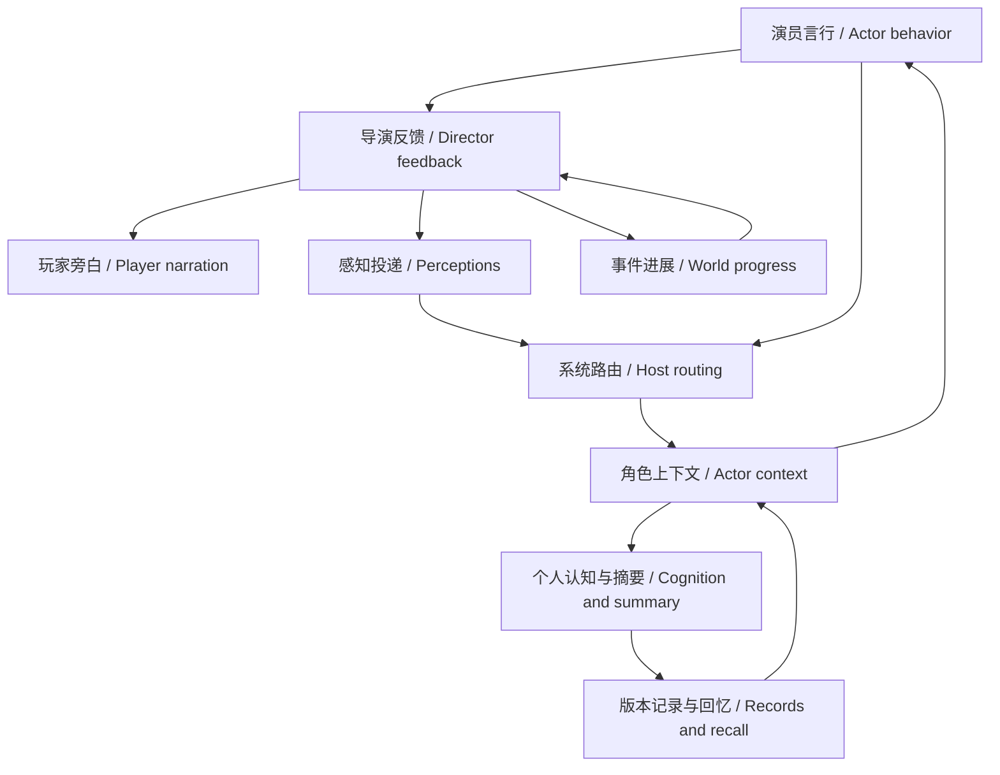

# Agent Note: Storyweaver 群组讨论、感知与记忆演进

Status: implemented

[English](2026-09-12-discussion-perception-memory.md) | 中文

## Problem

角色需要回应彼此，只接收自身可感知的信息，并让个人经历影响后续选择。既有运行时已有路由、持久化和玩家控制能力；本次完成规划中的讨论／感知／记忆链路，保留这些基础。

## Decision

产品现已采用[后台记忆队列](2026-09-13-background-memory-queue.zh.md)，前台结束不再等待私有整理。队列说明负责调度和结果接入；下文的感知、审核、回忆和评测决策继续适用。

D1–D4、S1–S3、M1–M6 已在下列范围实现并验证。K1–K8 继续作为保护边界，不是可选优化。本记录确认功能实现，不保证生成文字永远正确。文末保留成功和失败实验；其中旧的“下一步”描述属于历史，不是当前未交付事项。

| 需求 | 已交付行为 | 验证入口 |
|---|---|---|
| D1–D4 | 私有讨论请求与宿主决策；可配置发言机会、定向交接、公开预算、灵活发言及有界反馈／恢复。 | 核心讨论测试、演员执行器、服务组合、讨论设置界面及浏览器流程。 |
| S1–S3 | 共享感知与个别补充／替换、受限行为、观察者本地身份及尝试／结果关联。 | 世界测试、感知反馈组合及原生私有线索样本。 |
| M1–M3 | 相关摘要选择、精确／详情回忆、演员／导演私有整理、带依据的经历及理解与未决事项修订。 | 记忆／运行时测试、实际执行请求及原生回忆／修订／A5 探针。 |
| M4–M5 | 默认审核、可选自动启用、直接核对原文、纠正、停用、历史、重试、回退／导入及显式遗忘。 | 核心、SQLite、控制器、记忆界面和浏览器测试。 |
| M6 | 符合出身的初始知识、隔离的后天认知，以及间隔观察与反例后的经验修订。 | 背景知识测试及原生穿越者／儿童／原住民场景。 |

SQLite 仍是权威存储。模型提交限定范围的变化并调用回忆，不使用任意文件路径。摘要替换后仍可读取原文及来源版本。玩家旁白不自动成为角色证据，私有认知不成为公开讨论。角色错误仍是主观看法，动作尝试需要世界结果。

已保存设置继续优先。eagerness 保持为调度回退值，balanced 可显式选择。新指导采用灵活发言，不设置字符硬上限。发布的 Web 配置采用演员／导演各 16 条来源的整理阈值、两批限制和两次反馈续行；单独服务的默认整理仍关闭。产品默认先审核后替换，自动启用需显式设置角色策略。

K1–K8 的验证覆盖角色／实例与历史身份隔离、原子拒绝及取消、玩家发言与沉默、归档／改写行为、已存配方／共享语义、完整原文检索与原生用量，以及复用现有玩家面板。未使用玩家实例作为评估目标。

## Verification

当前功能回归通过 56 个文件的 324 项测试（.tmp/discussion-memory-completion-regression.log）。最新构建、13 项原文审核组件测试和独立浏览器流程通过。浏览器以模拟提供方验证批准前读原文、纠正、停用和讨论恢复。这些结果不表示全仓库检查全部通过。

| 场景 | 已核对证据 | 结论边界 |
|---|---|---|
| A1 | 14-33-49 当前构建遗物争议：六次公开机会、每人两次；破坏失败改变选择，通道反馈改变通行顺序。 | 审核模式；有界停止时并非所有人已逃离。 |
| A2 | 10-37-04 安静承诺：保管、修订 75 归还、修订 78 收起凭据。 | 样本仍有条款重复和一处旁白连续性问题。 |
| A3/A4 | 08-59-57 感知样本与当前组合测试：共享钟声一次、私有线索隔离、动作结算、玩家发言权保留。 | 发言仍可能缺乏依据；路由不判定文字真伪。 |
| A5 | 14-27-08 high 样本在修订中保留目击归因、传闻归属和依据经历作出的后续选择。 | low 反例仍保留；一组对照不是错误率估计。 |
| A6 | 当前核心／SQLite／控制器／界面回归、浏览器批准／纠正／停用，以及原生精确回忆和经历修订探针。 | 玩家审核仍是主动操作，不是自动事实认证。 |
| A7 | 09-24-44 恢复后的成长运行完成重复、反例和迁移阶段，每阶段有新的实际感知。 | 保留初次超时；时间跳转不模拟完整人生。 |

完整产物路径、测试和观察记录于 .tmp/discussion-memory-completion-audit.json 及下方保留记录。样本使用隔离临时实例。不应为声称文字普遍完美而继续追加原生重跑；已交付审核控制应对设计明确允许的摘要错误可能。

## Alternatives considered

整体重写或照搬 MVP 调度会丢失既有保护，且不能隔离停滞原因。统一旁白解析器或额外感知裁判会增加成本和分歧；共享投递配合显式例外足够。自由记忆文件会重复权威存储并削弱归属。强制自动启用会放大错误摘要，每句话后强制额外整理则增加延迟。这些方案未采用。

## Consequences

完整讨论／感知／记忆流程已可用，并保留玩家控制和可撤销摘要。模型生成的归因、重复、背景说法及年龄相符的文风仍有质量限制，存储校验不提供这些保证。保留来源核对和审核；A5 high 样本成功不构成覆盖模型偏好的理由。

成本仍高：当前 A1 耗时 538 秒，输出 93,724 token，其中整理 56,517，七次无效工具提交后成功恢复。缓存读取比例约 80%，不承诺其他运行相同，也不证明总成本下降。指定修改文档的双语配对通过；功能范围外既有全仓库文档失败继续记录，不做隐式修复。本次本地交付不表示已部署、提交 Git 或迁移玩家数据。

玩家操作见[指南](../../../../docs/roleplay-discussion-memory-guide.zh.md)。

## 保留的规划与评估记录

早期决策、实验与失败分支

以下保留原计划与中间证据。旧的剩余工作说明对应当时检查点；当前交付范围和验证以上文为准。

### Problem

#### 本轮范围与执行入口

当前按完整实现目标继续执行。下方已有实现与评测记录作为保留基线；每批先核对缺口，不能按最初的新增清单再次建设。玩家实例及已保存配置不作为测试或重置目标。

| 工作 | 下一步只解决什么 | 进入下一阶段的依据 |
|---|---|---|
| 群组讨论 D1–D4 | 核验主动申请、发言机会、定向回应及行动后的续接，借鉴 MVP 的节奏而非复制整个调度器。 | 同一场景能承接具体发言并形成下一步选择；沉默、拒绝与玩家席位仍有效。 |
| 感知 S1–S3 | 核验导演结算到每名角色实际请求的链路，尤其是共同变化、私密线索和行动结果。 | 该知道的人收到结果，不该知道的人没有收到；已结算尝试不因丢失反馈反复提出。 |
| 记忆 M1–M5 | 核验简述、详情、原文的分工，优先修正经历归属、过时未决事项及检索时间含义。 | 后续选择能引用正确经历，新的证据可以修订认识，纠正或停用摘要后仍可追溯。 |
| 成长 M6 | 在前述链路稳定后，对照穿越者与原生角色的初始知识和学习过程。 | 未知设定通过经历逐步获得，反证影响判断；时间跳跃本身不算学习证据。 |

每批实施沿用下文需求编号与 K1–K8 保护项，列出修改文件、现有行为、预期差异、验证入口及恢复办法。优先调整提示词和现有投影，只有表达能力确实不足时才增加工具或持久化字段；新增字段须先明确实例归属、来源、版本及导入回放处理。

M1/M2 时间来源核验确认，个人判断和状态历史未保存故事发生修订，不能从当前实体快照恢复它。[retention-records.ts](../../../../packages/story/roleplay-core/src/retention-records.ts) 因此明确投影 revisionScope: record，保留版本和引用，不再与事件修订比较。无时间个人原文按稳定标识单独排序；混合来源摘要的时间范围为 null，混合或无时间整理批次不推断较新事件窗口。保留摘要回忆同样标明记录版本。无持久化格式或配置变更，不能声称已补全个人认知时间线。

该批构建、142 项领域测试和三项真实装配测试通过；新增 RPC 断言复测通过，验证摘要版本标记通过实际接口返回，事件修订保持原义。来源块快照记录个人版本标记；历史回放与存档往返验证判断的标记和隔离。修改的排序／回忆源码及专属测试 lint 通过，types.ts 的未触及用量结构仍有七项既有分隔符诊断。没有运行新的原生模型样本，不从机制测试推断叙事质量改善。

M1/K6 后续核验覆盖普通角色政策：记录版本不是经历年龄，null 来源范围表示至少一条来源时间未知，显示顺序不能补足该时间。实际 Harness 系统提示断言及协议快照验证说明已投递；一项演员装配和三项服务装配测试通过，定向 lint 通过。保存的作者配方、文风和模型配置不变。该批验证政策传递，不声称未知个人历史已经获得时间戳或模型时间推理已普遍正确。

修正评测夹具后的原生完整复测 `2026-09-12T13-17-00-826Z` 在 61,330 毫秒通过，两次私有整理；已处理原文没有重复投递，额外佐证没有丢失，精确回忆与私密隔离通过。初始记忆引用较新答复，不再把存放问题保留为未答复；后续角色以亲眼观察为依据选择不照旧告示办。质量仍未通过：首次及修订后的经历详情把目击落水写成亲手放入，最终摘要把未获导演结算的归放尝试写成已落定，复述亦重复。普通／整理输出为 1,689／9,269 token；该样本没有未覆盖历史剩余，也不是时间指导的因果对照。独立 quality-review.json 保留这些失败，humanReviewed=false；显式自动生效仅用于隔离夹具，产品审核默认不变。

验收分为机制正确、叙事质量和成本三栏。缓存命中率超过 60% 是玩家观测，不能单独证明记忆有效；应同时比较实际输入输出、整理额外调用、首 token 时间和后续行动。随机措辞缺陷保留为质量记录，不无限扩张成功标准。详细范围、保护项、阶段及场景分别见下文对应章节。

M2/S3/K2 的请求核验找到待结算状态在私有背景筛选时丢失：普通角色 evidence 区块包含待反馈尝试，整理却与普通事件流一起排除它。新增 consolidation-pending 区块只保留冻结快照中本人、本批次仍待反馈的尝试编号，无动作正文或批次外成员，且明确缺席不代表成功。不改变结算、权限、存储或审核。构建、定向 lint、144 项领域测试及四项真实装配测试通过；新增运行时回归验证整理后的动作仍待结算、提案仍待审核，来源快照验证范围和提示内容。先前原生样本早于本修复，语义效果仍须复测。

待结算区块的原生复测 `2026-09-12T13-23-54-990Z` 在 73,426 毫秒完成并通过运行检查。归档确认修订 17 的真实整理请求包含本批次泡水尝试的待反馈编号，最终 outcome 摘要却仍把它写成已经形成的现场安排；因此投递验证通过，语义保真失败。最初经历仍误写亲手放入；一条问题摘要后来标记 resolved，但省略详情更新导致旧经历和 unresolved 问题仍保留。普通／整理输出为 6,504／8,428 token，轨迹不同，不作成本因果比较。独立质量审阅保存具体区块与失败，下一步核验摘要修订时简述、状态与可选详情的一致性；不以再次增加相同提示替代定位。

M1/M3 修订核验确认，省略 episode 保留原详情是已有兼容语义，且修订、解决、撤回、归档均有回归覆盖。为避免盲目删除可能仍有意义的问题，简述索引增加 unresolvedCount，表明详情中仍保存多少问题，不直接断言它们当前未决。共享工具说明明确只改状态不会清除这些内容，仍要求先读详情再提交完整修订。存储、历史和审核不变。160 项领域、字段结构和真实装配测试通过，六份所属快照更新；修订后的计数为零、实例隔离和原版本保留均验证。定向源码 lint 通过，原生是否主动正确修订详情仍未验证。

未决计数后的开放经历原生样本 `2026-09-12T13-30-40-790Z` 在 35,158 毫秒通过，只有一次私有整理，记忆均停留在版本 1。简述和详情正确保留目击滑入水中，后续选择承接观察，旧存放问题通过较新答复被补全。普通／整理输出为 1,915／4,418 token。本次没有详情修订或待结算动作，不能证明计数改善修订、待反馈指导改善语义，也不能归因成本下降。下一验证改为固定一条带未决问题的已有经历，再投递明确答复，直接观察读取和修订；不再依赖开放场景随机生成目标分支。独立审阅保留此覆盖缺口。

M3 定向验收新增 episode-revision-performance.e2e.ts：受控预置一条“客人几点取铜钥匙”的经历，再明确投递七点归还完成，仅让原生演员回应。样本 `2026-09-12T13-34-08-549Z` 原生用时 4,048 毫秒、输出 671 token，简述修订并标为 resolved，但旧详情及未决问题完全未改，结构断言按预期暴露失败。该失败测试保留，不能降低为只检查简述。夹具 lint 通过，产物在断言之前完整保存，预置与原生用量分离。后续以此短场景检验详情修订，避免反复运行无法保证覆盖目标分支的开放经历。

M3 修复将先读后改指导放入实际常驻 USING RETAINED NOTES 区块，保留字段说明和原有省略详情语义。构建、源码 lint、143 项领域／装配测试通过，两份所属快照更新。定向原生样本 `2026-09-12T13-37-53-648Z` 在 7,896 毫秒通过：事件 475 记录 narrative_recall 精确读取旧详情，同一记忆随后修订到版本 2，保留过去寄存经历，补入七点归还，更新解释并清空 unresolved。输出 1,370 token；这是短场景的成功链路证据，不是普遍保真或成本下降证明。此前失败样本保留，独立质量审阅不等于玩家批准，存储和审核默认不变。

D1–D4/K4/K6/M4 当前工作区复核：讨论创建和申请接受都捕获已保存的 floorPolicy，缺省仍为 eagerness；可选 balanced 不追溯改写旧配置。公开预算来自实际公开贡献数，不把私有准备算作发言。最新 [浏览器整链路](../../../../apps/web/tests/independent-narrative.e2e.ts) 在 19.68 秒通过，覆盖创建讨论、准备状态、打断／恢复、两人公开贡献、导演关闭及记忆审核／纠正入口；[设置控件](../../../../packages/client/ui-narrative/tests/discussion-settings.client.spec.tsx) 和讨论统计共五项测试通过，覆盖过时申请错误恢复、保存策略和公开余量显示。模型响应由录制模拟提供方控制，证明当前接口到界面链路，不能代替原生主动性或调度质量对照。不改变默认策略，也不据此宣称玩家拥有角色的全部分支已获浏览器覆盖。

D2/S3/K4 新增 player-discussion-feedback.real.spec.ts，补齐已有领域回归到发布工具和 SQLite 的装配证据。显式 balanced 下，AI 先发言并尝试开门，导演通过 director_observe 结算，讨论保持 active 且 playerTurn=true；自动调用玩家角色被拒绝，没有新增模型请求；导出导入后仍保留玩家席位。该测试与定向 lint 通过，不更改运行代码或默认值，不冒充浏览器／原生生成验收。夹具调试中的错误参数已修正，当前通过结果才是本次证据。

当前整合回归 `.tmp/discussion-memory-integrated.log` 覆盖 roleplay-core、roleplay-services、roleplay-store-sqlite，以及演员实际执行器和导演字段结构：24 个文件、214 项测试通过，未使用快照更新模式。与近期浏览器回归和原生经历修订成功样本分别构成机制、交互与单场景生成证据。尚未关闭的质量项是经历归属、尝试与结果的叙述保真，以及部分讨论重复；不得用本次绿色结果替代它们的原生验收。详情修订已由短场景验证，后续无需为同一已通过分支重复开放故事探针；下一次生成调整应针对上述未通过项，保留现有成功场景作为回归。

待结算动作的展示已在对应原文及执行内短引用 sourceRef 旁直接标注 resultStatus=awaiting-world-feedback，复用状态区块中同一冻结版本、同一角色范围的待结算交集。不改变原文、持久记录、来源归属、结算或审核策略。相关领域验证通过 145 项测试，日志为 .tmp/pending-inline-domain.log。这证明状态展示与隔离正确，不代表原生模型的语义可靠性已通过；此前把尝试写成完成的原生失败仍保留，等待针对性原生评估。

原文旁状态调整后的定向原生待结算探针通过：.artifacts/pending-attempt/2026-09-12T13-58-30-497Z。Flash/low 先回忆再提交一条记忆，摘要和详情均保留结果不确定性，宿主动作仍待结算。执行耗时 5,461 毫秒；原生整理两步、输出 810 token，模拟种子的用量另列。详情仍含“提交动作”等系统化措辞，因此这只证明一个固定用例中的待结算结果保留正确，不证明文风自然或混合批次可靠。构建与探针代码检查通过；此前混合批次失败记录继续保留。

当前混合历史样本 .artifacts/independent-memory/2026-09-12T14-00-36-437Z 在 78,395 毫秒内完成，两次私有整理输出 11,056 token，两步普通角色调用输出 3,900 token。传闻保留归属，反证影响次日选择，后续查看标签动作明确保持未确认。但归因仍失败：第一次普通 context_update 把目击写成亲测，整理进一步写成亲手浸水。共用的记忆 text 字段指导现已区分第一人称回忆与行为主体，并说明自己的复述不是行为发生的独立证据，覆盖普通和私有提交，不改写已存记忆。审核协议描述变化并更新五份快照后，18 项结构、修订和执行器测试通过，源码检查通过。新增指导尚待原生验证。源码／配置审计同时修正过时的默认值决策描述，区分已发布配置和服务级默认值。

加入共用行为主体指导后，.artifacts/independent-memory/2026-09-12T14-06-02-316Z 在 81,197 毫秒内完成。两步普通角色调用输出 2,767 token，两次私有整理共十一调用步、输出 11,534 token。首次普通回合没有创建记忆，但发言把观察称作试验。首次私有批次收到正确的“材料滑进水中”原文，详情仍写成角色把材料放入水中，第二批继续保留。传闻归属、后续依据经历作出选择、待结算查看动作均正确。这是语义归因失败，不是投递缺失或原始存储被改写；此样本未证明新指导成功。构建通过。综合回归最初通过 215 项中的 214 项，唯一服务协议快照差异只有预期的共用描述；核对更新后，两项组合测试通过。保留失败证据，没有不同机制可验证时不再追加近义指令。完成审计须区分已验证的来源／审核机制和生成质量，既不能声称归因问题已解决，也不能悄悄把计划改成要求所有文字永远正确。

M3/M4 审计发现具体审核体验缺口：来源只有编号，需要手动检索，生效记忆的详情只能进入纠正查看。Retention 现提供折叠的只读详情，以及记忆和提案的原文按钮，包含处理范围外的补充依据。复用限定角色范围的检索，保留加载、失败重试并聚焦结果；读取不会批准或修改记忆。四项组件测试和扩展后的独立浏览器流程通过，覆盖批准前读取精确原文及后续纠正／停用。构建通过，修改的组件和测试代码检查通过；locales 在新增键以外仍有既有引号诊断。已检查 .tmp/memory-source-review.png：入口和检索结果可见，但部分原文仍沿用结构化文本显示。本次交付直接核对入口，不声称语义归因错误已修复。玩家指南和 UI README 已同步双语更新。

M3/M4 原文核对现将完整、可识别的接收者发言／行动记录显示为当时的称呼、传达方式／对象和原始内容，完整记录保留在折叠的“原始数据”中。身份／修订不匹配、分段及不支持的结构保持原样。不判定世界真相、不修改记忆、不读取当前身份、不执行嵌入标记。首次构建正确拦截了跨浏览器边界的领域运行时导入；现采用界面内部只读展示识别器和仅类型的领域导入，没有放宽打包规则。十三项组件测试、源码／测试检查、构建及扩展浏览器流程通过。浏览器断言批准前原话可见、原始 JSON 折叠；已检查 .tmp/memory-source-review.png。既有批准、纠正和停用流程继续通过。指南与 UI README 双语配对一致；语义归因仍是独立未解决的质量问题。

A5 推理强度对照得到通过的 high 样本：.artifacts/independent-memory/2026-09-12T14-27-08-320Z。模型 ID、历史格式、完整历史、发布文档和执行预算与 14-06-02 的 low 样本一致，实际执行请求记录 high。审阅首次和修订后的详情，均保留材料滑入水中及本人观察，区分传闻与亲见，影响次日选择，并将新搬移动作保留为未确认。耗时 102,092 毫秒，普通角色输出 2,577、整理输出 16,788 token，整理共六调用步；low 耗时 81,197 毫秒，输出分别为 2,767／11,534。最终四条记忆仍有重复。对照保存在 .tmp/memory-agency-effort-comparison.json。这证明现有可选配置下能完成预期 A5 链路，不证明普遍更优、已测得错误率或应该覆盖既有默认值。普通角色和私有整理均使用 high，未单独隔离记忆生成阶段的效果。low 失败记录与默认先审核策略继续保留。

当前构建的 A1 原生验收在 .artifacts/independent-discussion/2026-09-12T14-33-49-743Z/A1-artifact/balanced 完成，耗时 538,322 毫秒，使用审核模式及发布配置的 16 条来源／两批设置。六次公开机会中每位角色各两次。破坏失败引出具体质疑、承认缺乏证据、保留分歧的撤退，以及收到狭窄通道反馈后的通行顺序调整。一人到达坡另一侧，其余等候；有界运行不宣称所有人已逃离。七次被拒工具输入均恢复。总输出 93,724 token，其中整理 56,517；缓存读取占已记录输入的 80.05%。这证明当前完整讨论／反馈链路可用，不证明无错误、成本下降或所有文字简洁。A1–A7 证据与 K1–K8 机制回归已汇入 .tmp/discussion-memory-completion-audit.json。剩余交付工作为文档生命周期核对，并简明说明实现、验证和限制；不应仅为消除一般随机文风问题继续增加功能或重复原生评估。

#### 本轮决策摘要

以下保留既有增量实施与验收记录，供后续计划核对。工作区已有实现与评测不能算作本轮新增，也不能把代码存在当作完整验收。后续实施使用隔离实例，不修改玩家活动故事。

| 优先级 | 下一步要解决的问题 | 完成的判断 |
|---|---|---|
| 1：群组讨论 | 借鉴 MVP 的发言机会分配，检查角色是否回应具体发言、提出行动并推动选择；分别比较调度、篇幅与提示词。 | 同场景中角色能提出并执行有动机的下一步，也允许拒绝、沉默与僵局；不能用更多轮次代替进展。 |
| 2：感知闭环 | 沿用导演生成感知、系统投递的方案，补齐行动结果和可感知转场；不解析整段旁白来自动广播。 | 角色实际请求包含应知的新情况，未在场者与私密交流之外的人不会因此得知。 |
| 3：个人记忆 | 由角色整理自己的经历、理解、影响及未决事项，默认上下文提供相关简述，详情和原文按需读取。 | 后续相关场景中的选择受到经历影响；误解可被修订，原始证据与历史版本仍可追溯。 |
| 4：长期成长与默认值 | 在上述闭环稳定后，再评估穿越者和原生成长角色，选择审核方式、整理时机和预算。 | 角色呈现知识差异与有依据的变化；同时记录质量、延迟、输入输出及缓存成本。 |

详细变更沿用 D1–D4、S1–S3、M1–M6 编号。已有代码的项目先验证并补缺；只有缺少必要表达时才增加数据或工具。M4 默认保留替换前审核，依据是当前实测仍有语义误读；显式自动生效仍可选择。调度和预算仍需对照，不把探索性建议直接视为已确认配置。

阅读顺序：[当前缺口与已有实现](#current-gaps-and-existing-implementation) → [回归保护边界](#preservation-boundaries) → [分阶段实施](#delivery-phases) → [验收场景](#acceptance-criteria)。D／S／M 表负责定义改动，K 表负责保护既有行为，P 表负责顺序，A 表负责验收；后面的执行记录只提供证据，不另外定义需求。用户报告的缓存命中和扮演评分作为比较起点，不承诺每次请求保持固定命中率。

玩家操作及审核语义见[群组讨论与角色记忆使用说明](../../../../docs/roleplay-discussion-memory-guide.zh.md)。

#### 当前验收状态

领域、模型工具、持久化、接口和既有玩家界面均已有实现。当前综合功能回归通过 56 个文件的 324 项测试，覆盖核心、服务、演员、界面、控制器、发布配置和 SQLite（.tmp/discussion-memory-completion-regression.log）。最新构建及浏览器原文核对／批准／纠正／停用流程通过。这证明已覆盖机制可用，不代表全仓库整洁或所有扮演语义正确。逐项审计记录于 .tmp/discussion-memory-completion-audit.json；最新 A5 归因反例仍未解决。评估不重置玩家故事或已保存的默认选择。

| 范围 | 已验证机制与真实样本 | 剩余验收 |
|---|---|---|
| D1–D4／A1、A2 | 主动申请、处理、私有准备、公开机会、交棒、暂停与有界恢复已有回归。A1 调度对照与 A2 次日还钥匙完整结束。新配方采用灵活贡献，保留已存偏好与调度默认。 | 部分场景仍反复检查和解释。评估实质选择与沉默，不增加轮数或强制人人发言。 |
| S1–S3／A3、A4 | 共同／私密投递、隐蔽尝试及结算关联通过实际提供方组合验证。最新真实私密样本结算了尝试，见证者完整请求不含私密代码，未提交未授权认知。 | 仍有一次行为结构错误后修复。无来源背景与语义转述的泄密需审阅输出，路由校验不能证明所有文字都正确。 |
| M1–M5／A5、A6 | 本人简述、详情与原文读取，私有整理，来源／版本校验，审核／自动策略，纠正、停用和恢复已接通。真实回忆样本主动读取预置步骤，另一份带发言归属的经历样本保留目击和时长。 | 其他样本仍混淆尝试归属、在详情中重复简述，且整理开销较大。单次成功不能证明错误率下降，保留替换前审核。 |
| M6／A7 | 差异化初始知识及重复／反例／迁移已有实际请求证据。十年变体经存档恢复完成三个阶段；成年角色收到十八岁的感知，并根据旧经历作出选择。 | 这是 900 秒超时后的分段完成。时间跳转不等于十年生活学习，也不能证明记忆的独立因果作用；年龄与人物口吻仍需纵向观察。 |

十年样本 `2026-09-12T09-04-53-222Z/A7-decade-growth/balanced` 保留完整采集产物与超时分支。记录的原生输入为 1,162,104 token，其中缓存读取 739,968（63.7%）；输出为 161,160，其中整理 97,877（60.7%）。统计包含已记录的失败与重试，中断响应可能缺少用量。较高命中率与较高总成本可以同时存在。Codex 审阅不等于玩家批准。

当前工作区通过合并运行的 53 文件／302 项功能回归，以及独立浏览器中的审核、纠正和停用场景。相关控制器、SQLite、演员和配置 README 已按已验证的集成与原生测量修正描述，不宣称普遍质量达标。261 个包的模型体验和限制章节检查通过，2,283 份 Markdown 的交叉链接可解析。全仓文档汇总仍为十项通过、五项失败：旧文档换行、缺失的中英文配对、Agent Note 格式、根指令字数预算及其他 README 结构问题（目前暴露到 story-home）。本次更新的指定配对通过。这些检查不消除尚存的叙事质量问题，也不能单独证明完整目标完成。

#### 剩余工作的顺序

当前核对区分实现与生成质量。可检查的共同证据见[领域回归](../../../../packages/story/roleplay-core/tests/world.spec.ts)、[执行器组合](../../../../packages/story/roleplay-services/tests/composition.real.spec.ts)及[记忆编辑测试](../../../../packages/client/ui-narrative/tests/retention-fields.client.spec.tsx)。

| 需求 | 已验证实现 | 剩余限制或工作 |
|---|---|---|
| D1 | 私有申请、去重、精确接受和原生主动发起；实际导演工具接受及重试已覆盖。 | 未证明自发频率。 |
| D2 | 保存的策略、机会公平性、定向交棒及 A1 对照。 | 没有普遍优胜的调度。 |
| D3 | 公开预算排除准备，保存的篇幅覆盖进入请求。 | 正文仍可能重复条款。 |
| D4 | 等待结果后恢复，当前 A2 完成寄存／归还链路。 | 部分日常旁白冗长。 |
| S1 | 共同、补充及替换感知与原子顺序。 | 文学一致性仍需审阅。 |
| S2 | 隐蔽尝试、耳语隔离，原生见证者未收到私密代码。 | 不做无依据说法的语义分类。 |
| S3 | 结算关联、有界反馈、取消及玩家控制。 | 尝试动作不等于确认成功。 |
| M1 | 相关简述、目标与按需详情／原文。 | 精简投影已保留回忆中的完整来源；语义保真仍在验收。 |
| M2 | 演员／导演冻结批次，待审核不重复整理。 | 替换体积需计入元数据而非只数正文，整理仍昂贵。 |
| M3 | 经历、版本化修订及原生先读后更新。 | 摘要仍可能重复或误读经历。 |
| M4 | 默认审核、显式自动、纠正和停用。 | 模型审阅不等于玩家批准。 |
| M5 | 来源覆盖、重试、回退、导入、置顶和显式遗忘。 | 来源有效本身不证明语义正确。 |
| M6 | 出身知识及原生重复／反例／迁移上下文。 | 时间跳跃不证明终身学习或成熟口吻。 |

K1–K8 仍是这些改动的强制保护项。归档中相同来源的请求片段揭示一个具体 M1／M2 缺口：五条原文共 1,459 字符，三条替换摘要却有 1,526（`2026-09-12T10-09-41-153Z`）；`2026-09-12T10-15-49-260Z` 的两条替换摘要为 1,163。这些计数排除无关上下文，不是 token 测量，且早于最新共同指导；它们说明正文变短不等于请求变小。下一步先检查简述投影，不继续只调提示词，也不从存储删除来源。

##### 精简记忆简述：实现与验证

本批限定为 [retention-records.ts](../../../../packages/story/roleplay-core/src/retention-records.ts) 中模型可见的投影及所属测试、文档。保留记忆标识、修订号、认知类型、状态、简述正文和可用的回忆引用。评估从普通简述中去除重复的所有者／作者字段和完整来源 ID 数组；存储与既有回忆响应仍保留完整来源。不改变审核、来源覆盖、归档、修订校验、上下文分区开关或已保存的作者配方。移除字段前，先验证现有读取与更新链路是否依赖它。

验收必须覆盖演员与导演的请求快照、记忆详情／原文读取及后续修订、所有者隔离，以及替换分区关闭时原文仍然保留。同一批渲染片段前后对照，计入元数据和共同指导。字符数与原生输入输出 token、缓存用量分开报告；投影更短不代表扮演质量更好。投影批次已经实现；更广泛的记忆质量验收仍未完成。

精简投影通过 143 项领域／修订测试、三项执行器组合测试及构建。计入未变共同指导的归档记忆区块对照，从 1,778 减至 1,394 字符，另一份从 1,415 减至 1,094；这是字符投影，不是原生 token 节省量。原生样本 `2026-09-12T11-14-20-551Z` 用时 41,585 毫秒完成：实际回忆先读旧详情引用再修订，所有者保持隔离，被覆盖原文未重复进入上下文。初次摘要仍把湿放提议写成已实施的改变，后续修订才改成提议，重复问题仍在。本样本整理输出 6,403 token、普通演员输出 1,528 token，没有受控成本对照。全仓文档检查仍为八项通过、七项失败，问题不在本次修改的文档对中；既有世界测试文件另有未触及位置的格式诊断。这些限制不否定投影专项验证，也不能证明 M2／M3 质量验收完成。

##### 整理背景与个人回忆复述

原生样本 `2026-09-12T11-14-20-551Z` 的首次私有请求包含较新的个人回忆，声称已经实施湿放计划。指定的较早事件没有这句话，新摘要却再次使用它。因此私有背景排除标识为个人回忆的生命周期记录，仍保留目标、信念、保留摘要和作者配方分区。明确分配的个人回忆仍保留在来源批次中。普通扮演和回忆读取仍保留个人记录，不改变存储、审核或来源覆盖策略。两个投影测试、三项实际执行器组合测试和构建通过；组合测试确认同一条个人回忆在私有整理中缺席，在后续普通扮演中恢复。本改动处理已观察到的输入混淆，不引入语义分类器，也不承诺以后所有摘要都准确。

原生样本 `2026-09-12T11-19-29-820Z` 在 57,734 毫秒完成，两次私有请求均未携带个人回忆背景。首次摘要保留接取失败和半个时辰观察，明确尚未改动存放办法。但后续发言仍将先前提议的隔夜浸泡说成已经实施，未提交对应动作；新摘要没有始终保留这个区别，旧未决问题也仍在。普通演员／整理输出为 2,997／7,689 token。本样本验证输入隔离，不证明普遍保真或成本下降。

D1 执行器验收现从已有讨论到记忆的组合继续运行，提交新的私有申请，再由 `director_command` 接受。两项组合测试通过：接受只创建一场讨论，两名参与者仍待准备，`advanceDiscussion=false` 不调度表演；重试同一导演命令返回原回执，不增加模型请求。原生主动发起仍由此前申请样本单独提供证据；本次模拟提供方组合不测量导演的自发决策。

D3 同版本对照记录的构建文件指纹一致，移除演员篇幅偏好后故事书完全相同。两组 A1/balanced 都采用审核策略及发布配置的 16 条整理阈值。各组六个公开贡献的长度中位数分别为长篇幅 379、灵活篇幅 156.5 个 Unicode 码点。灵活组 `2026-09-12T11-44-38-095Z` 在 583,948 毫秒完成，三人各有两次公开机会，后续逃离过程承接世界反馈。长篇幅组 `2026-09-12T11-34-30-929Z` 完成公开讨论，却在导演整理阶段于 600,064 毫秒超时：24 次调用增加了错误的 arguments 外层。其整理输出 86,678 token，灵活组为 49,748；全程缓存比例分别为 89.6% 和 79.8%。不同故事路径和修正调用使总成本不能单独归因于篇幅。本对照支持灵活公开贡献的方向，不证明普遍质量或 token 节省。导演私有政策现明确要求 command 外层，禁止 arguments／command.command 封装；新增执行器回归检查拒绝、修正后的完整提交、回执重试和失败请求纳入用量。这两个原生样本均早于该协议修复。

##### 导演回忆说明：验证结果

固定导演原生样本 `2026-09-12T12-00-34-122Z` 在 20,223 毫秒完成，归还钥匙摘要正确且待审核，command 封装有效，但有两次续读错误和一次摘要目标不存在。导演回忆缺少演员已有的字段指导。现为普通和私有导演工具共享说明：精确编号放在 query、检索词同时匹配、sourceId 仅供续读。检索、权限、存储和审核策略不变。

构建、定向 lint、十项 schema 测试及三项 Harness 组合测试通过；更新导演 schema 与三份请求快照。原生复测 `2026-09-12T12-11-13-149Z` 在 5,895 毫秒完成，无工具错误：整理两步、输出 526 token。待审核摘要正确保留已归还结果，没有写入世界或调度演员。本次未调用回忆，不能证明精确读取恢复或误用率下降。两份产物质量审阅均由 Codex 完成，不等于玩家批准。此前广泛回归证据及文档失败仍按上文记录。

##### 私有记忆排除公开表达指导

M2/K2/K6/K7：演员私有请求此前已排除表演和场景风格区块，却仍携带保存的表达配置，包括公开发言篇幅。导演还在指导目录内复制当前场景指令。现为两类所有者的整理背景排除表演、风格、场景风格及旁白篇幅；导演记忆查询同时省略重复的表演指令目录。身份、可见认知、保留摘要及其他作者模块仍可用。不更改存储配置、普通请求或摘要生效策略。

构建、定向 lint、139 项领域测试及三项实际 Harness 组合测试通过。两份包内上下文快照记录私有区块角色及顺序。实际请求断言验证：演员／导演长篇表达偏好及场景提示在整理前后出现，在整理中消失。原生固定经历探针支持既有评测篇幅覆盖并记录发布文档，允许在显式长篇偏好下检查隔离。真实生成质量另行审阅；移除无关指导本身不证明语义保真或净 token 节省。

原生样本 `2026-09-12T12-20-36-007Z` 使用带归属的固定经历及显式 400–800 字公开篇幅偏好，在 64,957 毫秒完成。两次私有请求均省略风格，普通请求保留；两次回忆调用成功，无工具错误。整理共两回合、四步、输出 9,617 token。后续选择引用观察到的反证，但首轮台词和经历详情把意外入水误写为学徒亲手放入，后续条款仍有重复。产物审阅保留这一失败。夹具显式使用自动生效，产品审核默认不变。这证明请求隔离及有界执行，不证明语义保真或受控成本下降。

A5/M2 评测区分演员误读与过严夹具。相同构建的低／高推理样本 `2026-09-12T12-31-49-036Z`、`2026-09-12T12-32-09-042Z` 使用一致的预置经历和篇幅设置。低推理在普通回合整理三条来源，剩余未处理来源不足以启动私有批次，行为合法；夹具却要求所有原文都已成为摘要，因而提前结束。高推理在 104,158 毫秒完成，仍将目击入水误记为亲手放入。不据此修改默认值，未完成与完成样本的总成本也不可直接比较。

夹具现记录剩余原文并检查其与有效摘要共同可用，仍要求精确回忆、隔离及排除被覆盖原文。新增领域回归验证普通回合的部分整理、剩余原文可见，以及后来新证据触发私有批次；137 项 world 测试与夹具 lint 通过。原生复测 `2026-09-12T12-35-50-564Z` 在 58,053 毫秒完成。首份经历正确保留意外入水，但后续行为在干托盘感知下虚构带标记的湿样。本样本恰好覆盖全部原文，不声称已验证原生部分覆盖后的选择；该分支由确定性回归覆盖。报告保留上述质量限制及夹具显式自动生效策略。

M2/K1/K2/K6/K7 来源呈现现将冻结引用头与保留原文的代码块分开，演员和导演共用。来源值、原有顺序、本地引用和正文保持不变，内嵌围栏也完整保留，避免第二层 JSON 正文转义。不修改来源选择、存储、回忆或普通表演。渲染器具备完整输出快照，实际 Harness 请求检查原文块。构建、定向 lint 与 139 项领域测试通过；三项 Harness 组合测试及两项格式测试也通过。对 `2026-09-12T12-35-50-564Z` 的相同来源，纯来源文字分别从 1,087 降至 1,042、从 2,647 降至 2,458 个 Unicode 字符。这不是 token 数量或完整请求节省，模型保真另行评测。

原文块格式的原生样本 `2026-09-12T12-42-38-900Z` 在 37,574 毫秒完成。修订 12 的一次私有执行使用两步模型调用、输出 5,338 token；一次 JSON 工具参数格式错误经重试恢复。初始经历保留了目击入水，但仍有过时未决事项和重复经过。后续普通行为虚构隔夜湿样。产物审阅因此仅证明来源引用可提交且错误可恢复，不证明记忆保真改善或成本变化的因果关系。产品审核和模型默认不变。

M2/M3/K1/K2/K7 对当前状态的核对可复用领域已允许的佐证来源引用。私有 unit.sourceIds 仍是精确处理批次，记忆变更则可引用同一冻结视角的其他原文。新增运行时回归回忆较新的归还钥匙观察，拒绝另一角色的私有线索且不留下部分写入；由于佐证来源未在该单元中被处理，它仍出现在普通证据中。共享记忆来源指导现明确该区别；演员整理在不确定旧问题当前状态时，先回忆再决定是否继续列为未决。不修改 schema、存储、可见范围或生效规则。构建、定向源码 lint、148 项领域／结构测试及三项实际 Harness 组合测试通过，字段和请求快照已更新。这证明路径可用，不证明模型会自发且语义正确地使用它。

佐证回忆原生样本 `2026-09-12T12-50-19-884Z` 在 35,788 毫秒完成，无工具错误，也未调用回忆。初始记忆保留了转述和目击入水的归属，但仍将较早的存放问题标为未答复，未结合普通回合的答复。说明后的佐证来源路径因此仅有机制验证，尚未自发演示。后续台词引用观察并提出通风架和干样对照，物理提交仍是尝试。保留这次当前状态核对失败，不宣称提示词已解决过时问题。

M1/M2/K1/K2/K7 的 consolidation-window 元数据明确显示较早批次并非当前事件的完整视图：报告批次结束修订／顺序、较新可读事件数量及第一条精确回忆引用，不投递其正文。演员候选仅来自冻结快照中已接收的事件，排除个人记录版本号及其他视角。引用记录于独立区块，分配来源成员不变。单元快照覆盖同次提交顺序、空窗口及不夹带正文；运行时佐证回忆回归检查精确指针和另一演员私有来源不出现。构建、定向 lint、141 项领域测试及三项实际 Harness 组合测试通过。不修改存储记录或策略，原生使用效果另行测量。

窗口样本 `2026-09-12T12-56-55-712Z` 的模型执行在 69,055 毫秒完成，两次精确回忆，一次工具错误经修正。首轮私有摘要引用了后来普通回合的答复，将旧存放问题记为已答复，同时保留店主是否接受尚不明确。原夹具因将所有记忆引用都算作已处理覆盖而失败。归档复核显示，后续证据中没有残留已处理原文，也没有丢失佐证原文；佐证答复按约定仍可见。夹具现分别报告和验证两类来源。这是原生核对当前状态的成功例子，不是普遍保真：首份简述仍将入水误写为学徒亲手操作。原始失败输出及独立审阅均保留。

| 优先项 | 下一项有限工作 | 保护与判断规则 |
|---|---|---|
| 1：摘要保真与压缩 | 用固定经历夹具区分简述理解、可选经历详情和可回忆原文；每次只改变一个变量，比较有来源的后续选择与全部调用成本。 | 保留归属、关键条件和未结算状态。精确来源覆盖不要求复述每句话；不另建记忆库、语义裁判或上下文总字符硬限制。 |
| 2：讨论节奏 | 复用 A1/A2，检查角色是否承接反馈行动、停止重复已结算检查，并保留各自口吻。拒绝和安静履约都可以是有效结果。 | 保留玩家席位、定向交棒、沉默、已保存文风与可配置预算。发言更多或障碍更多本身不算改善。 |

必要实现范围仍是 D1–D4、S1–S3 和 M1–M6。不把每次随机措辞缺陷都扩张为新工具或强制提示词条款。分别报告功能验收、已观察叙事质量和实测成本；保留尚未解决的质量限制，不承诺普遍真实。产品继续保留替换前审核、可选自动生效，以及既有调度和预算。

#### 背景

玩家反馈 AIAgentRolePlay MVP 的群组讨论更能促使角色主动推进。目标体验是人物持续成长：穿越者认识陌生世界，或原生角色通过亲身经历逐渐理解更大的世界。重复表达、文风趋同，以及交流无法影响后续选择，是本轮优先处理的产品问题。

本计划整理于 2026-09-12。实现按阶段逐项推进，完成状态以对应验收证据为准。工作区已有实现与验证记录保留为基线；实施时重新核对差距，不能按需求表重复建设。用户反馈缓存命中超过 60%、扮演效果约 6/10；这是玩家观测，不是受控基准或验收阈值。

### Proposal

在独立运行时上增量调整，沿用演员与导演分工。导演生成环境结果与接收者感知，系统保存并投递，演员解释自己的证据并维护个人认知。一般叙事一致性主要依赖提示词，确定性的归属、修订和事务校验继续保留。

#### 计划速览与执行约束

目标是让交流产生后续影响：角色根据自己的见闻形成理解，用这些理解决定下一次发言与行动。上下文更短、发言更多或冲突更频繁都不是独立的成功标准。

| 优先事项 | 核心增改 | 必须复用 |
|---|---|---|
| 讨论 D1–D4 | 主动申请、发言机会公平性、回应承接、公开预算与灵活篇幅。 | 私有准备、定向交棒、沉默、玩家接管和导演总结。 |
| 感知 S1–S3 | 共同感知与个别差异、隐蔽行为、尝试关联结果及有界反馈。 | 导演一次结算与系统投递，不另设感知裁判，不自动广播文学旁白。 |
| 记忆 M1–M5 | 相关概述与按需细读、角色自我整理、来源覆盖和摘要版本、纠正撤销。 | 个人信念与目标、回忆工具、现有审核入口及 SQLite 权威存储。 |
| 成长 M6 | 有依据的初始知识、经历驱动学习与反证修订。 | 视角隔离；不按年龄自动解锁设定，不暴露未知主题或身份。 |

需要核验的数据表达包括讨论申请、尝试与结果关联，以及带所有者、来源覆盖和修订的经历摘要；已有表达满足要求时不新增结构。主题索引用于找回本人已有记忆。字段按既有结构缺口确定，不另建自由文件存储或复制信念、目标系统。

提示词负责视角约束、回应承接和主观总结；工具负责提交与读取；系统负责投递、归属、版本、原子保存和停止调度。新实例保留替换前审核的回退默认值；显式自动生效仍可选择，并支持检查、纠正与撤销，不改变实例已保存的选择。整理在事件节点或未整理经历累积时触发，不要求每句话调用；阈值与预算可配置，具体值通过对照决定。

实施顺序为 P0 隔离基线 → P1 讨论 → P2 感知反馈 → P3 检索与最小结构 → P4 整理生命周期 → P5 成长场景。每批列明需求编号、涉及的 K1–K8 保护项、修改归属和验收证据；核验已有代码后补缺，不重复实现。局部代码、模拟提供方通过与真实扮演改善分别报告，未通过整链路验收的项目不得标记完成。

#### 当前缺口与已有实现

本表是本轮源码核对结果，不是完整验收结论。工作区已经包含多项计划能力；后续以补缺和验证为主，不能把需求表中的“新增”理解为再次创建同一系统。删除重复实施日志及过时测试数量，保留验证入口与未解决限制。

| 需求 | 已有代码基础 | 下一步与完成条件 |
|---|---|---|
| D1–D4 讨论 | 申请及处理链路、可选均衡调度、公开预算、回应指导和导演总结。 | 同场景对照 MVP，检查定向交棒、玩家接管、沉默和中断恢复；用真实输出决定默认调度与篇幅。 |
| S1/S2 感知 | 共同感知、补充／替换、隐蔽行动及来源顺序。 | 核验实际请求、界面预览、重载和回放的一致性；不增设旁白解析器。 |
| S3 反馈 | 待结果尝试、结算关联和有界导演续接。 | 验收讨论等待结果、玩家选择、失败重试与取消的完整链路。 |
| M1 检索 | 按类别分配个人记录，按近期本人感知或显式查询选择摘要，支持普通摘要和经历详情回忆。检索优先完整引用、最近更新的匹配摘要，再返回原文；历史修订保留当时顺序。 | 导演简述按指导或近期非空可见原文选择；事实与言行先排除已替代来源，再使用近期条数预算；继续验证长历史相关性及目标保留；词语排序不能标作语义检索。 |
| M2 整理 | 普通回合阈值整理、讨论节点演员分批整理、独立导演整理，以及来源覆盖与重试约束。 | 验收最新组合的完整请求、浏览器与用量记录；评估整理时机、批次成本及失败恢复，不重复增加整理执行器。 |
| M3 数据 | 经历详情包含主题、经历、理解、影响及未决事项；同摘要修订可保留详情，来源与版本复用已有结构。 | 验收概述到详情的关联、历史读取及存档往返；不复制信念系统。 |
| M4/M5 控制 | 自动／审核策略、玩家纠正、摘要停用与原文恢复已有代码及界面。 | 保留既有审核默认值，组合验证审核、纠正、置顶、遗忘、取消、回退、重载和导入；三个操作分别验收。 |
| M6 成长 | 角色可继承共享常识、使用个人列表或空列表。 | 验证穿越与原生成长中的学习、误解和反证；提示词约束模型预训练知识，不宣称模型已忘记它。 |

集中回归与浏览器证据统一见[当前验收状态](#acceptance-status)，执行记录保留于下文。浏览器场景使用模拟模型。源码存在、提供方组合、真实模型输出和玩家评审是不同证据等级，均不自动代表全仓或普遍叙事质量验收。

讨论主动性、视角隔离、主观记忆和渐进检索已经实现。当前验收聚焦混合历史的语义归因与较长讨论中的回应效果。此前配置比较继续作为证据；不覆盖已保存的故事设定来获得通过样本。

#### 下一阶段先解决什么

先打通一个可观察的闭环：群组讨论中的具体话语或行动 → 本人可感知的经历 → 本人对经历的理解 → 下次相关场景中的不同选择。先用 A1 神器争执与 A2 安静承诺验证，再扩展到穿越和幼年成长；长历史压缩率不能替代这个闭环。

| 层面 | 允许的专项调整 | 复用或保留的边界 |
|---|---|---|
| 提示词 | 讨论时承接具体回应，表达下一步意图；整理时区分见闻、推测、影响与未决事项；遇到相关反证时重新考虑。 | 保留作者文本、角色文风与未知身份约束，不强迫每轮改变立场、询问姓名或制造冲突。 |
| 工具 | 核验讨论申请、行动反馈、概述检索、详情回忆和摘要修订是否满足场景；只补确实缺失的参数或行为。 | 沿用现有提交与回忆工具，不给演员任意文件权限，不把回忆变成世界探索。 |
| 存储 | 核验实例／角色归属、来源范围、经历详情、摘要版本与策略；缺字段时才扩展结构。 | 复用信念、目标、意图及 SQLite，原文与历史可追溯，不另建通用“人格数据库”。 |
| 调度 | 分别比较发言机会、讨论篇幅和事件节点整理；只有确需结果时才续接导演反馈。 | 保留定向交棒、沉默、玩家席位、取消恢复；不同时改变所有变量。 |
| 界面 | 在既有讨论与记忆入口展示申请状态、摘要来源及自动／审核、纠正／停用操作。 | 默认只呈现简述和必要状态，详情展开；不新增散落的配置中心。 |

当前默认保留 eagerness 调度、灵活发言长度与先审核后替换。已发布的角色扮演 Web 配置将演员和导演的整理阈值设为 16，每次最多两批；单独使用服务时，未配置的服务级默认值关闭整理。已有实例的选择继续有效。下方匹配场景比较与失败分支说明了保守选择的依据；后续调优须对应具体失败，不能每次样本后重新讨论全部默认值。

每批进入实施前，先说明“当前缺哪一段链路”；退出时分别报告功能可用性、叙事质量与成本。若只有模拟测试通过，结论限定为机制可用；若真实模型未形成预期后续选择，继续调整该环节，不能用更多摘要或发言次数替代验收。

#### 每批变更的最小约定

开始实现前填写一条变更记录：需求编号、玩家可见的前后差异、复用能力、确需新增的数据、提示词／工具／存储／界面归属、受影响的 K 编号、验收场景和回退办法。只改提示词的批次也记录实际模型请求差异，不能把作者已经保存的要求当作可随意替换的默认值。

发现需要改变保护项时，先把该变化单列为明确需求并说明原因；不能夹带在相关函数重构中。一个批次只承诺它已验证的范围，未解决项继续保留，后续批次不以扩大修改面代替定位问题。

#### 目标体验示例

同一场争执中，甲听到乙承诺保管钥匙，丙只看到乙离开。甲的简述可以是“乙答应保管钥匙，我暂时相信他；下次进入遗迹前要确认”，详情保存原话来源、当时理解及未决疑虑。丙不能读取该承诺，也不能从摘要索引猜出它。导演记录承诺已经说出、钥匙去向尚未确认，不把甲的信任写成世界真相。

下一场讨论按当前问题提供相关简述，角色需要原话时再回忆。新证据若显示钥匙遗失，甲可以追问、改变信任或修订计划；过去的承诺与当时信任仍留在历史中。验收的是经历影响后续选择，而不是摘要必须更短或每轮必须发生冲突。

#### 当前实现基线

核对基线为本地 HEAD `d1e8ed11d8` 加现有未提交改动，不能只按 HEAD 重建。已获取上游 master 用于比较，它不拥有本地产品计划。当前产品使用 roleplay-core、roleplay-services、roleplay-controller、experimental/actor 和 ui-narrative；旧清单中的 Story/Brief 工具属于历史参照，不是目标依赖图。

下表为源码核对基线。现有测试是验证入口；源码路径本身不证明当前真实模型质量或完整浏览器体验。修改运行行为前，按 P0 补充本轮执行证据。

| 编号 | 保留能力 | 实现归属 |
|---|---|---|
| B1 | 一次结算提交事件内容、可选玩家旁白、逐角色感知和世界变化；发布不直接改写信念。 | [认知与结算](../../../../packages/story/roleplay-core/src/cognition.ts)、[导演工具](../../../../packages/experimental/actor/src/director-tool-schema.ts) |
| B2 | 发言和行动尝试形成带人物归属、有顺序的接收者证据；私人意图不公开，普通发言及动作目前按同场投递。 | [行为发布](../../../../packages/story/roleplay-core/src/behavior.ts)、[证据呈现](../../../../packages/story/roleplay-core/src/perceived-evidence.ts) |
| B3 | 已有私有准备、公开逐人发言、积极性、定向交棒、跳过/收束、玩家介入及恢复。导演启动与显式 API 推进两条路径都接入讨论结束后的导演总结。 | [讨论规则](../../../../packages/story/roleplay-core/src/discussion-rules.ts)、[导演续接](../../../../packages/story/roleplay-core/src/director-runtime.ts)、[API](../../../../packages/api/roleplay-controller/src/index.ts) |
| B4 | 演员回合原子保存行为和必要认知变化；信念已有态度、获得方式、来源及历史，记忆、目标、意图和转折记录均已存在。 | [演员协议](../../../../packages/story/roleplay-core/src/npc-protocol.ts)、[个人知识](../../../../packages/story/roleplay-core/src/knowledge.ts) |
| B5 | narrative_recall 在请求冻结修订下读取本人原始记录；context_update 提交保留摘要提案，摘要按所有者策略生效，未设置策略时需玩家审核。自动认知写入是另一项已有能力。 | [演员工具](../../../../packages/experimental/actor/src/narrative-executor.ts)、[记忆保留](../../../../packages/story/roleplay-core/src/retention.ts) |
| B6 | 当前请求使用领域投影和本次执行事务；旧技术日志保留供检查，不整段回灌为演员历史。 | [执行会话](../../../../packages/experimental/actor/src/execution-session.ts)、[视角投影](../../../../packages/story/roleplay-core/src/perspective.ts) |
| B7 | 讨论控制、记忆审核与回忆已有 API 和前端消费者；SQLite 叙事记录继续作为实例历史的权威来源。 | [讨论界面](../../../../packages/client/ui-narrative/src/client/Discussion.tsx)、[记忆界面](../../../../packages/client/ui-narrative/src/client/Retention.tsx)、[SQLite](../../../../packages/story/roleplay-store-sqlite/src/index.ts) |

#### 回归保护边界

下列边界约束本计划的改动，不意味着冻结全部源码。每次实现开始前记录需求编号、修改归属、受影响边界和验证方法。共用同一函数不构成改动无关产品语义的理由。

| 编号 | 保护要求 |
|---|---|
| K1 | 实例及角色隔离、系统绑定的模型工具、历史修订、原子回执、取消后的迟到结果拦截、导入与回放校验，对新增记录同样有效。 |
| K2 | 导演指导不等于角色证据；行动尝试不等于成功结果；口头声称不等于世界真相；角色信念允许错误。私有准备与认知不成为公开发言。 |
| K3 | 保留观察者局部引用、可读称呼、原话顺序、历史身份固定、耳语隔离及自然询问姓名。不得恢复按姓名寻址，或把真实内部编号当作角色知识。 |
| K4 | 玩家拥有的角色继续由玩家控制。保留沉默、分歧、僵局、私有准备、手工干预、暂停恢复及已有自动总结。主动性不等于强制共识或人人必须发言。 |
| K5 | 同实例重写及历史版本、独立运行、删除语义、故事书发布和存档身份保持完整。本计划不包含破坏性重置或静默转换。 |
| K6 | 保留可编辑配方、消息身份、实际请求检查、作者指导、自定义文本，以及一次复制与持续跟随的同步语义。新默认值不静默覆盖已保存故事书或实例。 |
| K7 | 不恢复上下文总字符截断。保留原文读取、dsh 原生用量/首 token/缓存统计及缺失样本语义；新增记忆执行也纳入同一统计。 |
| K8 | 复用现有玩家工作区、主题、详情折叠、错误恢复与流式呈现，不扩展成创造模式、同步、模型提供方或通用界面的重做。 |

#### MVP 参照与证据边界

外部参照为 `D:\projects\AIAgentRolePlay`，运行代码位于 `AgentAIRolePlay_V2/backend/app`。`interaction/discussion_manager.py` 的兜底选择按积极性 1–3 分、每次已发言扣 10 分；当前 discussion-rules 按积极性乘 100、每次已发言扣 40 分。两者都保留定向交棒；要调整的是公平性，不是重新实现交棒。

MVP 用 max_turns 限制单次发言累计数；当前上限为 maxRounds 乘参与人数。MVP 默认演员输出指导为 3–10 句话。初始对照基线建议约 300–600 个中文字；灵活篇幅探针的实测用于下文的新默认决策。保存配置可覆盖默认值，数字相同不代表讨论长度相同。

MVP 向普通 NPC 回合提供 request_group_discussion，持久化申请并通知前端；这是申请，不是单方面控制其他演员的权限。该差距对应 D1；工作区已有申请链路，后续核验与完善，不再视为完全缺失。

本地 `群组讨论测试.json` 将摧毁神器、保护神器、逃离遗迹三个冲突目标放入正在崩塌的场景。它是场景数据，不是执行记录。玩家的积极体验可能同时来自场景压力、人物塑造、配置、模型和调度，尚不能确定单一原因。

#### 群组讨论新增与调整

| 编号／类型 | 计划行为 | 边界与实现归属 |
|---|---|---|
| D1 · 核验补缺 | 演员可以提交议题、已知参与者和开场意图，形成待处理讨论申请；导演／玩家通过现有讨论归属接受、拒绝或延后。 | 复用局部引用；合并重复申请、拦截过时接受、保留玩家控制。涉及演员提交、讨论领域、控制器及现有讨论界面。 |
| D2 · 调整 | 对照更强公平性与当前积极性权重，保留定向交棒和玩家干预。寡言角色获得机会，不承担必须发言的义务。 | 参数由讨论领域管理，不直接照搬 MVP 常数；保留准备阶段和公开席位语义。 |
| D3 · 澄清 | 明确公开发言消耗与总预算，对照更短且灵活的贡献。区分公开发言预算、单次执行让出限制和私有准备开销。 | 不静默改变已保存 maxRounds 的含义；保留场景／人物的明确篇幅要求，不新增字符硬限制。 |
| D4 · 完善 | 简明提供当前问题、最近相关回应与交流余量；鼓励回答、选择、行动或确认未决分歧，需要外界反馈时暂停，结算后恢复原席位；交流结束时才收束。 | 立场可修订，不作为重复演讲提纲；安静场景无需凭空制造危机。保留整场 conclude 与单人回答结束的区别。 |

#### 感知与反馈新增及调整

导演继续使用一次结算调用。共同感知可以指定多个接收者，特殊感知单独投递。适合时可复用面向玩家的文学文字，但不自动广播旁白，也不事后把它解析成所有人通用的真相。

| 编号／类型 | 计划行为 | 边界与实现归属 |
|---|---|---|
| S1 · 简化 | 共同正文只生成一次并列出多个接收者，系统展开为现有逐角色证据；特殊项可以对指定角色补充或替换共同内容。 | 明确重叠与顺序，不重复投递；保留原子结算、来源归属和历史称呼。涉及观察结构、发布器、工具结构及预览。 |
| S2 · 补齐 | 保留普通同场发言，支持刻意隐蔽的行动或受限观察，避免先广播其行动原文；必要时由导演判断特殊感知。 | 区分意图目标、实际见证者与成功结果；保留现有耳语，不要求物理视野模拟器或额外语义裁判。 |
| S3 · 补齐 | 标记待世界结果的尝试，并让结算关联对应尝试；允许有界续接导演反馈和相关演员回应，也支持讨论为等待证据而暂停。 | 工作区已有有界续接代码；完善时复用已有讨论总结。遇玩家选择、取消、无新结果、失败或预算用尽停止，不无限推进。 |

主动探索通过演员提出询问、检查或搜寻等行动表达；回忆只读既有个人记录。对已可感知场景信息的只读查询，不得暗中推进时间、完成搜查或揭示隐藏设定。

#### 主观记忆新增与调整

| 编号／类型 | 计划行为 | 边界与实现归属 |
|---|---|---|
| M1 · 组织 | 上下文组合身份与必要当前认知、相关主题／人物／事件概述、近期未压缩感知；详细经历按需读取。 | 扩展 perspective 和 narrative_recall，改善空查询选择与记忆优先截取，不恢复总字符裁切，也不注入全部记忆。 |
| M2 · 核验补缺 | 在有意义的事件节点由演员总结自己的经历；导演另行整理已定事件和未决后果。长事件允许分段整理。 | 输入冻结且只含该角色可读内容；后台文字及模型推理不作为记忆证据。可用独立整理执行，不要求每次发言额外调用。 |
| M3 · 扩展 | 复用信念、目标、意图和来源历史，只补充缺少的经历／主题关联、简短概述、覆盖来源范围及摘要修订；区分观察、理解和个人影响。 | SQLite 保持权威。文件仅可作为可选导出／视图，不产生第二套真相。实例、角色和版本由系统绑定，模型不选择任意存储路径。 |
| M4 · 策略 | 默认保留替换前审核；允许显式启用自动生效，并支持玩家查看、纠正与撤销；现有已审核摘要和置顶保持原意。 | 复用已有自动／审核策略；已核验 proposeContextUpdate 及记忆界面的省略配置行为，不绕过玩家接受操作，不覆盖自定义及既有实例设置。 |
| M5 · 生命周期 | 摘要成功提交后，只替换其声明覆盖的普通上下文；原始细节仍可检索，版本可检查，失败不损坏原文。 | 取消与回退使过时摘要失效，重试不重复写入；未入上下文不等于遗忘，显式遗忘规则仍有效。 |
| M6 · 学习 | 明确符合出身的初始知识；保留合理共享常识，同时允许穿越者、幼童、受教育原生角色拥有不同范围。新证据可以改变确信程度与行为。 | 记忆索引不泄露隐藏主题、未读设定或后来才知道的身份；不把短句当作幼年模拟，不按年龄自动解锁世界设定。 |

有用的摘要保留角色经历、当前理解、个人影响和未解决之事。它可以保留带来源与不确定性的错误信念。新反证修订当前理解，不改写过去经历，也不强制每回合改变性格。

导演整理默认不读取全部演员私密记忆，当前导演回忆本就排除这些内容。导演按需读取私人认知属于另行考虑、暂缓的权限策略，不是本计划的前置条件。

#### 完整数据流与归属

同一事件保留三种用途不同的记录：导演结算“发生了什么”，系统向各角色投递“你看见或听见了什么”，角色整理“我如何理解，它对我有什么影响”。导演按创作需要读取世界设定与已结算事件，不必逐一读取所有角色的私有想法；演员的信任、猜测或误解也不回写为世界事实。无需先生成一篇对所有人都适用的客观全文。

例如，乙说“明早还你钥匙”，甲可以记住乙的承诺并形成期待；这不能证明乙已经把钥匙锁进柜子。次日要读取原话时，甲通过回忆工具取得本人可见的来源。旁观但没听见承诺的丙，不会得到这条记忆或泄露其内容的索引。导演只有在相应行动结算后，才把钥匙入柜作为后续世界状态。

框图表示目标信息流，不代表无限自主调度。稳定协议和身份可保留可缓存前缀，动态证据与回忆结果放在后部；信念确实变化时须及时可用，即使会使部分缓存前缀失效。

#### 分阶段实施

每阶段独立可审查，结束时更新需求状态。下表是后续实施顺序，已有代码先核验补缺，不重做整阶段。一个阶段通过不意味着可以进行无关清理或改变其他阶段的默认策略。

| 阶段 | 范围与产物 | 完成证据 |
|---|---|---|
| P0 · 基线 | 复现当前独立链路，读取可用的 MVP 实测记录，把神器争执改为隔离测试场景；记录实际模型、配置、提示词、参与者和公开发言预算。 | 基线请求与输出，区分代码／传输回归和真实模型判断。不把玩家活动实例作为测试目标。 |
| P1 · 讨论 | 对 D2–D4 逐项控制变量对照，随后单独核验 D1 的申请到处理链路并补缺；复用已有自动总结。 | 回应承接改善、重复立场减少，不强制发言、不丢失玩家干预。 |
| P2 · 感知 | 分别核验 S1/S2 投递与 S3 续接；只修补缺口，先确认尝试与结果关联，再验收自动后续。 | 共同／私密投递、隐蔽行动、有界结果回应验证；演员不能获得其他视角。 |
| P3 · 回忆 | 核验 M1 检索及 M3 已有结构，补齐概述到详情的缺口；保留现有摘要和原文读取。 | 能选中相关目标和记忆，无关大量记忆不挤掉当前问题。 |
| P4 · 整理 | 核验 M2 整理质量、保留已选定的 M4 审核默认值，并组合验收 M5 的运行时、存储、API、现有记忆界面、导出与恢复。 | 摘要替换可撤销、可追溯、隔离且纳入统计；审核模式在接受前不替换原文。 |
| P5 · 成长 | 较短反馈流程稳定后核验 M6 初始知识，再验证穿越者及原生成长的长场景并补缺。 | 人物经由经历获得、误解和修订知识，不以全知方式初始化。 |

每次变更记录：需求编号→领域／源码归属→结构／工具／API→存储与回放→实际模型请求→玩家入口→验证与未解决限制。涉及格式变化时先给出明确的非破坏性数据方案，不通过重置既有故事让测试通过。

首批实施限定为 P0/P1：固定神器争执与安静承诺两个场景，保存当前实际请求与结果；定位停滞发生在发言机会、未接到结果还是重复表达，再只调整对应环节。先不连带修改记忆结构、审核默认值或同步界面。若发现关键原因在结果投递，则将具体缺口归入 S3，单独推进 P2，而不是不断增加讨论轮数或提示词。

### Alternatives considered

**全面重写或整体复制 MVP。** 独立架构已有私有感知、原子认知和导演续接，替换它会丢失合理保证，却不能证明体验改善。借鉴有限机制并进行对照。

**统一客观全文或新增感知裁判。** 导演可在同一次调用生成共同观察与例外。另加模型解析全部文学旁白会增加成本及新的分歧来源，本计划不要求它。

**每条记忆强制审核。** 保留为选项，但它打断日常游玩，也容易把世界真相误作主观记忆有效性的标准。自动生效仍须保留归属、版本和玩家纠正。

**自由记忆文件、全知检索或摘要删除全部原文。** 这些方案会丢失归属、来源或恢复能力。采用单一叙事存储、按视角检索及保留细节；类似文件的渐进披露不要求任意文件系统工具。

**不断追加推进提示或每回合强制冲突。** 当前演员／导演指导已有推进要求。先验证事件反馈、检索、发言公平性和表达长度，不把停滞归因于缺少口号；安静的关系变化也算进展。

### Acceptance criteria

| 场景 | 可观察结果 | 保护边界 |
|---|---|---|
| A1 · 神器争执 | 不同目标产生对前文具体话语的回应，并形成行动、选择或明确未决分歧；沉默及定向回应有效，积极的两人不能无限挤占其他人。 | K2、K4 |
| A2 · 安静承诺 | 后续选择受先前承诺或关系变化影响，无须虚构危机或反复长篇发言。 | K2、K4、K6 |
| A3 · 共同事件与私密线索 | 见证者只收到一次共同变化，仅近处观察者获得线索；玩家旁白及原话保持可读，无私人意图泄露。 | K1–K3 |
| A4 · 调查后回应 | 搜查获得结果、未发现或明确待处理状态，不因结算丢失而反复提出同一次尝试；续接遵守玩家控制及预算。 | K1、K2、K4 |
| A5 · 传闻与反证 | 记忆保留转述身份，新证据修订信念并可改变行动，不改写旧经历；细节查询不揭示隐藏真相。 | K1–K3 |
| A6 · 摘要生命周期 | 自动／审核模式、生成失败、重复重试、迟到提交、置顶、显式遗忘、重载、导出导入及回退均保持覆盖范围和隔离正确。 | K1、K3、K5–K7 |
| A7 · 出身与身份 | 穿越者与原生角色获得有依据的不同初始知识；幼童学习依赖经历，索引不泄露未知姓名或未见主题。 | K1–K3 |

对照使用相同模型配置和场景，记录已保存提示词覆盖，在可行时用重复样本处理随机性。评估回应相关性、重复度、人物声音、影响后续的选择及玩家偏好；记录达成结果所需公开发言与未决尝试，不奖励过早共识或强制行动。

分别统计演员、导演与整理执行的输入输出 token、原生缓存命中、首 token 延迟、生成速率和整场耗时。计入摘要开销，节省的是后续请求而非已经花掉的 token。尽可能保留用户观测到的缓存优势，不为维持百分比而隐藏已经变化的认知。

已有验证入口包括[世界行为](../../../../packages/story/roleplay-core/tests/world.spec.ts)、[叙事链路](../../../../packages/story/roleplay-core/tests/narrative.spec.ts)、[上下文顺序](../../../../packages/story/roleplay-core/tests/context-cache-order.spec.ts)、[实际执行请求](../../../../packages/experimental/actor/tests/narrative-executor.real.spec.ts)和[独立版浏览器流程](../../../../apps/web/tests/independent-narrative.e2e.ts)。仅扩展受改动影响的测试；模拟提供方测试与真实模型扮演评估分开标注。

D1 完成核对发现：领域、适配器及玩家处理测试通过，但缺少原生邀请证据。新增真实测试首先只产生台词（`2026-09-12T10-45-44-177Z`）；仅扩充工具说明后仍未申请（`2026-09-12T10-48-21-391Z`）。普通席位消息现区分提出讨论与参加讨论，并仅在没有进行中讨论时提供申请提示。构建及定向领域／提供方检查后，`2026-09-12T10-51-01-549Z` 在 6,955 毫秒完成，生成面向预期三人的一条待处理申请；玩家明确接受后创建一场等待私有准备的讨论。已保存调度与作者指导不变。测试不指定工具调用，但角色提示给出与同伴商议的动机，因此验证的是可用的主动发起路径，不是自发频率。台词仍假定同伴熟悉桥面，不能当成已定世界知识。完整需求核对尚未结束。

当前回归覆盖领域、服务、演员适配器、剧情界面、控制器和发布配置测试，共 52 个文件／294 项；另补 SQLite 的 1 个文件／7 项。A2 `2026-09-12T10-37-04-497Z/A2-promise/balanced` 使用发布配置的整理阈值 16、最多两批，在 241,669 毫秒完成；自动生效仍是显式评测选择，不是产品的默认审核模式。到修订 75，寄存钥匙已归还，修订 78 店主收起寄存条，没有执行逾期兜底条款。记录输入为 417,045 token，其中缓存 323,328（77.5%）；输出 42,396，其中整理 21,231（50.1%）。成本仍高，前段协商仍添加假设条款并复述条件，清晨旁白引入换班而同一店主演员继续回应。此前阈值 4 的超时仍记为失败；生成条款与提示版本不同，不能将全部差异归因于阈值。本次补齐当前版本完整 A2 链路，不证明角色始终简洁或保证缓存命中率，仍需逐项核对完整需求的完成证据。

D4／M3 来源核对收窄了 A2 诊断：客人修订 73 的请求看到钥匙被递出，尚未接到。本次澄清有效摘要和变更操作语义，不强制结算或删除历史。构建、152 项定向测试及后续 139 项领域／提供方测试通过。固定对照预置同一有效承诺：`2026-09-12T10-32-50-325Z/unreturned` 耗时 5,383 毫秒，尝试按约定封匣；`2026-09-12T10-32-58-056Z/returned` 耗时 3,068 毫秒，收起空匣与纸笔，没有封匣。两个真实执行通过，但摘要均仍有效。这支持角色结合结果选择行动，不证明主动结束记忆、因果改善，也不补算失败的完整 A2。首次测试启动因测试配置不完整在模型执行前被拒绝；修正后的夹具提供必需配置，并清理启动失败资源。

当前 D4／A2 样本 `2026-09-12T10-20-00-464Z/A2-promise/balanced` 未通过 300 秒期限（300,042 毫秒），产物采集完整。到修订 80，钥匙已归还并收下，但演员和旁白仍在保管结束后延续三天兜底约定。客人解决了一条摘要，另一条有效摘要仍保留旧条件；其他所有者在中断前可能尚未整理最终结果，不能仅凭摘要仍有效就断定存储有错。导演实际请求含简短交接指导，仍用多段重演简单动作。旁白字数为 27／128／187／219／148／208；整理输出占 53,772 token 中的 36,425（67.7%）。本样本未通过节奏或成本改善验收。A2 只有两人，不能证明调度策略优劣。下一项有限的 D4／M3 排查是观察到完成后如何结束条件性义务，保留原条款作为历史而非当前职责；此证据不支持另建调度或仅因沉默自动收束。

M3 修订指导区分新建无详情简述与修订时省略既有详情，后者会保留旧内容。演员与导演在改变尚未读取的详情前先回忆；若新理解或状态使其过时，应提交完整修订。存储、来源覆盖和玩家纠正不变。构建、16 项定向领域／结构测试及 12 项提供方／结构测试通过。真实样本 `2026-09-12T10-15-49-260Z`（55,819 毫秒）中，演员分别读取两条旧详情，再将存放问题解决，更新影响并提交 `unresolved: []`。后续动作记忆仍保留未确认完成的区别。整理输出为 8,112 token，经过与详情仍重复，部分措辞使用来源／提交术语。这验证一个演员样本的详情修订路径，不证明导演普遍遵循、错误率下降或压缩改善。记录的审阅不等于玩家批准。

私有背景修正通过构建、137 项领域测试和 12 项提供方／结构测试。真实样本 `2026-09-12T10-09-41-153Z` 在 48,291 毫秒完成：两次记录的私有请求均未附带普通原始事件流，初次经历详情未混入后来的挪放动作。五条来源形成三条简述，共 189 字，部分可选详情字段被省略；整理输出为 7,258 token。单次样本不能证明压缩或成本改善。M2／M3 的剩余问题明确保留：模型省略详情修订时，已解决的简述仍保留过时的未决事项；后续发言把意外观察称为亲自试验。其他解释背景仍可见。Codex 审阅记录为 `humanReviewed: false`，记忆质量尚未完成验收。

#### 已执行验证与剩余验收

先写认识的真实样本 `2026-09-12T10-00-15-311Z` 在 54,144 毫秒完成，但简述仍先写经过，经历详情还引入五条指定来源之外的后续发言和挪架板尝试。因此 M2 从私有整理背景中移除普通感知／言行流，仅通过指定批次提供原文。同栏位的配方作者参考文字，以及身份、认知和已有摘要保留；普通请求不变，导演来源元数据也与演员一样重新汇总。定向测试覆盖作者参考保留，提供方测试检查实际演员／导演段落。此举收窄原始事件输入，不引入语义分类器，也不改变存储／审核（K1/K2/K6/K7）。

M1/M2 简述优先表达认识的指导替换共用字段说明：演员先写有范围的信念、预期或选择，导演记录已定情况和带归属的承诺。此前文字对两者都使用个人理解的表述，也未排除先复述经过的写法。支撑经过归入详情或可回忆原文，一两句仅为文风指导。不改变结构、已存配方、来源、审核或长度校验（K1/K2/K6/K7）。先验证实际共用工具说明，并重复相同 interrupted 经历场景，再判断质量。

可选经历补充通过 50 个文件、296 项集中回归、构建、浏览器纠正流程与界面文案归属检查。浏览器清空理解／影响后保存精简经历，来源不变，先前完整记录仍保留，截图已检查。修改源码 lint 通过，但 locale 文件仍有既有引号规范错误。真实样本 `2026-09-12T09-53-54-040Z` 在 51,708 毫秒完成：五条初始来源合成 177 字简述，保留没接住与半个时辰观察；后续记忆区分拟复验、挪动尝试和已收到的结果。两份摘要仍填写理解与影响且重复细节，因此结构支持可省略不等于模型会主动省略。整理记录输出为 6,238 token，不作为受控成本改善结论。归档 Codex 审阅保留上述限制，不宣称玩家批准。

M3 字段职责修正：原结构要求每份经历的理解与影响都非空，即使简述已表达，也迫使模型补写。这两项补充字段在共用领域／模型结构中改为可选；主题、经历和未决列表仍必填，旧记录内容保留。审核编辑器说明可选语义并移除清空值，卡片不展示缺失项。精确来源覆盖、摘要版本、归属与审核继续校验（K1/K2/K6/K8）。此举移除重复简述的结构诱因，不机械判定文字或强制长度限制。提供方／SQLite 存档与浏览器纠正测试覆盖较精简的详情形式，真实质量另行验证。

结果关联批次通过构建、136 项世界测试、四个工具／提供方文件的 13 项测试、源码 lint 和指定文档配对。上轮字段指导进入构建产物后，一份提供方快照需刷新，未放宽领域断言。真实 interrupted 经历样本 `2026-09-12T09-44-48-256Z` 在 73,205 毫秒完成：实际私有来源包含 `respondsTo`，摘要明确保留没接住，而非亲手放入水中；两个后续回合也描述为材料掉入水中。本人回忆及已覆盖原文排除通过。三条摘要仍重复经历详情，整理记录输出 11,233 token，后续“昨晚”比来源更具体。夹具含明确失败描述，与旧样本不同，不能作为关联格式的因果对照。Codex 评审仍不代表玩家批准。

M1/M2/S3 源码核对发现普通演员请求保留 `respondsTo`，但回忆／整理原文把结果观察简化为正文；导演事实原文同样丢失 `settles`。原文投影现直接序列化已有的明确关联，不新增存储；无关联文本不变，冻结修订、所有者过滤和存档身份保留（K1/K2/K3/K7）。两个待结果变体验证演员／导演回忆、结算前不可见和存档往返，136 项世界测试全部通过。提供方组合另外通过真实工具回忆私密结果后再回应，见证者继续不可见。

固定发言归属样本 `2026-09-12T09-35-43-221Z` 在 53,994 毫秒完成，五条来源合入一条生效摘要。简述 164 个字符，保留目击、半个时辰及反证；本人回忆成功，他人回忆为空，后续请求不含已覆盖原文。两个私有批次各调用一次，记录输出 5,046 token。经历 JSON 仍有 470 个字符且重复较多简述，未决列表扩展了未经测试的条件。因此只支持流程可用，不证明压缩质量全面达标，也不把与旧样本的耗时差视为因果收益。Codex 评审随存档保存，不宣称玩家审核。

M1/M2/M3 字段指导调整针对十年样本在简述和经历中重复逐条描述的问题。现有 text／experience／episode 说明明确优先保留当前理解、影响含义的条件和不重复的可选详情，并区分已接受尝试与已观察结果。原文读取、精确来源覆盖、归属、审核策略、已存数据与作者配方保持不变（K1/K2/K6/K7）。三个提供方／结构测试文件共 12 项通过，更新并检查五份指导快照，定向源码 lint 与构建通过。真实固定经历验证使用五来源发言归属夹具并保持 low 推理，不重跑长故事。

更新后的计划通过指定双语配对检查，重跑 Agent Note 格式校验后，本文件没有违规记录。`pnpm run test:docs` 全仓仍未通过：既有翻译配对、Markdown 换行、README 元数据／结构／限制、其他笔记格式和预算存在错误。首次检查也发现本计划的 CRLF 标题换行问题，已规范化并重跑所属格式检查；不将全文档命令报告为通过。本批仅整理文档与验收证据，不改变运行行为或玩家数据。

十年迁移续验 `2026-09-12T09-24-44-927Z/A7-decade-growth/balanced` 在 218,006 毫秒完成修订 168–202，采集无错误，本次续验执行没有工具拒绝。重复与反例沿用父报告已验证记录，三个计划阶段经恢复全部完成，并非无中断运行。小禾修订 181 的实际请求包含十八岁、陌生码头，以及遮灯的个人信念和生效摘要；182 选择后退观察水线，不把红灯直接当作旧蓝灯信号，导演于 191 结算后退。上下文仍有关于厚布的近期同伴发言，不能作为记忆单独起作用的因果测试。新简述保留“十年后”但未保留具体年龄，成年口吻仍依赖渡工。本次原生输出 38,191 token，其中整理 25,482（66.7%）。Codex 质量审阅与玩家批准继续区分。

此前离线验收覆盖核心、服务、演员适配器、控制器、SQLite 和叙事界面：50 个文件、296 项检查通过。新增完整配置感知测试在并行模块加载下需要显式 30 秒测试时限，此前 5 秒超时保留在工作记录中。这只是测试启动余量，不改变产品执行预算，也不是实际模型质量结论。

M6/P5 已在现有原生讨论评测器中新增 A7-decade-growth：保留首次经历、重复观察和反例，再让十八岁的角色于十年后面对陌生码头。稳定的出身表述避免身份永远停在八岁；只明确时间和年龄，不补写中间知识与人生经历。修改文件 lint 通过，十二个无凭据场景完成解析并跳过。隔离 balanced 样本正在运行，使用 low 推理、十六条来源整理及显式自动记忆生效，产品默认不变。运行完成性、记忆保真及符合年龄的迁移仍待存档评审。

演员执行器现依据冻结能力元数据展示已授权的认知字段和行为种类，不再只靠文字解释权限。领域校验及私人整理保持原意，旧请求元数据保留原有工具结构。十三项结构／组合检查、定向领域拒绝检查、构建和修改源代码 lint 通过。08:59 真实感知样本在 16,845 毫秒完成，没有权限拒绝，有一次行为结构错误并成功修正；没有待处理尝试，旁观者请求不含私人编号。共同感知未在私人补充中重复。孩子仍虚构钟声的先前表现，调查者提供了无依据解释；本样本不证明普遍语义保真、稳定提速或记忆质量通过。

08:42 感知存档中有两次反思权限拒绝：演员删除 thoughts 后仍保留 knowledge_changes，实际身份区块缺少能力清单，报错也只说私人反思。角色上下文现包含设定能力，工具指导说明字段映射，反思报错点明本次提交的字段。权限和原子拒绝不变。135 项既有世界检查及一项定向权限／上下文检查通过，构建、四项组合检查和源代码 lint 也通过。08:48 真实样本在 30,333 毫秒完成，没有反思拒绝，修订 9 保存私人记忆且编号保持隔离。仍有一次 schedule 拒绝需要修正；共同正文重复和提前声称感知结果仍待处理。这是单个样本，不是通用重试率或记忆质量验收。

S2/S3 真实感知样本暴露了两个不同问题。07:41 UTC 样本中导演两次漏填结算关联，再通过新增观察补记；模型侧 director_observe 现要求显式 settles 数组，漏填在写入前拒绝，领域记录保持兼容。07:46 样本三次结果均首次关联尝试，但演员把心中默记的编号放进了省略可见性的动作，造成广播。模型动作工具现要求显式 public/concealed，并区分可见动作与私人认知。08:42 样本在 27,704 毫秒完成，旁观者完整上下文不含私人编号，且没有待处理尝试。共同正文重复、旁白虚构历史和演员认知提交被拒仍是质量限制。十二项定向检查、构建和源代码 lint 通过；更新过时篇幅默认断言后，player-performance 浏览器检查通过。三个原生存档与 Codex 评审均保留在 .artifacts/independent-perception。本批隔离样本关闭整理，不证明长期记忆质量。

S1–S3/A3–A4 新增已发布配置的组合验证，覆盖隐蔽调查、一次共同结果、私人补充及有界角色回应。实际提供方请求确认隐蔽尝试与私人结果未进入旁观者上下文，两名角色各收到一次共同观察。结算清除待处理尝试，重试已接受的玩家指令不增加调用，原生存档导入保留可见性与结算状态。测试与源代码 lint 通过。模型输出为预置脚本：本项验证真实工具、运行时及 SQLite 链路，不证明真实模型的感知判断或叙事质量。

M6/A7 现检查演员实际请求区块中的新世界观察，不再根据可读取历史推断是否进入上下文。七项定向检查与源代码 lint 通过；十个真实场景完成加载，但无凭据运行均跳过。复核已有重复经历、反例和迁移存档，确认各阶段三名演员的实际请求均包含新世界观察；早期数量还混入了同伴动作。最新首次涨潮样本也通过逐请求复核。各存档另存 perception-request-audit.json，原报告保持不变。这证明投递，不证明理解正确、记忆的因果作用或童年到青年成长。产品提示词、存储及设置未改动。

M2/K3：固定经历新增可选 attributed 输入，使用已实现的普通演员提交链路预置店主发言，保留观察者局部称呼和 spoken 归属；原 narrated 基线保留。样本 `.artifacts/independent-memory/2026-09-12T07-21-56-332Z` 在 69,129 毫秒完成，两次私有整理，五条经历均被覆盖；实际初始请求、简述和详情正确区分店主转述与本人观察，后续复验仍为提议。已保留独立 Codex 审阅。由于来源由四条拆为五条并有受控预置，不宣称严格因果改善或真实店主主动性。后续报告按用途／逐次计量排除预置执行，全存档保留；旧样本统计未改写。

简述指导后的 low 固定经历样本 `.artifacts/independent-memory/2026-09-12T07-17-32-486Z` 在 56,029 毫秒完成，两次私有整理，覆盖、隔离和回忆检查通过。简述保留材料自行滑入水中的见证归属及半个时辰，但把“店主没试过”误归给“告示作者”；经历详情中的店主归属反而正确。独立 Codex 审阅标记为部分保真，不声称玩家审核、错误率降低或语义验收完成。

M2/M3：实测错误可以直接出现在无 episode 的简述中，而先前保真细则主要位于可选 experience 字段。必填 text 的模型指导现同样要求保留来源中的行为归属、否定、数量与时长，不用后来自述或编造的来源内容支持理解；仍允许主观判断错误。修改只涉及共用工具字段说明及六份实际协议快照，不改变存储、审核策略或执行权限。新构建的三文件十项协议／组合测试、源码 lint、文档配对及全量构建通过；旧构建组合测试的快照失败由新构建通过取代，不作为模型质量结论。

本批产物：A7 为 `.artifacts/independent-discussion/2026-09-12T07-00-06-158Z/A7-first-tide/balanced`；high 固定经历为 `.artifacts/independent-memory/2026-09-12T07-07-15-334Z` 与 `2026-09-12T07-09-14-393Z`，均保留独立 Codex 质量审阅而非玩家审核。第一个 high 样本原测试因强制要求额外私有整理而失败；没有改写该失败记录。评测现要求有效摘要覆盖全部预置经历，记录私有整理次数，并保留归属、回忆与原文替换检查。复测耗时 79,375 毫秒、两次私有整理，结构检查通过但语义仍不合格；一次通过不能证明高推理能解决归因偏差。

当前构建离线验收：roleplay-core、roleplay-services、experimental/actor、ui-narrative、roleplay-controller 与 roleplay-store-sqlite 共 48 个测试文件、290 项测试通过。独立浏览器场景另有 1 项通过；实际操作覆盖记忆批准、纠正、策略切换、停用摘要、原文读取和历史状态，已检查记忆面板截图。日志为 `.tmp/cognition-current-acceptance.log` 与 `.tmp/cognition-current-browser.log`。D1–D4 的申请、调度与预算，S1–S3 的投递和有界反馈，M1–M5 的检索、整理和恢复均有对应确定性验证；M6 仅验证初始知识隔离与允许修订的机制。此结果不代表全仓检查通过，也不把脚本指定的选择当作真实模型自主性证据。剩余完成条件是最新组合下 A1/A2 的自然推进、A3/A4 的叙事与结算一致性、A5 的总结保真和 A7 的长期成长质量；A6 的机制验收不能单独证明这些表现。

D1/S3/K4：排序调整后的 A7 样本 `.artifacts/independent-discussion/2026-09-12T04-47-52-651Z/A7-first-tide/balanced` 在私有准备阶段遇到原生 402/QUOTA/Insufficient Balance，没有产生叙事质量证据。该失败暴露了按参与者顺序抛错的问题：被取消的同伴可能掩盖最先发生的错误。ActorRuntime 保留首个失败，等待同批执行结束后再抛出。135 项世界测试通过，覆盖后列角色失败、先列角色取消且不产生公开输出；源码 lint 通过。不安排再次真实重试或购买额度。

S3/K2：检查 A7 审核样本修订 79 的导演实际请求，确认最新涨潮事实已送达，但其后排列更早的低水位事实及倒序言行。导演上下文保持原有近期来源选择，再在各区块内按时间及同次提交顺序呈现，避免历史以最旧状况结尾且不删除证据。134 项世界测试及三项演员／服务组合测试通过，源码 lint 通过。模型质量改善尚未验证，历史样本早于本次修改。

审核模式的 A2 与 A7 首次涨潮样本已完整结束，分别耗时 246,480 与 266,862 毫秒；精确用时以各自 review.json 为准。两份归档的所有摘要均待批准，生效摘要为零，因此只证明保留原文时的后续流程，不能计作压缩记忆有效。A2 已完成钥匙保管与取回，但角色仍把已天亮说成天不亮；A7 有主动退避，仍有脚步细节重复、幼童口吻偏成人和水位旁白冲突。独立 Codex 审阅保存在 `.artifacts/independent-discussion/2026-09-12T04-30-17-644Z/A2-promise/balanced/quality-review.json` 与 `.artifacts/independent-discussion/2026-09-12T04-34-29-994Z/A7-first-tide/balanced/quality-review.json`，未经过玩家审核。评测增加审核模式无批准即不得生成生效摘要的断言；历史归档已单独核验，历史测试进程未执行后来添加的断言。

最新集中回归覆盖 roleplay-core、roleplay-services、experimental/actor 和 ui-narrative，共 36 个文件、228 项测试通过；最新构建下独立故事浏览器用例也通过。该证据覆盖本专项机制及当前浏览器流程，不证明完整真实模型体验；功能清单已同步代码基础与验收限制。

A5 的领域场景验证演员在同次回合内根据反证修订信念与经历摘要，并改变公开回应。旧信念、旧摘要和来源保留在历史修订，私有经历不进入其他角色回忆或导演摘要。122 项世界测试通过；该脚本执行器证据证明提交、历史和隔离链路，不证明真实模型会主动修订理解。

独立版真实模型入口对 A1／A2 的两种调度配置保存隔离存档、实际请求、带来源记忆和原生用量。采集失败保留已成功证据并明确使评测失败。运行及计量方式见[服务说明](../../../../packages/story/roleplay-services/README.zh.md#known-limitations-and-deferred-work)。

| A2／balanced 样本 | 观察结果 | 验收限制 |
|---|---|---|
| `2026-09-11T20-33-30-261Z` | 达到 240 秒上限，未显式选择推理强度。 | 流程未完成，不算质量通过。 |
| `2026-09-11T20-43-55-981Z` | 显式 Low 约 108 秒结束。 | 评测在讨论等待反馈时推进到清晨，不能证明完整承诺后的记忆效果。 |
| `2026-09-11T20-50-04-221Z` | 修正阶段顺序，收束时达到 240 秒；36 次工具错误。 | 尚未发送后续场景指令，反复生成不完整 JSON，错误反馈缺少可操作信息。 |
| `2026-09-11T21-00-58-346Z` | 讨论完成，修订 62 后进入后续场景，店主核对来人并递出钥匙；11 次工具错误。 | 后续处理仍达到 240 秒；随机性及多项改动不足以证明稳定改善。 |
| `2026-09-11T21-11-33-587Z` | 在 480 秒评测上限下约 237 秒完成；后续演员核对并交还钥匙，11 次工具错误。 | 整理消耗 42,588 输出 token 中的 23,964（约 56%）；导演重述了约定，不能隔离演员记忆的贡献。本样本早于导演领域工具字段说明更新。 |
| `2026-09-11T21-22-34-755Z` | 批次额度修正及无条款提醒转场后约 229 秒完成；10 次整理产生总计 43,768 输出 token 中的 19,856。 | 质量未通过：清晨观察没有共同或逐角色感知投递，演员仍在约定“明天”，清晨旁白及场景指导未更新其实际感知。 |

样本路径位于 `.artifacts/independent-discussion` 下，再接 `A2-promise/balanced`。演员工具不提供世界事实摘要；私有整理只展示静默姿态和上下文更新，保留来源校验，按相关经历生成简述及可选详情。剧情错误反馈指出不完整 JSON，不自动修补或提交。最新字段说明也进入导演从领域生成的工具结构：新增不传系统生成的摘要身份，修改引用已有摘要及其修订号，每条变更单列来源。实际请求快照覆盖两类适配器。完整剧情质量、默认策略和整理总成本仍未验收通过。已定位并修正讨论与导演入口重复获得整理额度的问题：同一讨论和 epoch 共用持久成功批次，仅失败批次重试。领域测试覆盖有剩余旧记录时重复进入、部分失败后运行时重载、取消与存档导入，123 项世界测试通过。A2 后续指令现禁止重述约定条款或代替角色行动，报告保留精确指令；这是调整后的探针，不与旧样本作严格控制变量的因果比较。导演工具及协议已明确要求在演员回应前投递可感知的新时间／地点，不广播文学旁白。A2 评测保存首次后续执行前收到的新世界观察并拒绝漏投，不把行为证据算作环境投递。这些检查不证明时间语义正确或演员已经理解。

服务 Loader／SQLite／实际执行器组合已验证讨论结束后的两名演员私有整理及独立导演整理。10 次模拟模型调用均进入原生用量，重试不新增调用；导出导入保留摘要及累计统计，导演上下文不包含演员私有摘要。导入实例的后续回合先收到演员简述，再通过真实回忆工具读取详情并提交回应，新增两次调用仅影响导入实例。第二位讨论发言者在回应前实际收到第一位的已接受原话。原有服务组合用例及新增用例均通过，实际请求协议快照已与现有工具核对同步。该证据覆盖运行组合，不替代浏览器和真实模型质量验收。

最新完整构建及独立故事浏览器用例通过。该用例使用隔离数据与模拟提供方，通过真实界面验证讨论、记忆审核、纠正、策略切换和停用，并核对原文读取与历史修订。自动策略不批准旧提案，切回审核不撤销有效摘要。浏览器验证不证明真实模型的叙事质量，也未覆盖所有整理触发与长事件组合。

最近的领域及模拟提供方 Harness 定向检查通过 122 项，涵盖导演摘要选择。后续仍需真实模型同场景对照、最新自动整理组合的浏览器验收和 A1–A7 长场景评估；整仓既有文档失败不计作通过。每次实现仅更新对应证据，不反复追加过时测试数量。

A2/balanced Low 样本 `2026-09-11T21-32-05-665Z` 在后续场景前达到 480 秒期限。演员整理反复因来源覆盖不符被拒，因此该样本不能评价转场感知调整的效果。整理拒绝反馈现列出遗漏、超出和重复的来源编号，要求保持 silent 并完整重交，失败时不修改记忆。定向领域测试和模型可见快照覆盖遗漏来源、批次外的有效证据以及跨单元重复来源，并检查原文保留；实际 Loader／SQLite／Agent 组合检查下一次模型请求收到拒绝反馈、纠正后提交成功、仅保留两次执行回执，且失败模型调用计入用量。真实模型能否据此恢复仍未验证。

A2/balanced Low 样本 `2026-09-11T21-48-55-415Z` 在 293,334 毫秒完成执行，双方均收到新的天亮感知，产物收集无错误。叙事仍未验收：客人在修订 61 和 82 将原定清晨取回推到另一个“明早”，同时补办此前尚未完成的寄存。这混合了相对时间漂移与交接未完成两个问题，不能将原因单独归于记忆。样本有 12 次工具错误，均未触发新增来源诊断，因此跑通不能证明真实模型利用该反馈完成恢复。输出分别为演员 17,525、导演 10,581、整理 25,714 token，合计 53,820。下一步验收应关注相对事件的期限与目标延续，不为此强加新世界时钟，也不从非受控样本宣称成本改善。产物目录保存独立的 Codex 质量评审，人工评审仍未填写。

演员协议与私有整理提示词已补充相对事件的期限、计划与完成的区别，以及不编造日期的约束。演员应在收到表明期限已到的感知时作出行动选择，不默默推迟期限或丢弃目标。领域和实际 Harness 集中验证通过 126 项测试，并核对更新两份请求快照；这验证指令投递及既有机制，不证明真实模型已遵从时间语义。未修改已保存目标、作者提示词或世界时间结构。

真实模型入口新增 A5-counterevidence，可分别使用两种调度策略。有来源的告示之后出现可观察反例，不由导演直接宣布真假或编造隐藏原因。A5 要求演员回应前收到新观察，沿用 A1/A2 的存档、记忆和用量证据。无密钥加载解析六种变体并跳过提供方执行；A5 的学习效果仍需真实运行与评审。后续可能改变信任程度和存放选择，但评测不强制这两种响应，也不要求演员作出超过观察依据的结论。

A2/balanced Low 样本 `2026-09-11T21-57-35-740Z` 在 195,189 毫秒完成。修订 62 店主准备钥匙；修订 67 客人说出约定暗语并明确要求取回。记忆将“明早”明确对应到托付那夜之后的早晨。这支持后续选择的延续性，但交还尚未完成，单个样本也不能区分摘要与保留原文的作用，或证明提示词改善的因果关系。输出分别为演员 11,654、导演 4,546、整理 17,672 token，合计 33,872。后续描述仍是天未亮透，尚未证明精确期限判断。A5 增加后续事件前的 initialMemories 和最终记忆对照，以便独立于台词检查来源归属与理解变化。

评测角色现补充 intentions 所需的 schedule 能力。此前样本虽允许管理目标，却因该能力缺失出现可避免的夹具拒绝。这改变评测配置和故事书哈希，不修改产品权限或调度默认值；对照必须记录差异。已经运行的首个 A5 样本仍使用此前权限。导演普通调度只按名单顺序各执行一次，反馈续接由待结算的世界尝试驱动，不是每句有接收者的发言。因此 A2 未完成的交还应先检查回应顺序或使用讨论，不自动增加无界演员续聊。

导演 finish 工具结构和执行指令现说明按序各执行一次、可见的先前行为、先发起后回应，以及往返交流应使用讨论。运行时调度不变。串行调度回归检查后执行者收到先前公开请求，且后续回应不会倒灌到首个请求。受影响的领域及实际导演／演员工具测试通过 132 项，并核对更新三份快照。正在运行的首个 A5 评测早于本次指导，其结果不得归因于本改动。

A5/balanced Low 样本 `2026-09-11T22-01-52-058Z` 在 374,382 毫秒完成。演员区分告示、小样与整块材料的观察，保留来源，并选择晾干及分开保留材料，没有编造隐藏原因。角色在注入反例前已主动做小样试验，因此不是干净的首次反证对照。较晚生成的旧准备阶段记忆仍说是否滴水未知，而更早摘要已记录结果：整理需要区分那时未知与目前仍未决。输出分别为演员 26,173、导演 15,227、整理 25,527 token，合计 66,927。反复声明证据边界与摘要冗长仍需优化；样本早于 schedule 授权及导演顺序指导。Codex 质量评审只记录部分证据，不判定学习系统完整验收。

记忆简述现将角色可见来源的修订范围与摘要版本分开显示；新增请求元数据，不改变已存摘要结构或选择顺序。演员和整理指令区分过去未知与当前未决，不允许用旧指定批次声称证明了后续结果。领域和实际 Harness 检查通过 126 项测试，覆盖摘要被纠正后保留原证据范围，并增加投影快照。源码检查通过。真实模型能否摆脱过时疑问尚未验证；本改动不会自动解决摘要事项或改写信念。

同一来源修订投影已补入 narrative_recall 的摘要详情，使用已认证归属与冻结快照。现有领域回归确认按编号读取被纠正的摘要时，证据范围与自动上下文投影一致。受影响的 126 项测试与源码检查通过。未改变回忆权限、排序、存储结构或来源覆盖规则。

A7-first-tide 新增真实模型夹具：穿越者带地球经验，幼童个人常识为空，原生角色只知道一条本地观察规律。共同初始观察不解释灯光，交流及后续涨水可成为学习依据。检查首次实际请求的设定知识隔离，并要求后续感知；质量评审仍须区分听闻与亲历，不能把一个场景当成幼年到成年验收。八种夹具变体无密钥解析通过，提供方执行跳过。来源范围回归另补充历史摘要读取与其他角色无法凭私有摘要编号访问的验证。

真实评测报告现按最终冻结修订收集全部剧情分页，不再只保留前 100 条。测试覆盖 205 条记录与不足整页的分页，并拒绝缺页、总量变化或超量。分页失败保留首页、记录 playPaginationError，并继续收集后续产物，同时将本次运行判失败。这避免较长讨论与成长场景在评审中漏掉后续回应；不改变产品分页或已经运行的 A5 样本。

A5/balanced Low 样本 `2026-09-11T22-16-14-067Z` 在 256,463 毫秒完成，但学习质量评审未通过。演员观察到半个时辰后材料完整，却将“立刻”解释成告示作者的未知时间尺度，继续等待而无终止条件。部分记忆更明确使用过去时，但部分未决列表仍问另一人会不会查看，尽管查看已发生。这未证明有效信念修订。输出分别为演员 18,004、导演 7,384、整理 23,900 token，合计 49,288。样本还包含权限与导演顺序变化，不能单独归因。下一步须区分可错的信念修订与全知，检查无依据的补救解释、无限等待和过时未决事项。

演员协议现明确允许在反证下作出可错判断与信任修订，无需掌握隐藏因果解释。协议抑制无依据例外和无限追求确定性，同时保留有动机的否认、信任和沉默，不强迫所有角色同意或改变。实际 Harness 执行测试通过，已核对更新模型请求快照；源码检查通过。这验证指令投递，不证明真实模型改善。本批未改夹具人设、已存信念、工具能力或调度默认值。

演员私有整理现根据冻结请求选择专用执行指令与漏交纠正提示。工具仍保留 posture 和 context_update，字段说明与静默及必填语义一致；普通演员和导演继续选择各自协议。实际 Loader／SQLite／Agent 测试覆盖先输出普通文本、收到私有纠正、来源覆盖被拒、最终提交记忆的过程，仅保留成功回执并计入全部原生调用。随后同一角色在同一会话收到普通请求，测试确认普通工具和协议恢复、私有整理段不再出现，且没有额外公开行为。八个演员测试文件共 28 项通过，包含私有协议快照；源码检查通过。已经运行的 A5 样本早于此私有协议。成本、缓存与真实模型可靠性的影响仍待测量。

A5/balanced Low 样本 `2026-09-11T22-24-24-187Z` 在 356,297 毫秒完成。已检查的后续台词不再另解“立刻”，取出材料也绑定了具体整理事项而非无限等待。但交流扩展到砖、垫板和盆的位置，后补记忆仍把已经观察到的稳定性写成待定。输出分别为演员 21,786、导演 17,349、整理 26,156 token，合计 65,291。这只是部分证据，不代表记忆简洁性或围绕目标推进已验收，且样本早于专用整理协议。后续应测量该协议并在固定配置下对照 A1 调度，不继续只调 A5。

评测报告现从已接受的持久化讨论回合统计公开席位、顺序、每人发言／跳过／结束或未注明决定，以及连续席位。测试区分多段台词与一个席位、保留跳过和零参与，并不为空讨论推断结束决定。这些指标不把轮数均等视为更好的叙事。正在运行的 A1 对照早于报告接入，可从其存档补算同类统计。

A1/eagerness Low 样本 `2026-09-11T22-32-15-460Z` 在 480,069 毫秒达到期限，产物收集完整。已结束讨论的六个公开席位由 breaker 和 keeper 各占三个，scout 为零；scout 在之后普通回合仍有公开行为，不能称其整场未参与。输出为演员 37,009、导演 14,604、整理 32,916 token，合计 84,529。记录包含 12 次工具拒绝，其中有待结果尝试未结算、缺少行动者反馈及讨论调度错误。已保存 Codex 质量评审；本样本不能证明整场完成或专用整理协议降低成本。下一步核对相应导演请求与同一组 balanced 产物，分别判断机会分配、反馈闭环及整理开销；不据单次结果更改默认值。

同组 A1/balanced 在 480,067 毫秒达到期限，讨论席位为 breaker、keeper、scout 各两次；输出为演员 26,718、导演 14,866、整理 46,296 token，合计 87,880。两种策略都未完成整场，不能据均衡席位宣称质量或成本验收。首个导演请求已包含待结算尝试，实际观察却漏填 settles。导演协议及字段指导现明确：描述结果不能代替尝试关联，结算与行动者反馈同次提交；遗漏后的修复不重复发布旁白。实际 Harness 与工具快照检查通过 7 项，来源结算回归另通过 2 项，覆盖已发布文字不清除待尝试、补关联后可回应且旁白不重复。运行时校验未放宽；真实模型恢复效果尚待验证。

A1/balanced 旧样本的 46,296 整理输出 token 中，原生 usage 记录 24,280 reasoningTokens；13 次整理执行共发出 20 次模型请求，出现 6 次工具拒绝，其中两次把批次外来源再次列入处理范围。存储修订本已自动合并旧摘要来源。私有整理指导现区分 unit.sourceIds 的本批覆盖与旧摘要来源继承，不要求重复处理旧来源。领域回归只向摘要修订提交新反证，确认旧来源、历史版本及回忆仍保留；与实际演员请求快照共 127 项通过，源码检查通过。新的导演结算真实样本已先行启动，早于本次来源指导，不用于评价此项改动；本批尚未重新构建，等待该运行结束后再验证构建产物。

评测报告使用与实例注入相同的 executionSettings 对象记录整理阈值、批次上限、反馈续接和指令／讨论预算，避免比较时遗漏执行参数。当前夹具的演员与导演整理阈值为 4，Web profile 为 16；前者是频繁整理的测试配置，不能直接代表日常成本。本改动不改变任何阈值；八种场景变体无密钥解析并跳过真实执行，源码检查通过。正在运行的结算样本早于此报告字段。

A1/balanced 样本 `2026-09-11T22-52-05-270Z` 在 480,101 毫秒超时；讨论三人各一个公开席位后进入行动反馈。输出为演员 24,771、导演 20,852、整理 37,478 token，合计 83,101。没有出现未结算尝试调度或缺少行动者反馈的工具拒绝，但出现三次把讨论参与者列为普通演员，以及一次调用玩家专属指定席位。导演工具现从领域结构派生时仅暴露 close 和 request，并在工具解析时拒绝 floor、intervene、resume；领域及玩家权限不变。受影响实际 Harness／工具测试通过 8 项，额外允许与拒绝检查通过。样本早于记忆来源继承指导，不证明其成本效果；整场和叙事质量仍未验收。

最新源码已完成构建，构建后的 Loader／SQLite／执行器组合通过 2 项；导演专属工具的允许／拒绝检查同时确认玩家领域结构仍接受原操作。A7/balanced 样本 `2026-09-11T23-04-09-354Z` 在首次讨论准备阶段收到提供方 402／QUOTA／Insufficient Balance，未产生可评审表演。该失败不是成长质量结论；停止自动重试，真实模型验收待账户余额恢复。本地功能与回归验证可继续。

讨论参与者混入普通调度名单时，拒绝反馈现明确要求移除这些编号；没有其他演员时使用空 actors，通过 advanceDiscussion 继续讨论，或先关闭讨论再普通调度。针对实测模式的回归覆盖 advanceDiscussion 两种值，确认失败不改变任何叙事状态，修正后仍完成讨论总结、私人隔离和公共承诺保存；完整错误文本保留快照。此项不放宽调度限制，真实模型恢复效果待提供方恢复后评估。

恢复后的 A7/balanced 样本 `2026-09-11T23-52-50-960Z` 在 480,122 毫秒超时，后续修订 82 之后三人均收到新涨水观察。幼童在修订 94 退到高处并向渡工伸手；穿越者在初轮收回“灯暗代表船将离开”的地球经验推断，但后续表演尚未完成。原生角色反复说明未知，台词仍偏长。输出为演员 29,132、导演 20,444、整理 31,971 token，合计 81,547，另有 13 次工具拒绝。此样本不证明长期成长或摘要独立作用。评测增加正整数环境参数 DSH_ROLEPLAY_EVAL_CONSOLIDATION_THRESHOLD，保持默认 4，允许以 Web 现有值 16 单独对照；报告保存实际值，0 被拒绝，16 的无密钥变体解析通过。产品默认值未改；阈值 16 的单样本对照已启动。

实际 A7 私有整理请求仍含公开表演篇幅与当前场景指导。运行时现仅在私有整理投递时排除 performance、scene-style 两类段落，并从保留段落重建来源列表；身份、个人认知、证据和推理设置不变，存储配置不变。实际 Loader／SQLite／Agent 测试确认普通请求含作者场景指令、私有请求不含该指令及表演段落，随后普通请求恢复同一指令；世界回归通过。阈值 16 对照早于该调整，不能用于评价其效果。构建通过，构建后服务组合测试 2 项通过；世界回归 126 项及实际 Harness 测试 1 项通过。

A7/balanced 阈值 16 样本 `2026-09-12T00-03-11-539Z` 在 480,094 毫秒超时；讨论完成六个公开席位，每人两个，但完整场景未完成。演员、导演、整理输出分别为 21,696、15,053、49,573 token，合计 86,322；含 14 个工具错误。与阈值 4 的单样本相比，整理输出未下降，不能据此修改产品默认值。两次回忆失败中，角色把 sourceId 当成目标记录编号；现有工具字段说明明确编号放入 query，sourceId 只用于返回游标的续读校验。实际 Harness 测试通过并更新两份请求快照，源码检查通过；真实模型恢复效果未验证。

固定经历样本 `2026-09-12T00-30-37-509Z` 在 50,367 毫秒完成，原生执行证据已保存。摘要按完整引用可读，另一角色无法访问；源码检查及构建通过。演员输出 4,950 token，整理输出 3,840 token，私有整理共调用三次。四次工具拒绝包括两次夹具未授权行动、一次 JSON 错误及一次缺少私有提交。模型未调用回忆工具，后续选择仍可见近期原文，因此不能证明主动回忆或记忆的独立作用。台词及记忆仍以热水、时长、产地等无依据例外维护旧说法，简洁的信念修订尚未验收。后续夹具补齐普通行动授权并导出配置；本样本不作为这一新配置的证据。先完成该权限配置下的短验证，再扩大完整故事对照。

补齐行动授权的固定经历样本 `2026-09-12T00-33-00-215Z` 在 61,757 毫秒完成，包含两次演员回合及两次整理回合。摘要回读和归属隔离通过；原生输出为演员 3,522、整理 7,374 token。角色不再将已被反证的规则用于这批材料，但编造了告示其他条款，经历详情重复简述，并把过去未知留在未决列表；后续台词等待店主决定是否试验，提交的行动却已开始试验。短链路完成仍未达到语义质量验收，近期原文仍使记忆独立作用无法判定。两个短样本均另存 Codex 评审，玩家审核保持未完成。未修改产品默认值。

短样本的版本冲突来自把普通认知编号当成上下文摘要目标。校验现区分目标不可用与摘要版本过期或已停用；缺失和他人目标使用完全相同的提示。新增使用 add 并省略目标编号，过期摘要须提供其自身版本；归属与原子校验保留。实际 Harness 回归验证错误目标被拒绝、恢复提示进入下次请求、修正为新增后成功，以及失败调用计入用量。经历测试 7 项、世界测试 126 项、Harness 测试及源码检查通过。新错误提示下的真实模型恢复尚未测量。

补齐行动权限样本的后续实际请求替代了四条已整理观察，但仍包含角色先前的复述台词及一条个人记忆，不能据此分离上下文摘要的作用。夹具现记录后续证据、摘要、个人状态段落及已覆盖来源编号，并断言已覆盖且未置顶的原文不再投递。记忆字段说明现区分当前理解简述、有用经历详情、个人影响和当前未决问题，允许空未决列表，并抑制编造支持事件和重复复述；演员与导演共用说明。定向测试 15 项通过，核对更新四份模型／工具快照。新指导下的真实模型质量仍需测量。

字段指导样本 `2026-09-12T00-42-09-560Z` 在 70,610 毫秒完成，已覆盖原文排除、回忆及角色隔离检查通过。演员输出 2,165、整理输出 9,540 token；首批将四条观察合并为两条摘要，但详情仍重复，并在解释中颠倒告示的避水含义。未决列表仍混合假设的其他材料与批次内不确定性。因此不能宣称记忆简洁、语义忠实或成本降低。已独立保存质量评审，玩家审核保持未完成；保留失败供后续对照，不将 M2/M3 标为验收通过。

追溯 00:42 短样本确认：演员未说告示要求泡水，该关系由整理过程加入。经历字段现要求保留归属、否定关系及事件顺序，不从后续选择反推来源指令。另外，动作指导区分当下尝试与等待回复或未来条件的提议，同时保留有意的言行差异。实际演员／导演工具测试 8 项通过并核对快照，构建及源码检查通过。这些改动仅调整指令，不改写已存信念、不新增语义裁判，也不代表已测得质量提升。

归属／动作样本 `2026-09-12T00-47-17-590Z` 在 74,414 毫秒完成。首批整理为一个经历，保留了遇水溶化的原说法；条件性的再次试验没有立即执行。但后续台词把未验证的转述归到了告示作者而非转述的店主，把意外入水改说成主动试验，并在没有单独反馈时断言新检查的结果。演员输出 3,460、整理输出 10,529 token。保存摘要变短不代表成本降低或语义可靠。结构检查通过，继续保留这些不同错误用于下一轮感知与归属验证，不将整体质量目标标为完成。

导演记忆原文曾丢弃行为作者及同回合顺序。投影现保留 actorId、演员／玩家来源、场景、传递方式和已解析接收者，并在修订旁保留原顺序；动作仍为 action-attempt，省略私有目的。演员投影及存储不变。导演回忆快照覆盖发言／动作顺序、直接回忆、待结果尝试、耳语隔离及隐蔽动作隔离。世界测试 127 项及实际 Harness 回归通过；源码检查通过，已有 world 测试文件仍有其他位置的格式问题。本修改修复来源信息丢失，不代表已证明真实模型能正确归属。

导演自动整理在选择有限批次时现遵守回合内顺序；此前即使来源投影保留顺序，同修订记录仍按编号排序。回归以逆序编号发布两条发言，验证单来源批次选中第一条发言。128 项世界测试通过。完整回归还发现较早的内联快照更新误写了无关的寻址错误预期；已恢复原预期，归属快照使用独立文件。本批只修正来源选择，不改变讨论策略或记忆默认值。

最新 A2/balanced 阈值 16 样本 `2026-09-12T00-57-13-191Z` 在 480,057 毫秒到期；讨论和次日双方回应已发生，最后的导演整理未完成。演员、导演、整理输出分别为 14,814、4,979、75,182 token，五次整理执行包含 28 次原生调用。修订 35 的店主收钥匙动作未设置 awaitResult；修订 54 却确立抽屉为空、钥匙未移动，导致角色撤回先前说法。动作反馈声明和整理重试是具体剩余缺口。产物及用量采集完整，但未通过完成性与连续性验收。扩大后的 core／services／actor 回归覆盖 23 文件、197 项测试；其中一份过时的导演字段说明快照已核对更新，服务组合两项测试通过。不据此宣称整体质量通过或选定默认值。

最新 A2 存档确认导演记忆拒绝仍保持原子性。最后批次先漏了三个指定来源，随后反复混入五个以上额外来源，而通用错误没有指明编号。导演提交与结束现共用覆盖诊断，列出缺失、额外和重复编号，并说明完整重提步骤。三份错误快照验证原子性及合法恢复；实际 Harness 验证提示进入下一次模型调用、修正提交成功、拒绝调用计入用量。世界／Harness 共 129 项测试通过。真实模型重试是否减少尚未测量；动作缺少反馈声明的问题仍待处理。

模型动作结构现要求每项动作显式填写 await_result。指导要求检查、搜查、交接或存放物品即使看似常规也选择 true，表达性手势选择 false。领域及存储格式不变；这是模型工具的必填选择，不是语义分类器，也不自动判定成功。实际 Harness 测试拒绝省略选择的动作且不提交行为，接受显式值，并检查仅检查动作进入待反馈列表；普通工具快照已更新。通用 oneOf 校验目前指向无效行为项，尚不直接点名内部缺失字段，显式要求由工具结构提供。真实模型的交接连续性仍需验证。

### Risks

压缩可能通过重复使用强化错误摘要，因此必须保留来源、反证和纠正。更公平的调度可能削弱自然交锋，需保留定向回应与沉默。增加导演反馈可能提高成本并打断节奏，只在确需世界结果时触发。共同投递若不明确重叠语义，可能重复内容或泄露特殊信息。

提示词不能证明语义永远正确。本计划不新增语义验证服务，通过场景评估及纠正改进，并保留系统归属校验。幼年认知成长、长期文风稳定性及最佳整理频率仍需评估，不作为记忆结构自动带来的承诺。

#### 范围排除与决策延续

暂缓：通用世界时钟／唤醒调度器、独立潜意识代理、缺少检索证据支撑的向量基础设施、完整物理感知模拟、任意文件读写，以及导演读取全部私密心智。无关的同步、创造模式、模型提供方、原生统计和故事书生命周期改动另行立项。

替代关系检查保留[独立架构](../../implemented/architecture/2026-09-07-independent-narrative-instances.zh.md)、[人物归属感知](../../implemented/feature/2026-09-11-attributed-character-perception.zh.md)及[创作默认值](../../implemented/feature/2026-09-11-context-defaults-and-character-voice.zh.md)作为有效决策归属。本提案不改变已实现决策，因此不归档旧记录。实际实现时对部分替代建立双向引用，并仅根据验证后的行为更新功能清单。

#### 参考设计

[Concordia 观察机制](https://github.com/google-deepmind/concordia/blob/main/concordia/components/game_master/make_observation.py)参考逐角色投递；[Generative Agents](https://arxiv.org/abs/2304.03442)参考观察、反思和计划；[Letta 记忆块](https://docs.letta.com/tutorials/attaching-detaching-blocks/)参考常驻记忆管理。这些是架构参照，不证明本产品的长期扮演质量；用户的 MVP 体验仍是本地对照目标。

导演私有整理现采用专用指令，以及从领域结构生成的读回、上下文更新、结束工具子集。指令保留归属、事件顺序及说法、尝试、事实的区别，要求完整提交指定批次后再结束。普通执行恢复完整协议。演员 Harness 与结构的 8 项测试通过，私有协议单独留存快照。同时运行的 A2 行动反馈样本早于本改动，不能衡量其效果；真实模型的重试及连贯性验收仍待完成。

行动反馈 A2/balanced 样本 `2026-09-12T01-14-59-157Z` 在 425,447 毫秒内完成，归档无错误。输出为演员 35,561、导演 15,088、整理 27,003 token；4 次整理执行共调用原生模型 7 次。10 次工具错误涉及 JSON、缺少姿态、无效摘要或目标身份及演员记忆校验，未见导演精确批次重试。单次随机样本不能作为受控成本比较。检查和交接尝试得到显式结算，但质量尚未通过：客人编造睡过头的经历，旁白补写已完成记账，后续仍有条件式行动。另存 Codex 质量审阅，未标记玩家审核完成。该样本早于导演私有协议；新协议的 8 项 Harness/结构测试、源代码 lint、指定翻译配对和全量构建通过，真实模型效果仍待验证。

下一批 S3/M2 连贯性调整保护 K2 与 K6：演员指令不将跳过的时间当作已有经历，将依赖后续回复的分支留在发言或意图中；导演不能代为执行拟议的后续动作，也不能根据当前检查推断整段历史。这次细化现有指导，不新增状态字段、散文分类器或调度规则。实际 Harness 请求快照覆盖双方普通指令，8 项测试通过。这只验证指导被投递，不证明模型语义遵循；最新真实 A2 仍为改动前的留存样本。

A1/balanced `2026-09-12T01-26-49-234Z` 在 480,074 毫秒超时。讨论本身已在 6 个公开席位后关闭，但收束调用另造落石事件并继续两轮普通调度，未返回；测试预定的后续场景尚未开始。输出为演员 33,383、导演 13,455、整理 38,216 token，5 次工具拒绝，归档完整。角色能回应路况、尝试行动并保留分歧，但重复不干预宣言仍明显。下一项 D4/S3 修改保护 K2/K4/K6：临时导演执行目的区块区分内部继续与玩家空白继续指令，允许必要反馈，避免关闭后另起新一拍；私有记忆执行不添加此区块。129 项世界／Harness 测试和源代码 lint 通过，覆盖普通请求不含区块、内部请求含区块。这解决指令歧义，不是新的硬性限制，也不证明真实执行已完成。

M2/K7 评测新增按执行及所属角色归因的 executionUsage，附冻结修订、指定来源数，保留原生总量和请求前用量。重复会话及多次调用回归验证演员、记忆、导演和未分类分段的总量守恒。源代码 lint 通过，两份真实模型测试文件完成加载并在无凭据下跳过 9 项；跳过不算质量通过。正在运行的 A1 内部目的样本早于报告新增字段，其归档仍可用于同样分析。

A1/balanced 内部目的样本 `2026-09-12T01-38-53-127Z` 在修订 73 进入预定后续场景，但于 480,132 毫秒超时。讨论在一个公开席位后关闭，随后通过普通调度回应，尚不能证明公平讨论机会。输出为演员 21,186、导演 20,513、整理 38,731 token；7 次演员整理均为 16 条来源，不是小尾批次导致此次超时。完整归档另附 Codex 质量审阅，以及从会话计算的逐次成本。下一次保持已构建的模型和产品参数，将观察期限设为 900 秒，以获得完整证据；耗时仍按不利指标记录，不把延长评测期限当作产品改善，也不丢弃先前超时结果。

M2/K1/K7 批次选择现只在剩余来源均不属于收束中的讨论及其关联结果、且不足阈值时延后整理。这针对已观测的两条来源尾批，不延后相关讨论记忆，也不改配置预算；完整旧批仍处理。三个边界案例覆盖额度受限、小型无关尾批和完整旧批，并保留原文、重放与存档导入；129 项世界测试和源代码 lint 通过。正在运行的 900 秒 A1 样本使用此前构建，不能证明本优化效果；运行期间不并行构建。

A1/balanced 延长观察样本 `2026-09-12T01-48-30-570Z` 在 693,981 毫秒完成（测试总耗时 700 秒），后续场景修订为 73，归档无错误。记录输出共 125,797 token：演员 39,330、导演 21,977、整理 64,490；8 个 16 来源演员批次共 11 次调用。砚放弃破坏转向撤离，人物协调通过次序，落脚失败也改变了后续查找方法。这证明完整流程与部分质量，不是性能验收：讨论仅一个公开席位即关闭，后续对白来自普通调度，仍有条件式后续行动，导演持续封堵路线。样本使用尾批优化之前的构建。接下来须区分进行中讨论的反馈与收束，验证实际席位机会，并评估节奏，不能把反复障碍等同于进展。129 项回归通过的尾批修改仍待真实效果测量。

D2/S3/K4 归档核实：最新完整 A1 中，导演关闭群组时收到的状态仍为 active，currentSpeakerId 为 scout。内部目的指导现分别处理进行中反馈、收束、等待玩家及无讨论，不再提供通用条件式关闭提示。玩家分支同时检查状态与当前席位归属；测试发现下一席已属玩家时，状态仍可能是 active。两个领域流程变体验证结算后另一名 AI 获得席位并收束，或保留玩家席位、不自动表演。132 项世界／Harness 测试通过；真实模型是否保留席位仍待验证，不改变已保存的权限和设置。

M6/A7 评测新增初次涨潮后的间隔学习变体：两个月内依次重复观察、遇到可见反例、迁移到另一座码头。归档保留阶段计划、已进入阶段的完成情况、冻结边界、前后记忆与每个角色首次回应时的新感知，完整输入仍由原始请求存档提供。不因时间流逝授予知识，也不自动修改信念。10 个讨论变体在无凭据下完成解析，源代码 lint 通过；模型执行均跳过，不宣称成长验收。正在运行的 A1 席位样本早于这次仅涉及评测的新增。童年到成年及真实间隔学习的证据仍待完成。

A1/balanced 按状态区分目的的样本 `2026-09-12T02-08-20-488Z` 在 579,029 毫秒完成，后续场景修订为 56，归档完整。世界反馈间恢复了 4 个公开席位，但岚直到后续普通调度才表达立场。记录输出为演员 40,789、导演 15,119、整理 53,048 token。随后核查发现演员席位指导仍明确允许等待外部结果时收束，形成指令冲突。D2/S3/K3 现将其替换为暂停后恢复指导，并增加观察者本地的各参与者公开机会次数；公开放弃计数，私下准备不计，交棒与收束权限不变。世界测试通过，实际 Harness 请求验证次数及身份投影，并更新指导快照。最新真实样本早于这次演员上下文修复，完整发言机会验收仍待完成。

M6/A7 评测可通过原生导入与恢复，从已采集存档续跑一个未完成阶段，同时保留已完成学习与失败分支。五项辅助测试覆盖缺失边界、重复阶段、陈旧感知、仅同伴行为的观察、采集失败及计划已完成；定向 lint 通过。原始间隔样本完成重复观察（105–161），随后在反例阶段超时。隔离续跑在 456,483 毫秒完成反例（175–232），三名演员均收到新感知。对白与新增演员记忆区分了遮灯和逐渐变暗。质量仍只部分通过：儿童口吻成人化、挪船小动作反复、记忆冗长和离岸历史冲突仍可见。本阶段导演记忆未改变。迁移阶段待验证，现有结果不证明终身成长或记忆的因果作用。逐样本评审与原始报告一同留存。

迁移续跑 `2026-09-12T03-37-29-517Z` 在 452,336 毫秒完成修订 234–284，采集无错误。三个计划阶段现已通过原生恢复串联；另行区分同伴行为后，逐阶段确认每名预置演员均收到新的世界观察。修订 247、252 中，穿越者与儿童记得蓝灯被遮住，却没有认定陌生红灯遵循同样规律；261 中原住民根据当前情况选择检查，279 仍是离岸尝试，尚未裁定成功。这提供部分跨事件学习证据，不是无中断完整运行、记忆消融实验或幼年到成年验收。成人化同质表达与反复检查船只仍属 D3/D4 质量任务。下一批应对照灵活篇幅及符合年龄的表达，同时保护已保存偏好、来源归属与世界裁定。

D3/M6 分开处理两项变化。A1 灵活篇幅探针使用已有角色偏好字段，导演指导、预算及调度保持相同；它在口吻默认指导修改前启动，不能验证后者。比较基线仍是此前留存的 A1 样本，诊断版本差异使总成本不能作严格因果比较。演员创作默认指导另行补充符合年龄的表达、学习后保留个人口吻，以及有目的的动作细节，减少例行反复检查。不新增结构、工具或存储，保护 K2/K4/K6/K7。实际 Harness 组合与更新后的演员创作快照通过，覆盖自定义编辑与模块停用；定向 lint 通过。新默认指导尚未构建进正在运行的探针，真实模型效果仍待测量。

D3 默认决策：新演员创作配方采用灵活的 3–10 句贡献与简洁动作，允许一句话回应，也允许重要时刻充分展开；已保存配方与明确篇幅偏好不变。A1 灵活篇幅样本 `2026-09-12T03-48-37-040Z` 在 541,038 毫秒完成，三人均获得公开席位，后续选择能承接此前反馈。与较早的 balanced 样本相比，发布文档仅三名角色的篇幅偏好不同；每次公开提交的台词加动作 Unicode 码点中位数从 323 降至 184。演员／导演／整理输出为 28,512／22,396／45,785 token。诊断版本与故事路径不同，不能将总成本变化完全归因于篇幅。反复倒数宣告及冗长导演旁白仍是限制。采用的默认指导还包含另行审阅的年龄、口吻与细节指导；133 项领域／Harness 测试及定向 lint 通过，下一项真实模型验证为安静承诺场景。

构建后的组合默认指导在 173,827 毫秒完成 A2/balanced `2026-09-12T04-01-35-194Z`，采集无错误。夜里的条款延续为天亮本人取回，修订 64 完成交还裁定；没有虚构危机，后续指令也未重述条款。导演旁白冗长、重复接取手势及附带钥匙身份的来源问题保留为质量限制。另补默认审核模式运行回归：待审核提案保留可见原文，下一次安静的普通回合不重复整理；该测试通过，新增范围 lint 无错误。产品阈值保持演员 16 条、导演 16 条、最多两个整理批次与两次反馈续接，调度默认也不变。现有证据支持有界运行，不证明成本全局最优。

固定记忆样本 `2026-09-12T04-07-25-763Z` 在 34,129 毫秒完成，保留告示来源、否定告示且未虚构店主同意，但将目击意外入水写成亲自浸入，并在一处理解中把时长加倍。M2 因此在现有经历工具描述中补充见证／行动者、准确数量与时长、后来自述的区别。八项结构／Harness 测试及定向 lint 通过，演员、导演与服务请求快照只更新该字段描述；字段、权限与已存数据不变。须在重新构建后运行真实样本，才能评价准确性改善。

重新构建后的固定记忆样本 `2026-09-12T04-12-23-226Z` 在 41,862 毫秒完成。初次简述保留目击及半个时辰，最终记录把计划中的小块试验保留为未执行，并区分记录尝试与已定结果。但修订 9、14 的普通台词仍声称亲手浸入材料，因此表演阶段的经历归属仍未解决。一次复测不代表错误率测量。下一项针对演员表演与经历归属，不再新增记忆结构或自动事实分类器。

S3/M2/D4 后续调整将已发现的经历归属要求补到普通演员表演，而不只放在记忆工具中：区分目击与行动、保留数量时长，不将先前自述当作已定个人历史，仍允许当下主动说谎。导演默认区分单项结果反馈与重要发展，已保存篇幅偏好及显式字数检查继续优先。保护 K2/K4/K6/K7，不增加字段或调用。更新后的普通演员请求快照与 134 项领域／Harness 检查通过，源代码定向 lint 通过；重新构建后分别用固定经历与安静交接样本判断效果。

