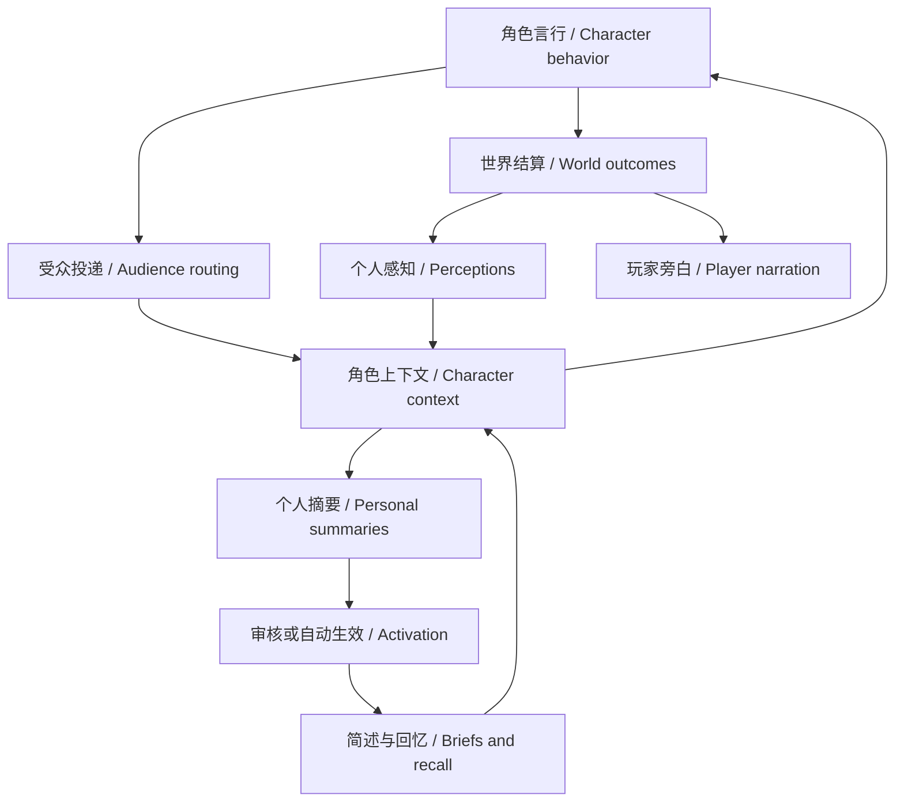

# Group discussions and character memory

English | [中文](roleplay-discussion-memory-guide.zh.md)

## Summary

This page explains how characters in independent Storyweaver join discussions, receive events and form personal memories. The director supplies world outcomes and character perceptions; the host routes them by audience, and characters consolidate their own understanding. Memory belongs to one character in one story instance; separate runs of the same book do not share acquired experiences. Summaries can be wrong, and players can inspect sources, correct them or disable them.

## Table of Contents

- [From an event to a later choice](#event-to-choice)
- [How discussions progress](#discussion)
- [Inspecting and correcting memory](#review)
- [Initial knowledge and growth](#growth)
- [Evaluating results](#verification)
- [Further Exploration](#further-reading)
- [Dev Note](#dev-note)

-----

## From an event to a later choice

One event can produce public narration, different observations and different personal interpretations. Follow the arrows by owner; narration has no automatic path into character memory.

Player narration and character perception are supplied separately. Secrets, literary interpretation or backstage arrangements visible to the reader do not automatically enter every character's context merely because narration mentions them. Ordinary visible behavior is routed to its scene audience; whispers, concealed actions and personal clues retain audience restrictions. Characters receive locally available labels and references, can respond without first knowing true names, and can ask for names when needed.

“I want to search the cabinet” is an attempted action; finding something, finding nothing or being unable to tell requires world feedback. Recall only reads that character's existing records. It cannot search the current cabinet, advance time or reveal unseen setting material. A director's performance intention is not evidence already perceived by the character.

Ordinary character requests combine identity and cognition, relevant briefs and recent perceptions not replaced by summaries. Characters can search originals or read details when precise wording or experience matters. Successful consolidation neither refunds spent tokens nor deletes original history; it lets later requests use summaries to represent covered sources. Public contribution length and scene performance instructions do not enter private consolidation requests.

-----

## How discussions progress

A character can submit a discussion request with a topic, participants and intention. The request awaits a decision and does not speak for other people. Players can choose “Accept and create discussion”, “Defer for later” or “Decline invitation” on the request; the manual discussion entry under “More actions” supports explicitly choosing a topic and participants.

Discussions distinguish private preparation from public speaking opportunities. The public budget is a ceiling, and preparation does not consume a public slot; an opportunity is not an obligation to speak. Directed handoffs, silence, disagreement and unresolved differences are valid. Discussions can pause for action results and continue after feedback. A player-controlled character's floor waits for the player instead of receiving an automatic AI performance.

Look for responses to specific previous claims, choices or changed methods rather than counting turns alone. Quiet fulfillment of a promise can be progress without manufacturing a crisis. Saved scheduling and length settings remain effective; new default guidance does not overwrite authored preferences.

-----

## Inspecting and correcting memory

Open “Memory review” in the story tools, choose a character or the director under “Whose memory to review”, and inspect that owner's proposals, effective summaries and sources. The director consolidates public events and unresolved consequences; the player's ability to select an actor for review does not grant the director that actor's private memory.

| Action | Effect |
|---|---|
| After review | New summaries do not replace source context before approval; this is the behavior without an explicit alternative policy. |
| Automatic activation | Subsequent new summaries activate automatically; existing pending proposals still require a decision and are not approved in bulk. |
| Switch back to review | Changes treatment of subsequent new summaries without revoking already effective memories. |
| Correct memory | Revises the brief and necessary episode details while preserving old versions and sources. |
| Disable summary and restore source context | Disables this summary's replacement effect; originals rejoin ordinary context selection, subject to relevance, entry budgets and coverage by other effective summaries. |
| Retrieve original records | Reads originals available to that perspective without granting another character's private experience. |

During review, distinguish “Experienced events” from “Character interpretation”. “He promised to return the key” supports an expectation, not a completed return. Distrusting him may be a reasonable interpretation, but inventing an earlier experience of receiving the key needs correction. When editing the brief, also check details and unresolved questions so the brief does not claim completion while the details still say pending. Interpretation and impact are optional; information already expressed in the brief need not be repeated.

Expand a memory topic to read its experience and interpretation without editing. Under “Source records”, select “Read source” to fetch an original directly; results appear in the search area and receive focus. Compare the original with both the brief and the episode before approval or correction. Reading a source does not approve the proposal. Recognized speech and action records show the names known at that time and the original wording; expand “Raw data” to inspect the complete record. Partial or unrecognized records remain unchanged.

-----

## Initial knowledge and growth

Configure justified starting knowledge in each storybook character's private cognition settings. A newcomer may retain Earth experiences without knowing unfamiliar world rules; a native child can know local daily life without possessing all adult knowledge. Shared common knowledge is for knowledge actually held in common. A character who does not inherit it receives only separately configured initial common knowledge; leaving that empty grants no shared common knowledge.

Later cognition develops through observations, reports, attempts and counterevidence. Allow misunderstanding and revision without inserting the entire world setting into personal memory. A time jump does not mean the system simulated every intervening day, nor does it guarantee a mature voice. Growth needs supported new experiences and perceptible changes in time.

-----

## Evaluating results

Inspect the request used for a character turn through “Thoughts and original context”, rather than relying only on a preview of current settings. Check received evidence, selected briefs, recall results and final behavior; historical requests preserve their original perspective. Native usage includes actor, director and private consolidation calls. High cache reuse can coexist with large total input and output.

Verified isolation, versioning and recovery do not guarantee semantically faithful summaries. Native samples still include misremembering witnessed accidental immersion as personally placing material in water, repeated conditions and expensive consolidation. Review by default has a practical basis; automatic activation suits play that accepts these errors and later correction. See the [acceptance record](../.agents/notes/implemented/feature/2026-09-12-discussion-perception-memory.md#acceptance-status) for samples and the limits of their conclusions.

Developer verification entry points

The [browser flow](../apps/web/tests/independent-narrative.e2e.ts) covers activation policies, correction and disabling; the [executor composition](../packages/experimental/actor/tests/narrative-executor.real.spec.ts) checks actual requests, private tools and restoration of ordinary turns; [domain regressions](../packages/story/roleplay-core/tests/world.spec.ts) cover delivery, discussions, sources and history. Run verification with temporary instances rather than writing test events into a player's active story. Review native output after structural assertions pass; model evaluations skip by default when credentials are absent.

## Further Exploration

These references cover initial authoring and the implementation evidence behind the behavior described here.

- [Storybook configuration instructions](storybook-json-editing-guide.md): author initial characters and cognition.
- [Discussion, perception and memory plan](../.agents/notes/implemented/feature/2026-09-12-discussion-perception-memory.md): requirements, preservation boundaries and evidence.
- [Independent narrative domain](../packages/story/roleplay-core/README.md): persistence, perspectives and execution contracts.

## Dev Note

Maintenance scope

This page describes the independent application, not the legacy Story/Brief implementation. Labels and entry points follow the current locale dictionary and browser flow; update both language versions when product entry points change.

