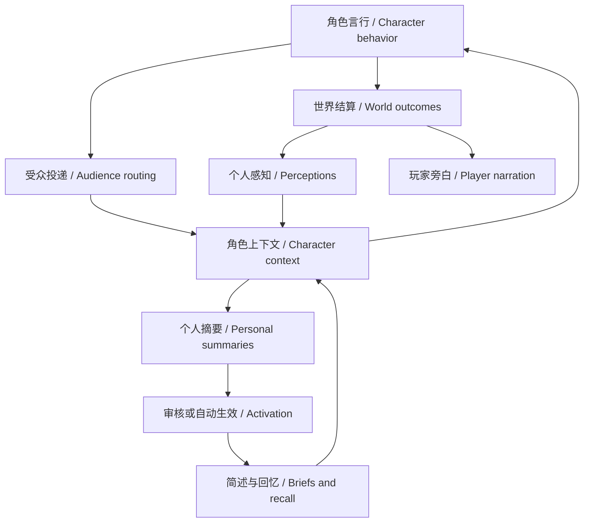

# 群组讨论与角色记忆

[English](roleplay-discussion-memory-guide.md) | 中文

## 概述

本页说明独立版 Storyweaver 中，角色怎样参与讨论、接收事件并形成个人记忆。导演提供世界结果及面向角色的感知，系统按受众投递，角色整理自己的理解。记忆属于具体故事实例中的具体角色，同一本故事书的不同运行不会共享后天经历。摘要可以出错，玩家可检查来源、纠正或停用。

## 目录

- [从事件到后续选择](#event-to-choice)
- [群组讨论怎么推进](#discussion)
- [查看和纠正记忆](#review)
- [初始知识与成长](#growth)
- [判断效果](#verification)
- [进一步阅读](#further-reading)
- [开发备注](#dev-note)

-----

## 从事件到后续选择

同一个事件可以产生玩家旁白、不同感知及不同个人理解。沿图中的归属关系阅读，旁白没有自动进入角色记忆的路径。

玩家旁白和角色感知分别提供。读者看到的秘密、文学解释或幕后安排，不会因出现在旁白中就自动进入所有角色的上下文。普通可见言行按场景受众投递；耳语、隐蔽行动和个人线索保留受众限制。角色看到的是对自己可用的称呼及引用，不必先知道真名才能回应，也可以在需要时询问姓名。

“我想搜查柜子”是行动尝试；搜到了什么、没有找到什么或暂时无法确认，需要世界反馈。回忆工具只能读取该角色已有的记录，不能替它搜索当前柜子、推进时间或揭露未见设定。导演指导表演的意图不等于角色已经看见的证据。

普通角色请求组合身份与认知、相关简述、近期未被替代的感知。需要准确措辞或经历细节时，角色可以检索原文或读取详情。整理成功不会追回已消耗的 token，也不会删除原始历史；只是让后续请求可以用摘要代表其覆盖的来源。公开发言篇幅和场景表演要求不进入私有整理请求。

-----

## 群组讨论怎么推进

角色可以提交讨论申请，说明话题、参与者及意图。申请等待处理，不会自动替其他人物发言。玩家可以在申请处选择“接受并创建讨论”“稍后处理”或“拒绝申请”；“更多操作”内的手动讨论入口适合明确指定话题和参与者。

讨论区分私有准备和公开发言机会。公开预算是上限，准备不占公开席位；有机会不等于必须说话。定向交棒、沉默、不同意和未解决的分歧均有效。需要行动结果时讨论可暂停，反馈后继续；轮到玩家控制的人物时等待玩家，不由 AI 自动代演。

看角色是否回应上一人的具体主张、作出选择或改变方法，而不是只看发言轮数。安静的承诺兑现也可以是进展，不需要每次制造危机。已有故事的调度和篇幅配置继续有效，新默认指导不会覆盖保存的作者偏好。

-----

## 查看和纠正记忆

打开故事工具中的“记忆审核”，先在“审核谁的记忆”中选择角色或导演，再查看该所有者的提案、有效摘要及来源。导演整理公共事件与未决后果，不会因审核入口能选择演员就获得演员私有记忆。

| 操作 | 生效含义 |
|---|---|
| 审核后生效 | 新摘要在批准前不替代来源上下文；这是未显式选择其他策略时的行为。 |
| 自动生效 | 后续新摘要自动启用；已有待审核提案仍需处理，不会被批量批准。 |
| 切回审核 | 改变后续新摘要的处理方式，不撤销已经生效的记忆。 |
| 纠正记忆 | 修订简要认知和需要保留的经历详情，保留旧版本与来源。 |
| 停用摘要，恢复来源上下文 | 停用该摘要的替代作用；原文重新参与普通上下文选择，仍受相关性、条数和其他有效摘要覆盖影响。 |
| 检索原始记录 | 查看该视角可访问的原始材料，不把其他角色的私有经历变成本人知识。 |

审核时分开看“亲历与见闻”和“角色的理解”。“他答应归还钥匙”支持角色期待，不证明钥匙已经归还；角色不信任对方可以是合理理解，但凭空声称自己曾经拿回钥匙需要纠正。修改简述时也检查详情和未决事项，避免简述说已完成、详情却仍写未完成。理解与影响选填，简述已表达的内容无需重复。

展开记忆主题即可查看经历与理解，无须进入编辑。在“来源记录”中点击“查看原文”，可以直接读取依据；结果显示在检索区并获得焦点。批准或纠正前，同时对照原文、摘要和经历详情。查看原文不会批准提案。已识别的发言和行动记录显示当时已知的称呼及原话；展开“原始数据”可核对完整记录。分段或无法识别的记录保留原样。

-----

## 初始知识与成长

在故事书的角色私有认知设置中按出身配置已知内容。穿越者可保留地球经历，却不应初始化为知道异世界规则；原生儿童可以拥有本地生活常识，而不拥有成年人的全部知识。共享常识只用于确实共同掌握的知识；取消继承的角色仅收到其单独设置的初始常识，留空不授予共享常识。

后续通过看见、听闻、尝试及反证形成认知。允许误解和修订，不把世界设定整体塞进个人记忆。时间跳转本身不代表系统模拟了期间每一天，也不保证人物口吻自动成熟；需要有依据的新经历与可感知的时间变化。

-----

## 判断效果

从角色回合的“思考与当时上下文”查看当次请求，而不是只看当前配置预览。核对角色实际收到的证据、相关简述、回忆结果及最终言行；历史请求保持当时的视角。原生用量统计包含演员、导演及私有整理调用，缓存命中较高仍可能伴随较大的总输入输出。

已验证的隔离、版本和恢复机制不保证每份摘要语义正确。原生样本仍出现把“目击材料落水”误记为“自己把材料放入水中”、重复条款及整理开销较高的问题。默认审核有实际依据；自动生效适合愿意接受并事后纠正这些错误的游玩方式。具体样本和结论边界见[验收记录](../.agents/notes/implemented/feature/2026-09-12-discussion-perception-memory.zh.md#acceptance-status)。

开发者验证入口

[浏览器流程](../apps/web/tests/independent-narrative.e2e.ts)覆盖审核策略、纠正和停用；[执行器组合](../packages/experimental/actor/tests/narrative-executor.real.spec.ts)检查实际请求、私有工具和普通回合恢复；[领域回归](../packages/story/roleplay-core/tests/world.spec.ts)覆盖投递、讨论、来源与历史。用临时实例运行验证，不向玩家正在游玩的故事写入测试事件。通过结构断言后仍需审阅原生输出，模型评测默认跳过缺少凭据的运行。

## 进一步阅读

这些文档分别说明初始创作，以及本页行为背后的实现与验证依据。

- [故事书配置说明](storybook-json-editing-guide.zh.md)：编写初始角色和认知。
- [群组讨论、感知与记忆计划](../.agents/notes/implemented/feature/2026-09-12-discussion-perception-memory.zh.md)：需求编号、保护边界及证据。
- [独立叙事领域](../packages/story/roleplay-core/README.zh.md)：持久化、视角和执行约定。

## 开发备注

维护范围

本页针对独立版链路，不描述旧 Story/Brief 实现。文案与入口以当前语言字典及浏览器流程为依据；更改产品入口时同步维护本页的中英文版本。

